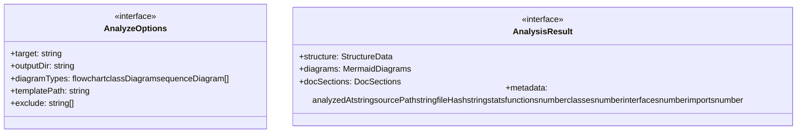
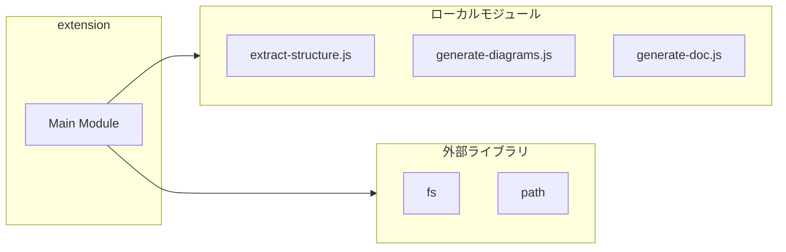
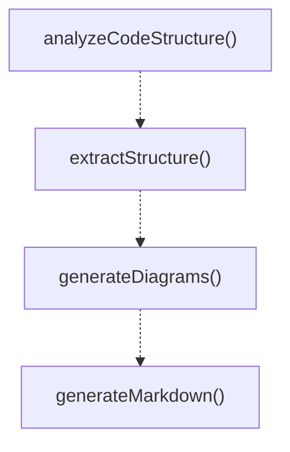
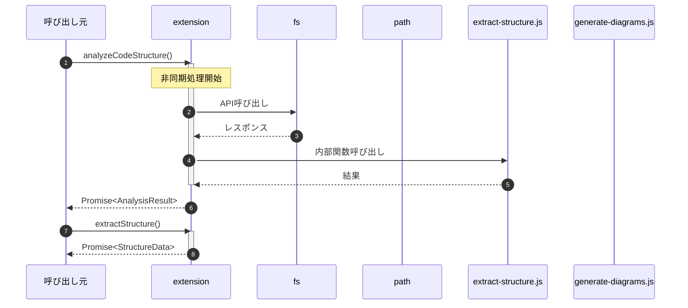

# extension

## 概要

`extension` モジュールのAPIリファレンス。

## インポート

```typescript
import { extractCodeStructure, ExtractOptions, StructureData } from './tools/extract-structure.js';
import { generateMermaidDiagrams, DiagramOptions, MermaidDiagrams } from './tools/generate-diagrams.js';
import { generateDocSections, DocOptions, DocSections } from './tools/generate-doc.js';
import { readFileSync, writeFileSync, existsSync... } from 'fs';
import { join, relative, basename } from 'path';
```

## エクスポート一覧

| 種別 | 名前 | 説明 |
|------|------|------|
| 関数 | `analyzeCodeStructure` | コード構造を解析し、ドキュメント生成に必要なデータを抽出 |
| 関数 | `extractStructure` | 構造データのみを抽出（軽量版） |
| 関数 | `generateDiagrams` | Mermaid図のみを生成（構造データから） |
| 関数 | `generateMarkdown` | ドキュメントをMarkdown形式で出力 |
| インターフェース | `AnalyzeOptions` | - |
| インターフェース | `AnalysisResult` | - |

## 図解

### クラス図



### 依存関係図



### 関数フロー



### シーケンス図



## 関数

### analyzeCodeStructure

```typescript
async analyzeCodeStructure(params: {
  target: string;
  outputDir?: string;
  diagramTypes?: string[];
  includeLLMContext?: boolean;
}): Promise<AnalysisResult>
```

コード構造を解析し、ドキュメント生成に必要なデータを抽出

**パラメータ**

| 名前 | 型 | 必須 |
|------|-----|------|
| params | `{
  target: string;
  outputDir?: string;
  diagramTypes?: string[];
  includeLLMContext?: boolean;
}` | はい |

**戻り値**: `Promise<AnalysisResult>`

### extractStructure

```typescript
async extractStructure(params: {
  target: string;
  exclude?: string[];
}): Promise<StructureData>
```

構造データのみを抽出（軽量版）

**パラメータ**

| 名前 | 型 | 必須 |
|------|-----|------|
| params | `{
  target: string;
  exclude?: string[];
}` | はい |

**戻り値**: `Promise<StructureData>`

### generateDiagrams

```typescript
async generateDiagrams(params: {
  structure: StructureData;
  types?: string[];
}): Promise<MermaidDiagrams>
```

Mermaid図のみを生成（構造データから）

**パラメータ**

| 名前 | 型 | 必須 |
|------|-----|------|
| params | `{
  structure: StructureData;
  types?: string[];
}` | はい |

**戻り値**: `Promise<MermaidDiagrams>`

### generateMarkdown

```typescript
async generateMarkdown(params: {
  result: AnalysisResult;
  outputPath?: string;
}): Promise<string>
```

ドキュメントをMarkdown形式で出力

**パラメータ**

| 名前 | 型 | 必須 |
|------|-----|------|
| params | `{
  result: AnalysisResult;
  outputPath?: string;
}` | はい |

**戻り値**: `Promise<string>`

### computeHash

```typescript
computeHash(structure: StructureData): string
```

構造データのハッシュを計算（ドリフト検出用）

**パラメータ**

| 名前 | 型 | 必須 |
|------|-----|------|
| structure | `StructureData` | はい |

**戻り値**: `string`

## インターフェース

### AnalyzeOptions

```typescript
interface AnalyzeOptions {
  target: string;
  outputDir?: string;
  diagramTypes?: ('flowchart' | 'classDiagram' | 'sequenceDiagram')[];
  templatePath?: string;
  exclude?: string[];
  includeLLMContext?: boolean;
}
```

### AnalysisResult

```typescript
interface AnalysisResult {
  structure: StructureData;
  diagrams: MermaidDiagrams;
  docSections: DocSections;
  metadata: {
    analyzedAt: string;
    sourcePath: string;
    fileHash: string;
    stats: {
      functions: number;
      classes: number;
      interfaces: number;
      imports: number;
    };
  };
}
```

---
*自動生成: 2026-02-17T22:16:16.435Z*
