# extract-structure

## 概要

`extract-structure` モジュールのAPIリファレンス。

## インポート

```typescript
import { readFileSync, readdirSync, statSync } from 'fs';
import { join, relative, extname } from 'path';
import { minimatch } from 'minimatch';
```

## エクスポート一覧

| 種別 | 名前 | 説明 |
|------|------|------|
| 関数 | `extractCodeStructure` | - |
| インターフェース | `ExtractOptions` | - |
| インターフェース | `FunctionInfo` | - |
| インターフェース | `ParameterInfo` | - |
| インターフェース | `ClassInfo` | - |
| インターフェース | `MethodInfo` | - |
| インターフェース | `PropertyInfo` | - |
| インターフェース | `InterfaceInfo` | - |
| インターフェース | `InterfacePropertyInfo` | - |
| インターフェース | `InterfaceMethodInfo` | - |
| インターフェース | `ImportInfo` | - |
| インターフェース | `ExportInfo` | - |
| インターフェース | `FileStructure` | - |
| インターフェース | `StructureData` | - |
| インターフェース | `DependencyGraph` | - |

## 図解

### クラス図

```mermaid
classDiagram
  class ExtractOptions {
    <<interface>>
    +targetPath: string
    +excludePatterns: string[]
  }
  class FunctionInfo {
    <<interface>>
    +name: string
    +signature: string
    +filePath: string
    +line: number
    +jsDoc: string
  }
  class ParameterInfo {
    <<interface>>
    +name: string
    +type: string
    +optional: boolean
    +defaultValue: string
  }
  class ClassInfo {
    <<interface>>
    +name: string
    +filePath: string
    +line: number
    +jsDoc: string
    +methods: MethodInfo[]
  }
  class MethodInfo {
    <<interface>>
    +name: string
    +signature: string
    +parameters: ParameterInfo[]
    +returnType: string
    +isAsync: boolean
  }
  class PropertyInfo {
    <<interface>>
    +name: string
    +type: string
    +visibility: publicprotectedprivate
    +isStatic: boolean
    +isReadonly: boolean
  }
  class InterfaceInfo {
    <<interface>>
    +name: string
    +filePath: string
    +line: number
    +jsDoc: string
    +properties: InterfacePropertyInfo[]
  }
  class InterfacePropertyInfo {
    <<interface>>
    +name: string
    +type: string
    +optional: boolean
    +isReadonly: boolean
    +jsDoc: string
  }
  class InterfaceMethodInfo {
    <<interface>>
    +name: string
    +signature: string
    +parameters: ParameterInfo[]
    +returnType: string
  }
  class ImportInfo {
    <<interface>>
    +source: string
    +names: string[]
    +filePath: string
    +line: number
    +isDefault: boolean
  }
  class ExportInfo {
    <<interface>>
    +name: string
    +source: string
    +filePath: string
    +line: number
    +isDefault: boolean
  }
  class FileStructure {
    <<interface>>
    +filePath: string
    +relativePath: string
    +functions: FunctionInfo[]
    +classes: ClassInfo[]
    +interfaces: InterfaceInfo[]
  }
  class StructureData {
    <<interface>>
    +basePath: string
    +analyzedAt: string
    +files: FileStructure[]
    +functions: FunctionInfo[]
    +classes: ClassInfo[]
  }
  class DependencyGraph {
    <<interface>>
    +nodes: idstringnamestringpathstring[]
    +edges: fromstringtostringtypeimportexport[]
  }
  class VisitorCallbacks {
    <<interface>>
    +onFunction: funcFunctionInfo>void
    +onClass: clsClassInfo>void
    +onInterface: intfInterfaceInfo>void
    +onImport: impImportInfo>void
    +onExport: expExportInfo>void
  }
```



### 依存関係図


### シーケンス図


## 関数

### extractCodeStructure

```typescript
async extractCodeStructure(options: ExtractOptions): Promise<StructureData>
```

**パラメータ**

| 名前 | 型 | 必須 |
|------|-----|------|
| options | `ExtractOptions` | はい |

**戻り値**: `Promise<StructureData>`

### collectTypeScriptFiles

```typescript
collectTypeScriptFiles(basePath: string, excludePatterns: string[]): string[]
```

**パラメータ**

| 名前 | 型 | 必須 |
|------|-----|------|
| basePath | `string` | はい |
| excludePatterns | `string[]` | はい |

**戻り値**: `string[]`

### walk

```typescript
walk(dir: string): void
```

**パラメータ**

| 名前 | 型 | 必須 |
|------|-----|------|
| dir | `string` | はい |

**戻り値**: `void`

### analyzeFile

```typescript
analyzeFile(filePath: string, basePath: string): FileStructure
```

**パラメータ**

| 名前 | 型 | 必須 |
|------|-----|------|
| filePath | `string` | はい |
| basePath | `string` | はい |

**戻り値**: `FileStructure`

### visitNode

```typescript
visitNode(node: ts.Node, sourceFile: ts.SourceFile, callbacks: VisitorCallbacks): void
```

**パラメータ**

| 名前 | 型 | 必須 |
|------|-----|------|
| node | `ts.Node` | はい |
| sourceFile | `ts.SourceFile` | はい |
| callbacks | `VisitorCallbacks` | はい |

**戻り値**: `void`

### extractFunction

```typescript
extractFunction(node: ts.FunctionDeclaration, sourceFile: ts.SourceFile): FunctionInfo
```

**パラメータ**

| 名前 | 型 | 必須 |
|------|-----|------|
| node | `ts.FunctionDeclaration` | はい |
| sourceFile | `ts.SourceFile` | はい |

**戻り値**: `FunctionInfo`

### extractFunctionFromExpression

```typescript
extractFunctionFromExpression(name: string, expr: ts.ArrowFunction | ts.FunctionExpression, decl: ts.VariableDeclaration, sourceFile: ts.SourceFile): FunctionInfo
```

**パラメータ**

| 名前 | 型 | 必須 |
|------|-----|------|
| name | `string` | はい |
| expr | `ts.ArrowFunction | ts.FunctionExpression` | はい |
| decl | `ts.VariableDeclaration` | はい |
| sourceFile | `ts.SourceFile` | はい |

**戻り値**: `FunctionInfo`

### extractParameters

```typescript
extractParameters(params: ts.NodeArray<ts.ParameterDeclaration>, sourceFile: ts.SourceFile): ParameterInfo[]
```

**パラメータ**

| 名前 | 型 | 必須 |
|------|-----|------|
| params | `ts.NodeArray<ts.ParameterDeclaration>` | はい |
| sourceFile | `ts.SourceFile` | はい |

**戻り値**: `ParameterInfo[]`

### buildFunctionSignature

```typescript
buildFunctionSignature(name: string, parameters: ParameterInfo[], returnType: string, isAsync: boolean): string
```

**パラメータ**

| 名前 | 型 | 必須 |
|------|-----|------|
| name | `string` | はい |
| parameters | `ParameterInfo[]` | はい |
| returnType | `string` | はい |
| isAsync | `boolean` | はい |

**戻り値**: `string`

### extractClass

```typescript
extractClass(node: ts.ClassDeclaration, sourceFile: ts.SourceFile): ClassInfo
```

**パラメータ**

| 名前 | 型 | 必須 |
|------|-----|------|
| node | `ts.ClassDeclaration` | はい |
| sourceFile | `ts.SourceFile` | はい |

**戻り値**: `ClassInfo`

### extractMethod

```typescript
extractMethod(node: ts.MethodDeclaration, sourceFile: ts.SourceFile): MethodInfo
```

**パラメータ**

| 名前 | 型 | 必須 |
|------|-----|------|
| node | `ts.MethodDeclaration` | はい |
| sourceFile | `ts.SourceFile` | はい |

**戻り値**: `MethodInfo`

### extractProperty

```typescript
extractProperty(node: ts.PropertyDeclaration, sourceFile: ts.SourceFile): PropertyInfo
```

**パラメータ**

| 名前 | 型 | 必須 |
|------|-----|------|
| node | `ts.PropertyDeclaration` | はい |
| sourceFile | `ts.SourceFile` | はい |

**戻り値**: `PropertyInfo`

### extractVisibility

```typescript
extractVisibility(node: ts.MethodDeclaration | ts.PropertyDeclaration): 'public' | 'protected' | 'private'
```

**パラメータ**

| 名前 | 型 | 必須 |
|------|-----|------|
| node | `ts.MethodDeclaration | ts.PropertyDeclaration` | はい |

**戻り値**: `'public' | 'protected' | 'private'`

### extractInterface

```typescript
extractInterface(node: ts.InterfaceDeclaration, sourceFile: ts.SourceFile): InterfaceInfo
```

**パラメータ**

| 名前 | 型 | 必須 |
|------|-----|------|
| node | `ts.InterfaceDeclaration` | はい |
| sourceFile | `ts.SourceFile` | はい |

**戻り値**: `InterfaceInfo`

### extractImport

```typescript
extractImport(node: ts.ImportDeclaration, sourceFile: ts.SourceFile): ImportInfo
```

**パラメータ**

| 名前 | 型 | 必須 |
|------|-----|------|
| node | `ts.ImportDeclaration` | はい |
| sourceFile | `ts.SourceFile` | はい |

**戻り値**: `ImportInfo`

### extractExport

```typescript
extractExport(node: ts.ExportDeclaration | ts.ExportAssignment, sourceFile: ts.SourceFile): ExportInfo
```

**パラメータ**

| 名前 | 型 | 必須 |
|------|-----|------|
| node | `ts.ExportDeclaration | ts.ExportAssignment` | はい |
| sourceFile | `ts.SourceFile` | はい |

**戻り値**: `ExportInfo`

### extractJsDoc

```typescript
extractJsDoc(node: ts.Node): string | undefined
```

**パラメータ**

| 名前 | 型 | 必須 |
|------|-----|------|
| node | `ts.Node` | はい |

**戻り値**: `string | undefined`

### buildDependencyGraph

```typescript
buildDependencyGraph(files: FileStructure[]): DependencyGraph
```

**パラメータ**

| 名前 | 型 | 必須 |
|------|-----|------|
| files | `FileStructure[]` | はい |

**戻り値**: `DependencyGraph`

### resolveImportPath

```typescript
resolveImportPath(fromPath: string, importSource: string): string
```

**パラメータ**

| 名前 | 型 | 必須 |
|------|-----|------|
| fromPath | `string` | はい |
| importSource | `string` | はい |

**戻り値**: `string`

## インターフェース

### ExtractOptions

```typescript
interface ExtractOptions {
  targetPath: string;
  excludePatterns?: string[];
}
```

### FunctionInfo

```typescript
interface FunctionInfo {
  name: string;
  signature: string;
  filePath: string;
  line: number;
  jsDoc?: string;
  parameters: ParameterInfo[];
  returnType: string;
  isAsync: boolean;
  isExported: boolean;
}
```

### ParameterInfo

```typescript
interface ParameterInfo {
  name: string;
  type: string;
  optional: boolean;
  defaultValue?: string;
}
```

### ClassInfo

```typescript
interface ClassInfo {
  name: string;
  filePath: string;
  line: number;
  jsDoc?: string;
  methods: MethodInfo[];
  properties: PropertyInfo[];
  extends?: string;
  implements: string[];
  isExported: boolean;
}
```

### MethodInfo

```typescript
interface MethodInfo {
  name: string;
  signature: string;
  parameters: ParameterInfo[];
  returnType: string;
  isAsync: boolean;
  isStatic: boolean;
  visibility: 'public' | 'protected' | 'private';
  jsDoc?: string;
}
```

### PropertyInfo

```typescript
interface PropertyInfo {
  name: string;
  type: string;
  visibility: 'public' | 'protected' | 'private';
  isStatic: boolean;
  isReadonly: boolean;
  jsDoc?: string;
}
```

### InterfaceInfo

```typescript
interface InterfaceInfo {
  name: string;
  filePath: string;
  line: number;
  jsDoc?: string;
  properties: InterfacePropertyInfo[];
  methods: InterfaceMethodInfo[];
  extends: string[];
  isExported: boolean;
}
```

### InterfacePropertyInfo

```typescript
interface InterfacePropertyInfo {
  name: string;
  type: string;
  optional: boolean;
  isReadonly: boolean;
  jsDoc?: string;
}
```

### InterfaceMethodInfo

```typescript
interface InterfaceMethodInfo {
  name: string;
  signature: string;
  parameters: ParameterInfo[];
  returnType: string;
}
```

### ImportInfo

```typescript
interface ImportInfo {
  source: string;
  names: string[];
  filePath: string;
  line: number;
  isDefault: boolean;
  isNamespace: boolean;
}
```

### ExportInfo

```typescript
interface ExportInfo {
  name: string;
  source?: string;
  filePath: string;
  line: number;
  isDefault: boolean;
}
```

### FileStructure

```typescript
interface FileStructure {
  filePath: string;
  relativePath: string;
  functions: FunctionInfo[];
  classes: ClassInfo[];
  interfaces: InterfaceInfo[];
  imports: ImportInfo[];
  exports: ExportInfo[];
}
```

### StructureData

```typescript
interface StructureData {
  basePath: string;
  analyzedAt: string;
  files: FileStructure[];
  functions: FunctionInfo[];
  classes: ClassInfo[];
  interfaces: InterfaceInfo[];
  imports: ImportInfo[];
  exports: ExportInfo[];
  dependencyGraph: DependencyGraph;
}
```

### DependencyGraph

```typescript
interface DependencyGraph {
  nodes: { id: string; name: string; path: string }[];
  edges: { from: string; to: string; type: 'import' | 'export' }[];
}
```

### VisitorCallbacks

```typescript
interface VisitorCallbacks {
  onFunction: (func: FunctionInfo) => void;
  onClass: (cls: ClassInfo) => void;
  onInterface: (intf: InterfaceInfo) => void;
  onImport: (imp: ImportInfo) => void;
  onExport: (exp: ExportInfo) => void;
}
```

---
*自動生成: 2026-02-17T22:24:18.772Z*
