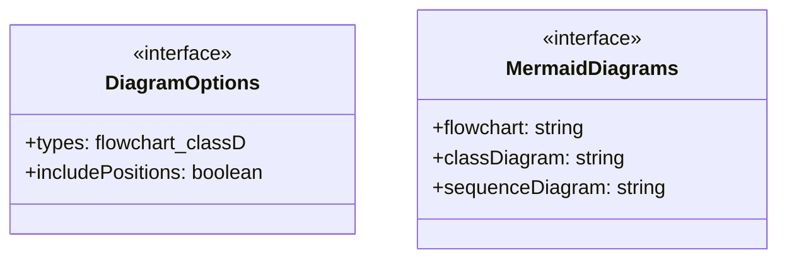
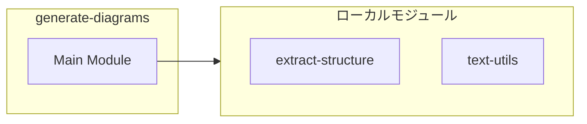
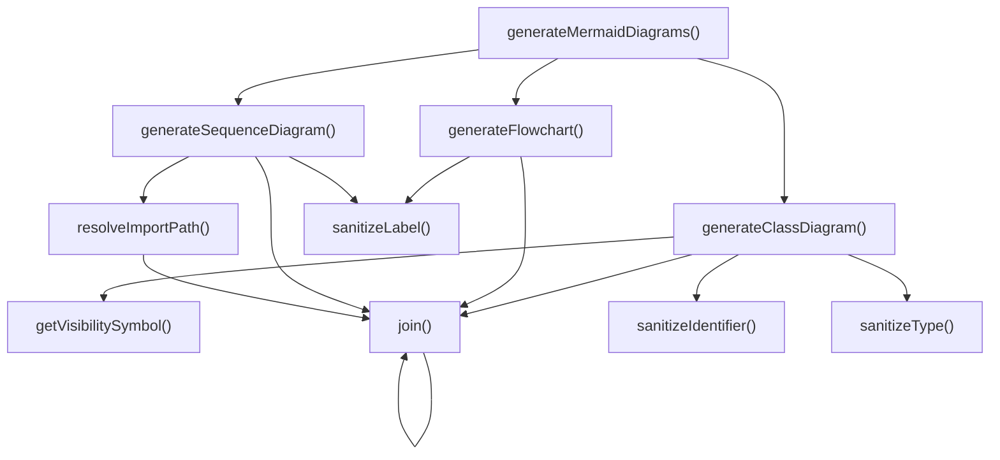

# generate-diagrams

## 概要

`generate-diagrams` モジュールのAPIリファレンス。

## インポート

```typescript
// from './extract-structure.js': StructureData, ClassInfo, FunctionInfo, ...
// from '../../../lib/text-utils.js': truncateText
```

## エクスポート一覧

| 種別 | 名前 | 説明 |
|------|------|------|
| 関数 | `generateMermaidDiagrams` | 構造データからMermaid図を生成する |
| インターフェース | `DiagramOptions` | 図生成の設定オプション |
| インターフェース | `MermaidDiagrams` | Mermaid図の出力結果 |

## 図解

### クラス図



### 依存関係図



### 関数フロー



## 関数

### generateMermaidDiagrams

```typescript
generateMermaidDiagrams(structure: StructureData, options: DiagramOptions): MermaidDiagrams
```

構造データからMermaid図を生成する

**パラメータ**

| 名前 | 型 | 必須 |
|------|-----|------|
| structure | `StructureData` | はい |
| options | `DiagramOptions` | はい |

**戻り値**: `MermaidDiagrams`

### generateFlowchart

```typescript
generateFlowchart(structure: StructureData): string
```

**パラメータ**

| 名前 | 型 | 必須 |
|------|-----|------|
| structure | `StructureData` | はい |

**戻り値**: `string`

### generateClassDiagram

```typescript
generateClassDiagram(structure: StructureData): string
```

**パラメータ**

| 名前 | 型 | 必須 |
|------|-----|------|
| structure | `StructureData` | はい |

**戻り値**: `string`

### generateSequenceDiagram

```typescript
generateSequenceDiagram(structure: StructureData): string
```

**パラメータ**

| 名前 | 型 | 必須 |
|------|-----|------|
| structure | `StructureData` | はい |

**戻り値**: `string`

### sanitizeLabel

```typescript
sanitizeLabel(text: string): string
```

**パラメータ**

| 名前 | 型 | 必須 |
|------|-----|------|
| text | `string` | はい |

**戻り値**: `string`

### sanitizeIdentifier

```typescript
sanitizeIdentifier(name: string): string
```

**パラメータ**

| 名前 | 型 | 必須 |
|------|-----|------|
| name | `string` | はい |

**戻り値**: `string`

### sanitizeType

```typescript
sanitizeType(type: string): string
```

**パラメータ**

| 名前 | 型 | 必須 |
|------|-----|------|
| type | `string` | はい |

**戻り値**: `string`

### getVisibilitySymbol

```typescript
getVisibilitySymbol(visibility: 'public' | 'protected' | 'private'): string
```

**パラメータ**

| 名前 | 型 | 必須 |
|------|-----|------|
| visibility | `'public' | 'protected' | 'private'` | はい |

**戻り値**: `string`

### resolveImportPath

```typescript
resolveImportPath(fromPath: string, importSource: string): string
```

**パラメータ**

| 名前 | 型 | 必須 |
|------|-----|------|
| fromPath | `string` | はい |
| importSource | `string` | はい |

**戻り値**: `string`

### join

```typescript
join(paths: string[]): string
```

**パラメータ**

| 名前 | 型 | 必須 |
|------|-----|------|
| paths | `string[]` | はい |

**戻り値**: `string`

## インターフェース

### DiagramOptions

```typescript
interface DiagramOptions {
  types: ('flowchart' | 'classDiagram' | 'sequenceDiagram')[];
  includePositions?: boolean;
}
```

図生成の設定オプション

### MermaidDiagrams

```typescript
interface MermaidDiagrams {
  flowchart?: string;
  classDiagram?: string;
  sequenceDiagram?: string;
}
```

Mermaid図の出力結果

---
*自動生成: 2026-02-22T19:27:00.166Z*
