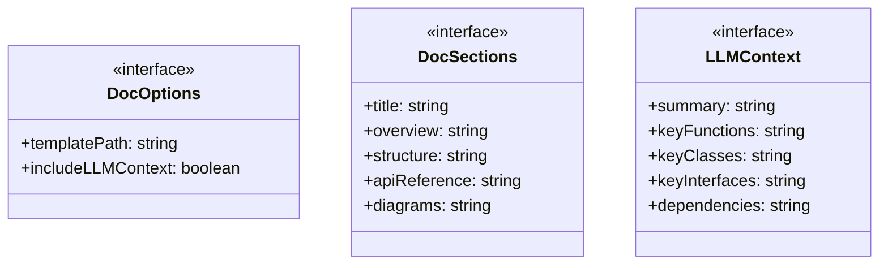
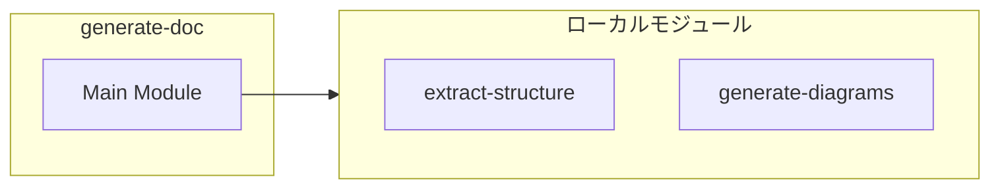

# generate-doc

## 概要

`generate-doc` モジュールのAPIリファレンス。

## インポート

```typescript
import { StructureData, FunctionInfo, ClassInfo... } from './extract-structure.js';
import { MermaidDiagrams } from './generate-diagrams.js';
```

## エクスポート一覧

| 種別 | 名前 | 説明 |
|------|------|------|
| 関数 | `generateDocSections` | - |
| インターフェース | `DocOptions` | - |
| インターフェース | `DocSections` | - |
| インターフェース | `LLMContext` | - |

## 図解

### クラス図



### 依存関係図



## 関数

### generateDocSections

```typescript
generateDocSections(structure: StructureData, diagrams: MermaidDiagrams, options: DocOptions): DocSections
```

**パラメータ**

| 名前 | 型 | 必須 |
|------|-----|------|
| structure | `StructureData` | はい |
| diagrams | `MermaidDiagrams` | はい |
| options | `DocOptions` | はい |

**戻り値**: `DocSections`

### generateTitle

```typescript
generateTitle(structure: StructureData): string
```

**パラメータ**

| 名前 | 型 | 必須 |
|------|-----|------|
| structure | `StructureData` | はい |

**戻り値**: `string`

### generateOverview

```typescript
generateOverview(structure: StructureData, includeLLMContext?: boolean): string
```

**パラメータ**

| 名前 | 型 | 必須 |
|------|-----|------|
| structure | `StructureData` | はい |
| includeLLMContext | `boolean` | いいえ |

**戻り値**: `string`

### generateStructureSection

```typescript
generateStructureSection(structure: StructureData): string
```

**パラメータ**

| 名前 | 型 | 必須 |
|------|-----|------|
| structure | `StructureData` | はい |

**戻り値**: `string`

### generateAPIReference

```typescript
generateAPIReference(structure: StructureData): string
```

**パラメータ**

| 名前 | 型 | 必須 |
|------|-----|------|
| structure | `StructureData` | はい |

**戻り値**: `string`

### generateFunctionSection

```typescript
generateFunctionSection(func: FunctionInfo): string
```

**パラメータ**

| 名前 | 型 | 必須 |
|------|-----|------|
| func | `FunctionInfo` | はい |

**戻り値**: `string`

### generateClassSection

```typescript
generateClassSection(cls: ClassInfo): string
```

**パラメータ**

| 名前 | 型 | 必須 |
|------|-----|------|
| cls | `ClassInfo` | はい |

**戻り値**: `string`

### generateInterfaceSection

```typescript
generateInterfaceSection(intf: InterfaceInfo): string
```

**パラメータ**

| 名前 | 型 | 必須 |
|------|-----|------|
| intf | `InterfaceInfo` | はい |

**戻り値**: `string`

### generateDiagramsSection

```typescript
generateDiagramsSection(diagrams: MermaidDiagrams): string
```

**パラメータ**

| 名前 | 型 | 必須 |
|------|-----|------|
| diagrams | `MermaidDiagrams` | はい |

**戻り値**: `string`

### generateLLMContext

```typescript
generateLLMContext(structure: StructureData): LLMContext
```

**パラメータ**

| 名前 | 型 | 必須 |
|------|-----|------|
| structure | `StructureData` | はい |

**戻り値**: `LLMContext`

### generateSuggestedExplanationPoints

```typescript
generateSuggestedExplanationPoints(structure: StructureData): string[]
```

**パラメータ**

| 名前 | 型 | 必須 |
|------|-----|------|
| structure | `StructureData` | はい |

**戻り値**: `string[]`

## インターフェース

### DocOptions

```typescript
interface DocOptions {
  templatePath?: string;
  includeLLMContext?: boolean;
}
```

### DocSections

```typescript
interface DocSections {
  title: string;
  overview: string;
  structure: string;
  apiReference: string;
  diagrams: string;
  llmContext?: LLMContext;
}
```

### LLMContext

```typescript
interface LLMContext {
  summary: string;
  keyFunctions: string[];
  keyClasses: string[];
  keyInterfaces: string[];
  dependencies: string[];
  suggestedExplanationPoints: string[];
}
```

---
*自動生成: 2026-02-18T00:15:35.487Z*
