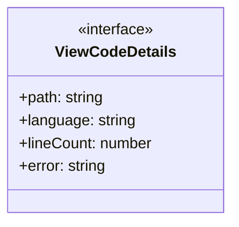
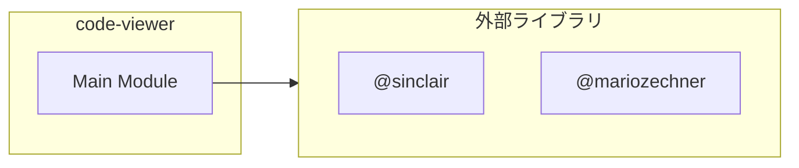

# code-viewer

## 概要

`code-viewer` モジュールのAPIリファレンス。

## インポート

```typescript
// from 'node:fs': fs
// from '@sinclair/typebox': Type
// from '@mariozechner/pi-coding-agent': ExtensionAPI
// from '@mariozechner/pi-coding-agent': highlightCode, getLanguageFromPath
// from '@mariozechner/pi-tui': Text
```

## エクスポート一覧

| 種別 | 名前 | 説明 |
|------|------|------|

## ユーザーフロー

このモジュールが提供するツールと、その実行フローを示します。

### view_code


```mermaid
sequenceDiagram
  autonumber
  actor User as ユーザー
  participant System as System
  participant Internal as "Internal"
  participant Storage as "Storage"
  participant Unresolved as "Unresolved"

  User->>System: view_code
  System->>Internal: existsSync
  System->>Storage: readFileSync
  System->>Internal: getLanguageFromPath
  System->>Unresolved: code.split (node_modules/typescript/lib/lib.es5.d.ts)
  System->>Internal: highlightCode
  System->>Internal: 行番号付きでコードをフォーマット
  Internal->>Unresolved: maxLineNum.toString (node_modules/typescript/lib/lib.es5.d.ts)
  Internal->>Unresolved: lines 		.map((line, index) => { 			const lineNum = (startLine + index).toString().padStart(width, ' '); 			return `${lineNum} | ${line}`; 		}) 		.join (node_modules/typescript/lib/lib.es5.d.ts)
  Internal->>Unresolved: lines 		.map (node_modules/typescript/lib/lib.es5.d.ts)
  Internal->>Unresolved: (startLine + index).toString().padStart (node_modules/typescript/lib/lib.es2017.string.d.ts)
  System->>Unresolved: '─'.repeat (node_modules/typescript/lib/lib.es2015.core.d.ts)
  System->>Unresolved: String (node_modules/typescript/lib/lib.es5.d.ts)
  System-->>User: 結果

```

## 図解

### クラス図



### 依存関係図



## 関数

### formatWithLineNumbers

```typescript
formatWithLineNumbers(lines: string[], startLine: number): string
```

**パラメータ**

| 名前 | 型 | 必須 |
|------|-----|------|
| lines | `string[]` | はい |
| startLine | `number` | はい |

**戻り値**: `string`

## インターフェース

### ViewCodeDetails

```typescript
interface ViewCodeDetails {
  path?: string;
  language?: string;
  lineCount: number;
  error?: string;
}
```

---
*自動生成: 2026-02-28T13:55:18.843Z*
