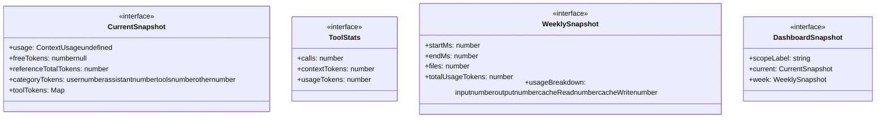

# context-usage-dashboard

## 概要

`context-usage-dashboard` モジュールのAPIリファレンス。

## インポート

```typescript
import { existsSync, readdirSync, readFileSync } from 'node:fs';
import { homedir } from 'node:os';
import { dirname, join } from 'node:path';
import { BranchSummaryEntry, CompactionEntry, ContextUsage... } from '@mariozechner/pi-coding-agent';
import { truncateToWidth } from '@mariozechner/pi-tui';
// ... and 1 more imports
```

## エクスポート一覧

| 種別 | 名前 | 説明 |
|------|------|------|

## 図解

### クラス図



### 依存関係図

```mermaid
flowchart LR
  subgraph this[context-usage-dashboard]
    main[Main Module]
  end
  subgraph local[ローカルモジュール]
    validation_utils_js[validation-utils.js]
  end
  main --> local
  subgraph external[外部ライブラリ]
    _mariozechner[@mariozechner]
    _mariozechner[@mariozechner]
  end
  main --> external
```

## 関数

### addToMap

```typescript
addToMap(map: Map<string, number>, key: string, value: number): void
```

**パラメータ**

| 名前 | 型 | 必須 |
|------|-----|------|
| map | `Map<string, number>` | はい |
| key | `string` | はい |
| value | `number` | はい |

**戻り値**: `void`

### getOrCreateToolStats

```typescript
getOrCreateToolStats(map: Map<string, ToolStats>, toolName: string): ToolStats
```

**パラメータ**

| 名前 | 型 | 必須 |
|------|-----|------|
| map | `Map<string, ToolStats>` | はい |
| toolName | `string` | はい |

**戻り値**: `ToolStats`

### toTotalUsageTokens

```typescript
toTotalUsageTokens(usage: any): number
```

**パラメータ**

| 名前 | 型 | 必須 |
|------|-----|------|
| usage | `any` | はい |

**戻り値**: `number`

### safeStringify

```typescript
safeStringify(value: unknown): string
```

**パラメータ**

| 名前 | 型 | 必須 |
|------|-----|------|
| value | `unknown` | はい |

**戻り値**: `string`

### estimateUnknownTokens

```typescript
estimateUnknownTokens(value: unknown): number
```

**パラメータ**

| 名前 | 型 | 必須 |
|------|-----|------|
| value | `unknown` | はい |

**戻り値**: `number`

### estimateMessageTokens

```typescript
estimateMessageTokens(message: any): number
```

**パラメータ**

| 名前 | 型 | 必須 |
|------|-----|------|
| message | `any` | はい |

**戻り値**: `number`

### extractToolCalls

```typescript
extractToolCalls(message: any): string[]
```

**パラメータ**

| 名前 | 型 | 必須 |
|------|-----|------|
| message | `any` | はい |

**戻り値**: `string[]`

### parseTimestampMs

```typescript
parseTimestampMs(entry: any): number | undefined
```

**パラメータ**

| 名前 | 型 | 必須 |
|------|-----|------|
| entry | `any` | はい |

**戻り値**: `number | undefined`

### getScopeDirFromSession

```typescript
getScopeDirFromSession(ctx: ExtensionAPI["context"]): string | undefined
```

**パラメータ**

| 名前 | 型 | 必須 |
|------|-----|------|
| ctx | `ExtensionAPI["context"]` | はい |

**戻り値**: `string | undefined`

### listSessionFiles

```typescript
listSessionFiles(scopeDir: string | undefined): string[]
```

**パラメータ**

| 名前 | 型 | 必須 |
|------|-----|------|
| scopeDir | `string | undefined` | はい |

**戻り値**: `string[]`

### collectFromDir

```typescript
collectFromDir(targetDir: string): void
```

**パラメータ**

| 名前 | 型 | 必須 |
|------|-----|------|
| targetDir | `string` | はい |

**戻り値**: `void`

### collectCurrentSnapshot

```typescript
collectCurrentSnapshot(ctx: ExtensionAPI["context"]): CurrentSnapshot
```

**パラメータ**

| 名前 | 型 | 必須 |
|------|-----|------|
| ctx | `ExtensionAPI["context"]` | はい |

**戻り値**: `CurrentSnapshot`

### collectWeeklySnapshot

```typescript
collectWeeklySnapshot(scopeDir: string | undefined): WeeklySnapshot
```

**パラメータ**

| 名前 | 型 | 必須 |
|------|-----|------|
| scopeDir | `string | undefined` | はい |

**戻り値**: `WeeklySnapshot`

### collectDashboardSnapshot

```typescript
collectDashboardSnapshot(ctx: ExtensionAPI["context"]): DashboardSnapshot
```

**パラメータ**

| 名前 | 型 | 必須 |
|------|-----|------|
| ctx | `ExtensionAPI["context"]` | はい |

**戻り値**: `DashboardSnapshot`

### formatTokens

```typescript
formatTokens(value: number): string
```

**パラメータ**

| 名前 | 型 | 必須 |
|------|-----|------|
| value | `number` | はい |

**戻り値**: `string`

### formatPercent

```typescript
formatPercent(value: number): string
```

**パラメータ**

| 名前 | 型 | 必須 |
|------|-----|------|
| value | `number` | はい |

**戻り値**: `string`

### formatCost

```typescript
formatCost(value: number): string
```

**パラメータ**

| 名前 | 型 | 必須 |
|------|-----|------|
| value | `number` | はい |

**戻り値**: `string`

### formatDate

```typescript
formatDate(ms: number): string
```

**パラメータ**

| 名前 | 型 | 必須 |
|------|-----|------|
| ms | `number` | はい |

**戻り値**: `string`

### crop

```typescript
crop(value: string, width: number): string
```

**パラメータ**

| 名前 | 型 | 必須 |
|------|-----|------|
| value | `string` | はい |
| width | `number` | はい |

**戻り値**: `string`

### renderDashboard

```typescript
renderDashboard(theme: any, snapshot: DashboardSnapshot, width: number): string[]
```

**パラメータ**

| 名前 | 型 | 必須 |
|------|-----|------|
| theme | `any` | はい |
| snapshot | `DashboardSnapshot` | はい |
| width | `number` | はい |

**戻り値**: `string[]`

### add

```typescript
add(line: any): void
```

**パラメータ**

| 名前 | 型 | 必須 |
|------|-----|------|
| line | `any` | はい |

**戻り値**: `void`

## インターフェース

### CurrentSnapshot

```typescript
interface CurrentSnapshot {
  usage: ContextUsage | undefined;
  freeTokens: number | null;
  referenceTotalTokens: number;
  categoryTokens: {
    user: number;
    assistant: number;
    tools: number;
    other: number;
  };
  toolTokens: Map<string, number>;
  toolCalls: Map<string, number>;
}
```

### ToolStats

```typescript
interface ToolStats {
  calls: number;
  contextTokens: number;
  usageTokens: number;
}
```

### WeeklySnapshot

```typescript
interface WeeklySnapshot {
  startMs: number;
  endMs: number;
  files: number;
  totalUsageTokens: number;
  usageBreakdown: {
    input: number;
    output: number;
    cacheRead: number;
    cacheWrite: number;
  };
  totalCost: number;
  models: Map<string, number>;
  tools: Map<string, ToolStats>;
}
```

### DashboardSnapshot

```typescript
interface DashboardSnapshot {
  scopeLabel: string;
  current: CurrentSnapshot;
  week: WeeklySnapshot;
}
```

---
*自動生成: 2026-02-17T22:16:16.452Z*
