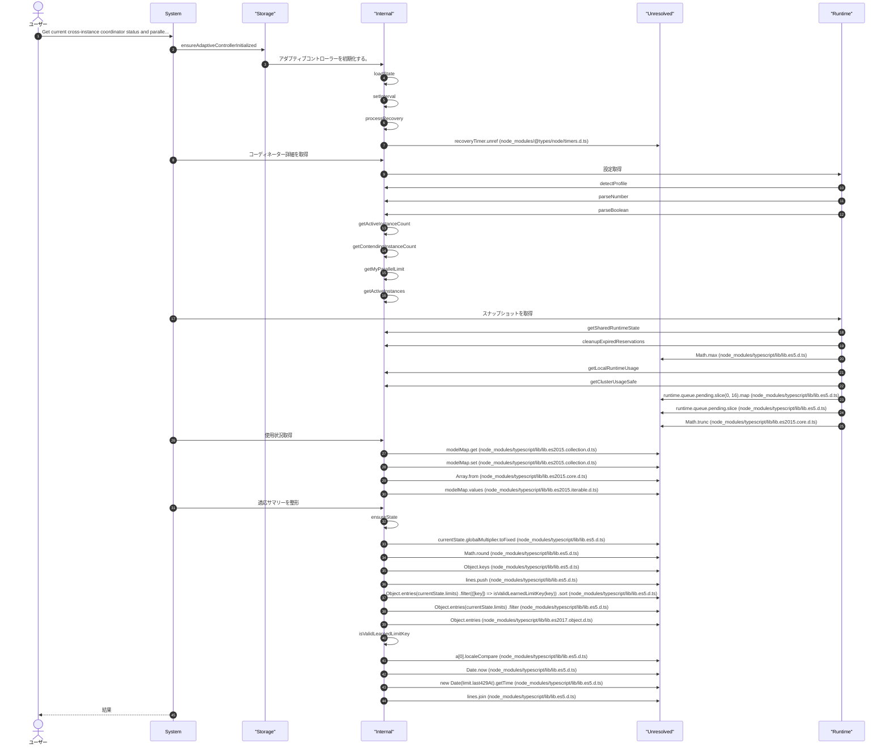
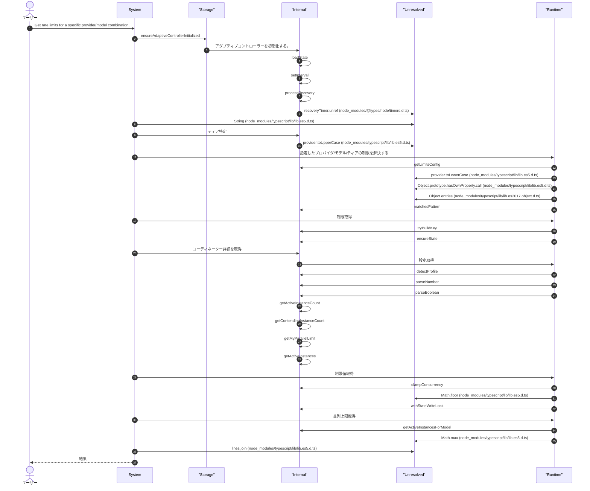
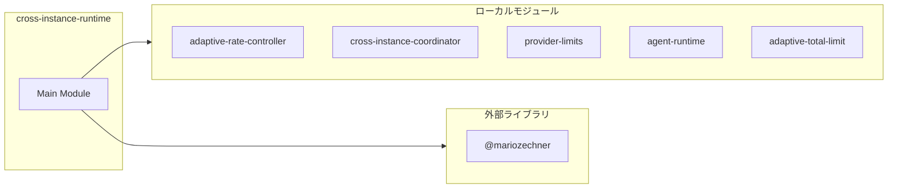
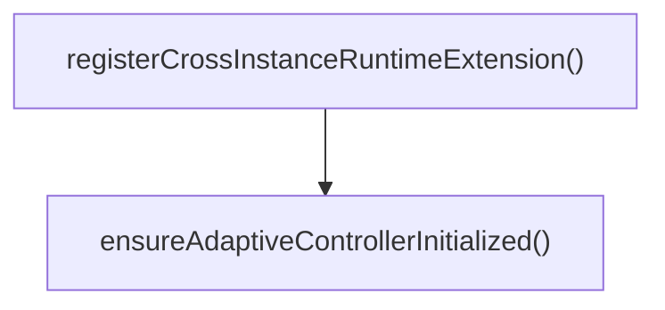

# cross-instance-runtime

## 概要

`cross-instance-runtime` モジュールのAPIリファレンス。

## インポート

```typescript
// from '@mariozechner/pi-ai': Type
// from '@mariozechner/pi-coding-agent': ExtensionAPI
// from '@mariozechner/pi-tui': Text
// from '../lib/adaptive-rate-controller': initAdaptiveController, shutdownAdaptiveController, getEffectiveLimit, ...
// from '../lib/cross-instance-coordinator': registerInstance, unregisterInstance, getCoordinatorStatus, ...
// ... and 3 more imports
```

## エクスポート一覧

| 種別 | 名前 | 説明 |
|------|------|------|
| 関数 | `registerCrossInstanceRuntimeExtension` | 拡張機能を登録 |

## ユーザーフロー

このモジュールが提供するツールと、その実行フローを示します。

### pi_instance_status

Get current cross-instance coordinator status and parallelism allocation.



### pi_model_limits

Get rate limits for a specific provider/model combination.



## 図解

### 依存関係図



### 関数フロー



## 関数

### ensureAdaptiveControllerInitialized

```typescript
ensureAdaptiveControllerInitialized(): void
```

Ensure adaptive controller is initialized (lazy on first session start).
This defers file I/O from extension load time to first actual use.

**戻り値**: `void`

### registerCrossInstanceRuntimeExtension

```typescript
registerCrossInstanceRuntimeExtension(pi: ExtensionAPI): void
```

拡張機能を登録

**パラメータ**

| 名前 | 型 | 必須 |
|------|-----|------|
| pi | `ExtensionAPI` | はい |

**戻り値**: `void`

---
*自動生成: 2026-02-23T06:29:41.929Z*
