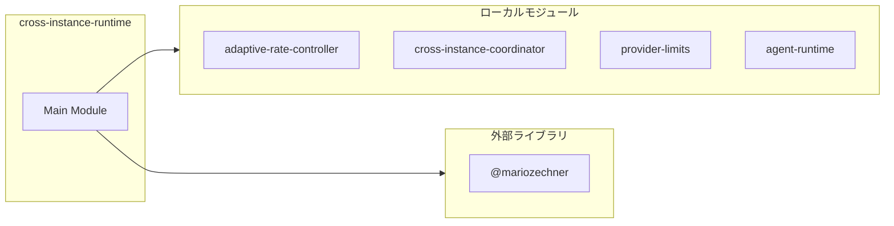

# cross-instance-runtime

## 概要

`cross-instance-runtime` モジュールのAPIリファレンス。

## インポート

```typescript
import { ExtensionAPI } from '@mariozechner/pi-coding-agent';
import { initAdaptiveController, shutdownAdaptiveController, getEffectiveLimit... } from '../lib/adaptive-rate-controller';
import { registerInstance, unregisterInstance, getCoordinatorStatus... } from '../lib/cross-instance-coordinator';
import { resolveLimits, getConcurrencyLimit, formatLimitsSummary... } from '../lib/provider-limits';
import { getRuntimeSnapshot, notifyRuntimeCapacityChanged } from './agent-runtime';
```

## エクスポート一覧

| 種別 | 名前 | 説明 |
|------|------|------|
| 関数 | `registerCrossInstanceRuntimeExtension` | クロスインスタンスランタイム拡張を登録する |

## 図解

### 依存関係図



## 関数

### registerCrossInstanceRuntimeExtension

```typescript
registerCrossInstanceRuntimeExtension(pi: ExtensionAPI): void
```

クロスインスタンスランタイム拡張を登録する

**パラメータ**

| 名前 | 型 | 必須 |
|------|-----|------|
| pi | `ExtensionAPI` | はい |

**戻り値**: `void`

---
*自動生成: 2026-02-18T07:48:44.461Z*
