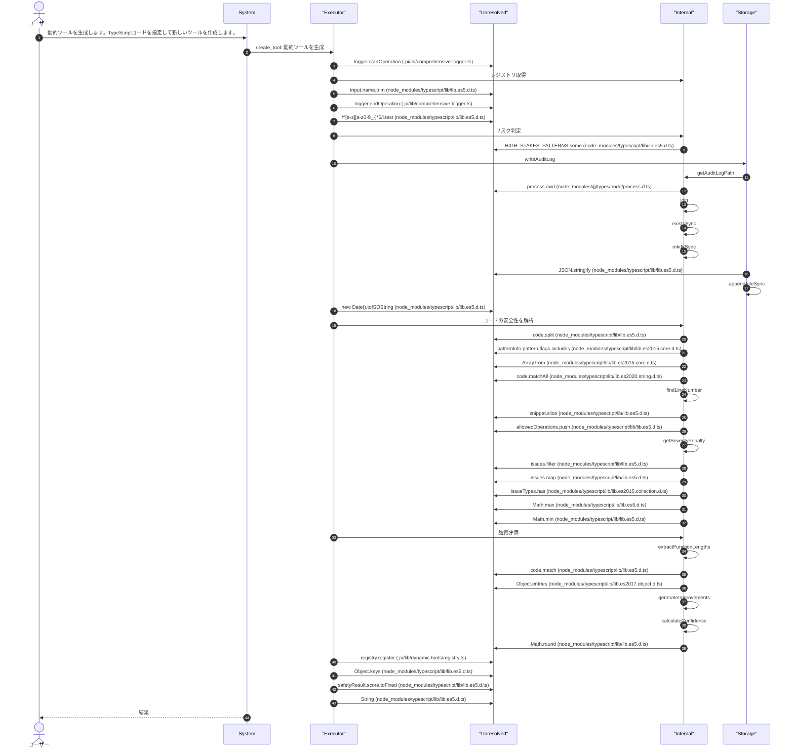
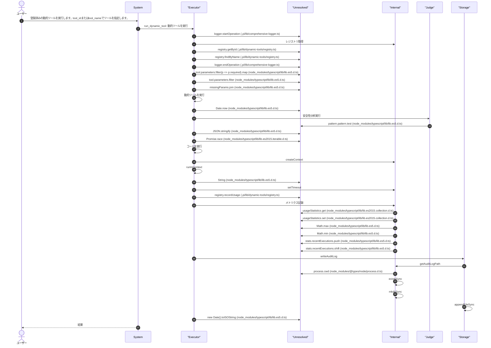
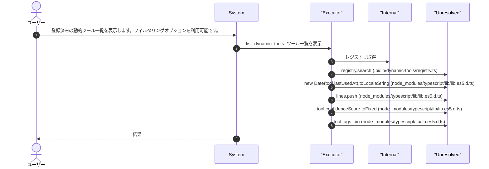
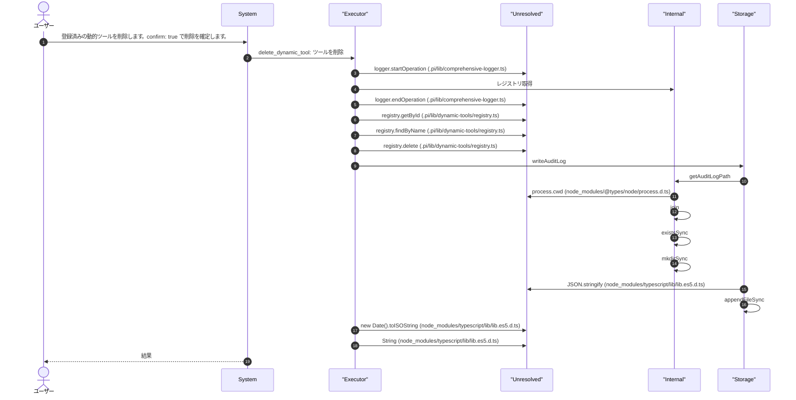
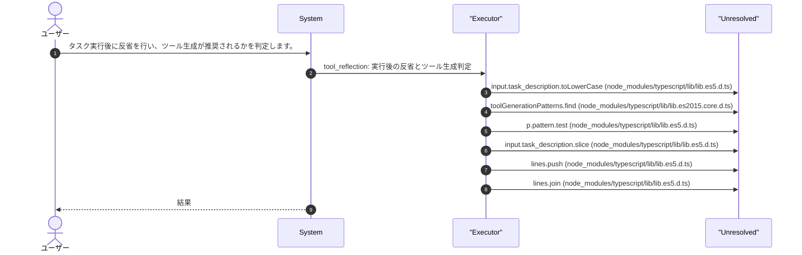
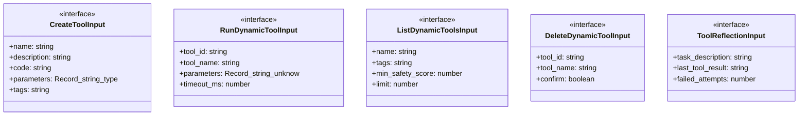
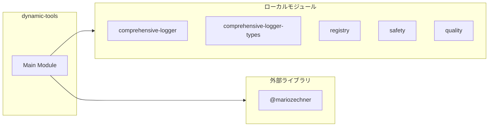
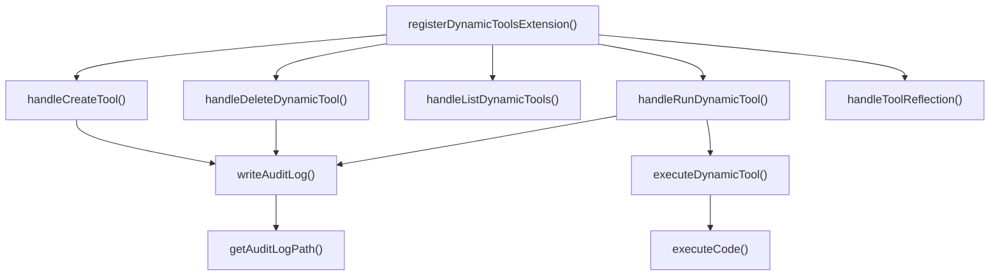
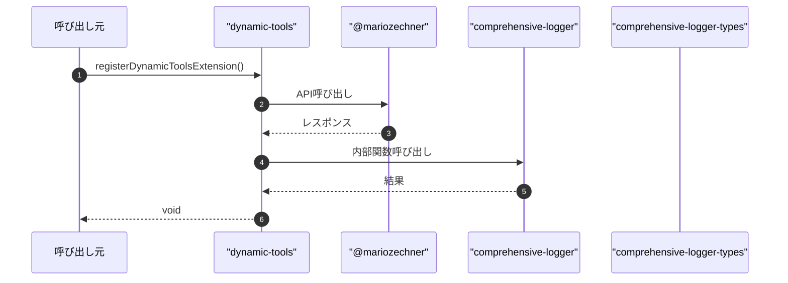

# dynamic-tools

## 概要

`dynamic-tools` モジュールのAPIリファレンス。

## インポート

```typescript
// from 'node:fs': appendFileSync, existsSync, mkdirSync
// from 'node:path': join
// from '@mariozechner/pi-ai': Type
// from '@mariozechner/pi-coding-agent': ExtensionAPI, ToolResultEvent
// from '../lib/comprehensive-logger': getLogger
// ... and 6 more imports
```

## エクスポート一覧

| 種別 | 名前 | 説明 |
|------|------|------|
| 関数 | `registerDynamicToolsExtension` | 動的ツール拡張を登録 |

## ユーザーフロー

このモジュールが提供するツールと、その実行フローを示します。

### create_tool

動的ツールを生成します。TypeScriptコードを指定して新しいツールを作成します。



### run_dynamic_tool

登録済みの動的ツールを実行します。tool_idまたはtool_nameでツールを指定します。



### list_dynamic_tools

登録済みの動的ツール一覧を表示します。フィルタリングオプションを利用可能です。



### delete_dynamic_tool

登録済みの動的ツールを削除します。confirm: true で削除を確定します。



### tool_reflection

タスク実行後に反省を行い、ツール生成が推奨されるかを判定します。



## 図解

### クラス図



### 依存関係図



### 関数フロー



### シーケンス図



## 関数

### getAuditLogPath

```typescript
getAuditLogPath(): string
```

**戻り値**: `string`

### writeAuditLog

```typescript
writeAuditLog(entry: {
  timestamp: string;
  action: string;
  toolId?: string;
  toolName?: string;
  success: boolean;
  details?: Record<string, unknown>;
  error?: string;
}): void
```

**パラメータ**

| 名前 | 型 | 必須 |
|------|-----|------|
| entry | `object` | はい |
| &nbsp;&nbsp;↳ timestamp | `string` | はい |
| &nbsp;&nbsp;↳ action | `string` | はい |
| &nbsp;&nbsp;↳ toolId | `string` | いいえ |
| &nbsp;&nbsp;↳ toolName | `string` | いいえ |
| &nbsp;&nbsp;↳ success | `boolean` | はい |
| &nbsp;&nbsp;↳ details | `Record<string, unknown>` | いいえ |
| &nbsp;&nbsp;↳ error | `string` | いいえ |

**戻り値**: `void`

### executeDynamicTool

```typescript
async executeDynamicTool(tool: DynamicToolDefinition, params: Record<string, unknown>, timeoutMs: number): Promise<ToolExecutionResult>
```

動的ツールを実行
注意: 同一プロセス内でフル権限実行

**パラメータ**

| 名前 | 型 | 必須 |
|------|-----|------|
| tool | `DynamicToolDefinition` | はい |
| params | `Record<string, unknown>` | はい |
| timeoutMs | `number` | はい |

**戻り値**: `Promise<ToolExecutionResult>`

### executeCode

```typescript
async executeCode(code: string): Promise<ToolExecutionResult>
```

コードを実行
セキュリティ: VMコンテキストからrequire, process, タイマーを削除し
外部モジュールアクセス、プロセス操作、サンドボックスエスケープを制限

利用可能なグローバルオブジェクト:
- console, Buffer
- 標準オブジェクト: Promise, JSON, Object, Array, String, Number, Boolean, Date, Math
- エラークラス: Error, TypeError, RangeError, SyntaxError
- URL関連: URL, URLSearchParams

利用不可（セキュリティ制約）:
- require: 外部モジュールアクセス禁止
- process: 環境変数・プロセス情報アクセス禁止
- global, globalThis: グローバルスコープ汚染禁止
- __dirname, __filename: ファイルシステムパス漏洩禁止
- setTimeout, setInterval, clearTimeout, clearInterval: サンドボックスエスケープ防止

**パラメータ**

| 名前 | 型 | 必須 |
|------|-----|------|
| code | `string` | はい |

**戻り値**: `Promise<ToolExecutionResult>`

### handleCreateTool

```typescript
async handleCreateTool(input: CreateToolInput): Promise<string>
```

create_tool: 動的ツールを生成

**パラメータ**

| 名前 | 型 | 必須 |
|------|-----|------|
| input | `CreateToolInput` | はい |

**戻り値**: `Promise<string>`

### handleRunDynamicTool

```typescript
async handleRunDynamicTool(input: RunDynamicToolInput): Promise<string>
```

run_dynamic_tool: 動的ツールを実行

**パラメータ**

| 名前 | 型 | 必須 |
|------|-----|------|
| input | `RunDynamicToolInput` | はい |

**戻り値**: `Promise<string>`

### handleListDynamicTools

```typescript
async handleListDynamicTools(input: ListDynamicToolsInput): Promise<string>
```

list_dynamic_tools: ツール一覧を表示

**パラメータ**

| 名前 | 型 | 必須 |
|------|-----|------|
| input | `ListDynamicToolsInput` | はい |

**戻り値**: `Promise<string>`

### handleDeleteDynamicTool

```typescript
async handleDeleteDynamicTool(input: DeleteDynamicToolInput): Promise<string>
```

delete_dynamic_tool: ツールを削除

**パラメータ**

| 名前 | 型 | 必須 |
|------|-----|------|
| input | `DeleteDynamicToolInput` | はい |

**戻り値**: `Promise<string>`

### handleToolReflection

```typescript
async handleToolReflection(input: ToolReflectionInput): Promise<string>
```

tool_reflection: 実行後の反省とツール生成判定

**パラメータ**

| 名前 | 型 | 必須 |
|------|-----|------|
| input | `ToolReflectionInput` | はい |

**戻り値**: `Promise<string>`

### registerDynamicToolsExtension

```typescript
registerDynamicToolsExtension(pi: ExtensionAPI): void
```

動的ツール拡張を登録

**パラメータ**

| 名前 | 型 | 必須 |
|------|-----|------|
| pi | `ExtensionAPI` | はい |

**戻り値**: `void`

## インターフェース

### CreateToolInput

```typescript
interface CreateToolInput {
  name: string;
  description: string;
  code: string;
  parameters?: Record<string, {
    type: "string" | "number" | "boolean" | "object" | "array";
    description: string;
    default?: unknown;
    enum?: string[];
    minimum?: number;
    maximum?: number;
    required?: boolean;
  }>;
  tags?: string[];
  generated_from?: string;
}
```

### RunDynamicToolInput

```typescript
interface RunDynamicToolInput {
  tool_id?: string;
  tool_name?: string;
  parameters: Record<string, unknown>;
  timeout_ms?: number;
}
```

### ListDynamicToolsInput

```typescript
interface ListDynamicToolsInput {
  name?: string;
  tags?: string[];
  min_safety_score?: number;
  limit?: number;
}
```

### DeleteDynamicToolInput

```typescript
interface DeleteDynamicToolInput {
  tool_id?: string;
  tool_name?: string;
  confirm?: boolean;
}
```

### ToolReflectionInput

```typescript
interface ToolReflectionInput {
  task_description: string;
  last_tool_result: string;
  failed_attempts?: number;
}
```

---
*自動生成: 2026-02-18T18:06:17.245Z*
