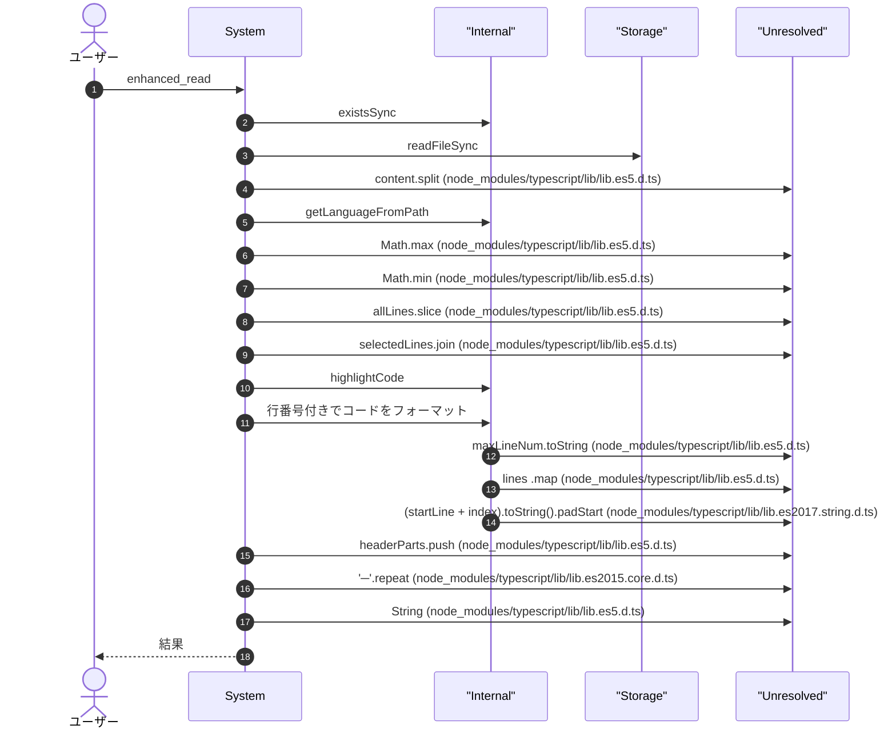
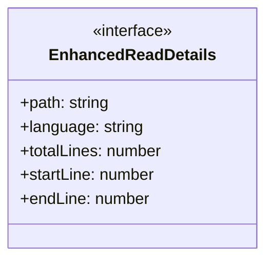
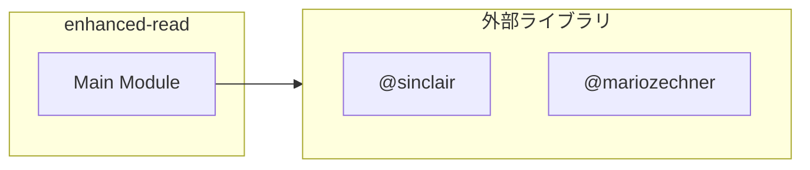

# enhanced-read

## 概要

`enhanced-read` モジュールのAPIリファレンス。

## インポート

```typescript
// from 'node:fs': fs
// from '@sinclair/typebox': Type
// from '@mariozechner/pi-coding-agent': ExtensionAPI
// from '@mariozechner/pi-coding-agent': highlightCode, getLanguageFromPath
// from '@mariozechner/pi-tui': Text
```

## エクスポート一覧

| 種別 | 名前 | 説明 |
|------|------|------|

## ユーザーフロー

このモジュールが提供するツールと、その実行フローを示します。

### enhanced_read




## 図解

### クラス図



### 依存関係図



## 関数

### formatWithLineNumbers

```typescript
formatWithLineNumbers(lines: string[], startLine: number): string
```

**パラメータ**

| 名前 | 型 | 必須 |
|------|-----|------|
| lines | `string[]` | はい |
| startLine | `number` | はい |

**戻り値**: `string`

## インターフェース

### EnhancedReadDetails

```typescript
interface EnhancedReadDetails {
  path: string;
  language: string;
  totalLines: number;
  startLine: number;
  endLine: number;
  displayedLines: number;
  error?: string;
}
```

---
*自動生成: 2026-02-22T18:55:28.494Z*
