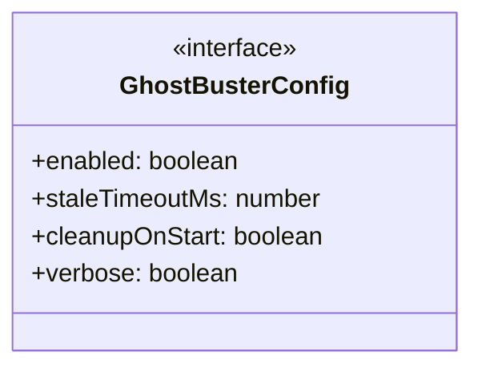
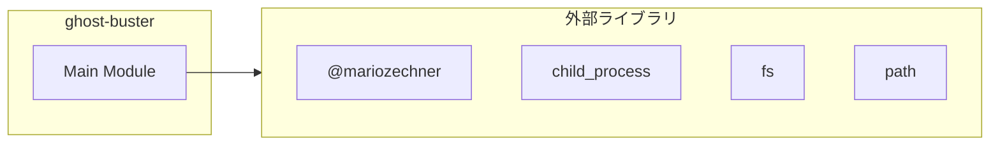

# ghost-buster

## 概要

`ghost-buster` モジュールのAPIリファレンス。

## インポート

```typescript
// from '@mariozechner/pi-coding-agent': ExtensionAPI
// from 'child_process': execSync
// from 'fs': fs
// from 'path': path
```

## エクスポート一覧

| 種別 | 名前 | 説明 |
|------|------|------|

## 図解

### クラス図



### 依存関係図



## 関数

### isProcessRunning

```typescript
isProcessRunning(pid: number): boolean
```

プロセスが実行中か確認

**パラメータ**

| 名前 | 型 | 必須 |
|------|-----|------|
| pid | `number` | はい |

**戻り値**: `boolean`

### isPiProcess

```typescript
isPiProcess(pid: number): boolean
```

プロセスがpiプロセスか確認

**パラメータ**

| 名前 | 型 | 必須 |
|------|-----|------|
| pid | `number` | はい |

**戻り値**: `boolean`

### parseLockFile

```typescript
parseLockFile(filePath: string): { instanceId: string; pid: number } | null
```

ロックファイルからインスタンス情報を解析

**パラメータ**

| 名前 | 型 | 必須 |
|------|-----|------|
| filePath | `string` | はい |

**戻り値**: `{ instanceId: string; pid: number } | null`

### cleanupGhostLocks

```typescript
cleanupGhostLocks(config: GhostBusterConfig, ctx?: ExtensionAPI): string[]
```

ゴーストロックファイルを検出・削除

**パラメータ**

| 名前 | 型 | 必須 |
|------|-----|------|
| config | `GhostBusterConfig` | はい |
| ctx | `ExtensionAPI` | いいえ |

**戻り値**: `string[]`

## インターフェース

### GhostBusterConfig

```typescript
interface GhostBusterConfig {
  enabled: boolean;
  staleTimeoutMs: number;
  cleanupOnStart: boolean;
  verbose: boolean;
}
```

ゴーストバスター設定

---
*自動生成: 2026-02-28T13:55:18.966Z*
