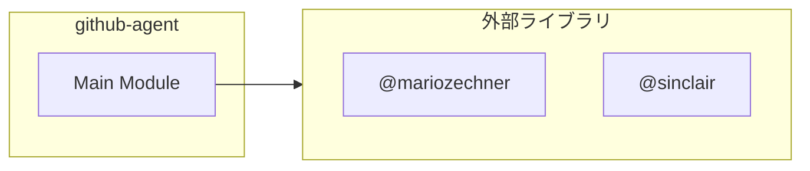

# github-agent

## 概要

`github-agent` モジュールのAPIリファレンス。

## インポート

```typescript
import { execFile } from 'node:child_process';
import { promisify } from 'node:util';
import { ExtensionAPI } from '@mariozechner/pi-coding-agent';
import { Type, Static } from '@sinclair/typebox';
// ... and 1 more imports
```

## エクスポート一覧

| 種別 | 名前 | 説明 |
|------|------|------|

## 図解

### 依存関係図



## 型定義

### GhAgentArgs

```typescript
type GhAgentArgs = Static<typeof GhAgentParams>
```

---
*自動生成: 2026-02-18T07:17:30.217Z*
