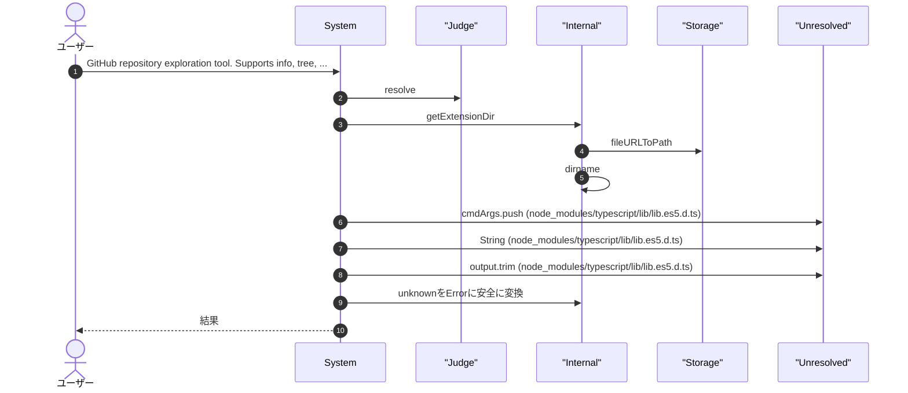
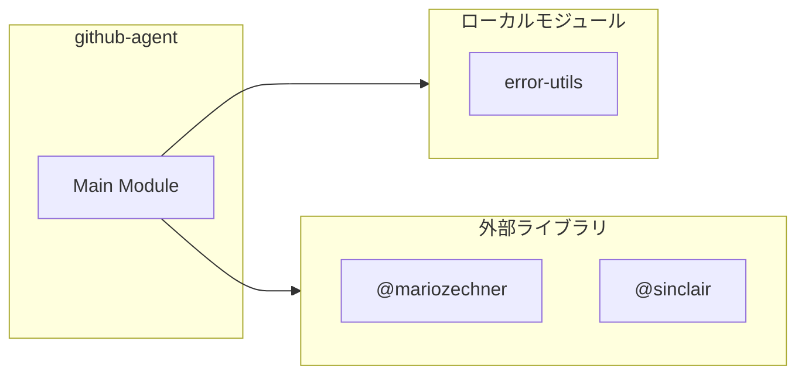

# github-agent

## 概要

`github-agent` モジュールのAPIリファレンス。

## インポート

```typescript
// from 'node:path': dirname, resolve
// from 'node:url': fileURLToPath
// from 'node:child_process': execFile
// from 'node:util': promisify
// from '@mariozechner/pi-coding-agent': ExtensionAPI
// ... and 3 more imports
```

## エクスポート一覧

| 種別 | 名前 | 説明 |
|------|------|------|

## ユーザーフロー

このモジュールが提供するツールと、その実行フローを示します。

### gh_agent

GitHub repository exploration tool. Supports info, tree, read, and search commands.



## 図解

### 依存関係図



## 関数

### getExtensionDir

```typescript
getExtensionDir(): string
```

**戻り値**: `string`

## 型定義

### GhAgentArgs

```typescript
type GhAgentArgs = Static<typeof GhAgentParams>
```

---
*自動生成: 2026-02-28T13:55:18.969Z*
