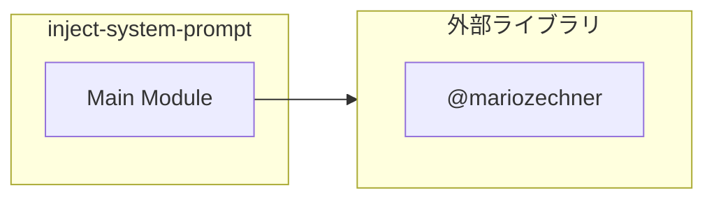

# inject-system-prompt

## 概要

`inject-system-prompt` モジュールのAPIリファレンス。

## インポート

```typescript
// from '@mariozechner/pi-coding-agent': ExtensionAPI
// from 'node:fs': readFileSync, existsSync
// from 'node:path': join, dirname
// from 'node:url': fileURLToPath
```

## エクスポート一覧

| 種別 | 名前 | 説明 |
|------|------|------|

## 図解

### 依存関係図



## 関数

### readGuideFile

```typescript
readGuideFile(filename: string): string
```

docsディレクトリからガイドファイルを読み込む

**パラメータ**

| 名前 | 型 | 必須 |
|------|-----|------|
| filename | `string` | はい |

**戻り値**: `string`

---
*自動生成: 2026-02-28T13:55:18.970Z*
