# invariant-pipeline

## 概要

`invariant-pipeline` モジュールのAPIリファレンス。

## インポート

```typescript
import { readFileSync, writeFileSync, existsSync... } from 'node:fs';
import { join, dirname } from 'node:path';
import { Type } from '@mariozechner/pi-ai';
import { ExtensionAPI } from '@mariozechner/pi-coding-agent';
```

## エクスポート一覧

| 種別 | 名前 | 説明 |
|------|------|------|

## 図解

### クラス図

```mermaid
classDiagram
  class SpecState {
    <<interface>>
    +name: string
    +type: string
    +initialValue: unknown
    +constraints: string
  }
  class SpecOperation {
    <<interface>>
    +name: string
    +parameters: name_string_type_st
    +preconditions: string
    +postconditions: string
    +description: string
  }
  class SpecInvariant {
    <<interface>>
    +name: string
    +condition: string
    +description: string
  }
  class ParsedSpec {
    <<interface>>
    +title: string
    +description: string
    +states: SpecState
    +operations: SpecOperation
    +invariants: SpecInvariant
  }
  class GenerationOutput {
    <<interface>>
    +content: string
    +warnings: string
    +errors: string
  }
  class GenerationResult {
    <<interface>>
    +success: boolean
    +outputs: quint_path_string
    +errors: string
    +warnings: string
  }
  class VerifyQuintInput {
    <<interface>>
    +quint_path: string
    +check_invariants: boolean
    +check_liveness: boolean
  }
  class GenerateMacrosInput {
    <<interface>>
    +spec_path: string
    +output_path: string
    +struct_name: string
  }
  class GenerateTestsInput {
    <<interface>>
    +spec_path: string
    +output_path: string
    +struct_name: string
    +test_count: number
  }
  class GenerateMBTInput {
    <<interface>>
    +spec_path: string
    +output_path: string
    +struct_name: string
    +max_steps: number
  }
  class TransitionResult {
    <<interface>>
    +code: string
    +warning: string
  }
```



### 依存関係図


## 関数

### parseSpecMarkdown

```typescript
parseSpecMarkdown(content: string): ParsedSpec
```

**パラメータ**

| 名前 | 型 | 必須 |
|------|-----|------|
| content | `string` | はい |

**戻り値**: `ParsedSpec`

### parseConstantValue

```typescript
parseConstantValue(valueStr: string, type: string): unknown
```

Parse constant value based on type

**パラメータ**

| 名前 | 型 | 必須 |
|------|-----|------|
| valueStr | `string` | はい |
| type | `string` | はい |

**戻り値**: `unknown`

### generateQuintSpec

```typescript
generateQuintSpec(spec: ParsedSpec, moduleName?: string): GenerationOutput
```

**パラメータ**

| 名前 | 型 | 必須 |
|------|-----|------|
| spec | `ParsedSpec` | はい |
| moduleName | `string` | いいえ |

**戻り値**: `GenerationOutput`

### mapTypeToQuint

```typescript
mapTypeToQuint(type: string): string
```

**パラメータ**

| 名前 | 型 | 必須 |
|------|-----|------|
| type | `string` | はい |

**戻り値**: `string`

### getDefaultValue

```typescript
getDefaultValue(type: string): unknown
```

**パラメータ**

| 名前 | 型 | 必須 |
|------|-----|------|
| type | `string` | はい |

**戻り値**: `unknown`

### formatValue

```typescript
formatValue(value: unknown, type: string): string
```

**パラメータ**

| 名前 | 型 | 必須 |
|------|-----|------|
| value | `unknown` | はい |
| type | `string` | はい |

**戻り値**: `string`

### generateRustMacros

```typescript
generateRustMacros(spec: ParsedSpec, structName?: string): GenerationOutput
```

**パラメータ**

| 名前 | 型 | 必須 |
|------|-----|------|
| spec | `ParsedSpec` | はい |
| structName | `string` | いいえ |

**戻り値**: `GenerationOutput`

### mapTypeToRust

```typescript
mapTypeToRust(type: string): string
```

**パラメータ**

| 名前 | 型 | 必須 |
|------|-----|------|
| type | `string` | はい |

**戻り値**: `string`

### translateConditionToRust

```typescript
translateConditionToRust(condition: string): string
```

**パラメータ**

| 名前 | 型 | 必須 |
|------|-----|------|
| condition | `string` | はい |

**戻り値**: `string`

### translateToModelAccess

```typescript
translateToModelAccess(condition: string, states: SpecState[]): string
```

Translate condition to use model.field access for state variables

**パラメータ**

| 名前 | 型 | 必須 |
|------|-----|------|
| condition | `string` | はい |
| states | `SpecState[]` | はい |

**戻り値**: `string`

### translatePreconditionToRust

```typescript
translatePreconditionToRust(precondition: string, states: SpecState[], prefix: string): string
```

Translate precondition to Rust expression for guard checks
Converts natural language/math notation to Rust boolean expressions
Uses model.field access pattern for state variables

**パラメータ**

| 名前 | 型 | 必須 |
|------|-----|------|
| precondition | `string` | はい |
| states | `SpecState[]` | はい |
| prefix | `string` | はい |

**戻り値**: `string`

### translatePostconditionToOperationCode

```typescript
translatePostconditionToOperationCode(postcondition: string, states: SpecState[]): string
```

Translate postcondition to state transition code for operation tests
Returns Rust code that modifies model state

**パラメータ**

| 名前 | 型 | 必須 |
|------|-----|------|
| postcondition | `string` | はい |
| states | `SpecState[]` | はい |

**戻り値**: `string`

### translatePostconditionToTransition

```typescript
translatePostconditionToTransition(postcondition: string, states: SpecState[]): TransitionResult
```

**パラメータ**

| 名前 | 型 | 必須 |
|------|-----|------|
| postcondition | `string` | はい |
| states | `SpecState[]` | はい |

**戻り値**: `TransitionResult`

### generatePropertyTests

```typescript
generatePropertyTests(spec: ParsedSpec, structName?: string, testCount?: number): GenerationOutput
```

**パラメータ**

| 名前 | 型 | 必須 |
|------|-----|------|
| spec | `ParsedSpec` | はい |
| structName | `string` | いいえ |
| testCount | `number` | いいえ |

**戻り値**: `GenerationOutput`

### generateMBTDriver

```typescript
generateMBTDriver(spec: ParsedSpec, structName?: string, maxSteps?: number): GenerationOutput
```

**パラメータ**

| 名前 | 型 | 必須 |
|------|-----|------|
| spec | `ParsedSpec` | はい |
| structName | `string` | いいえ |
| maxSteps | `number` | いいえ |

**戻り値**: `GenerationOutput`

### capitalize

```typescript
capitalize(s: string): string
```

**パラメータ**

| 名前 | 型 | 必須 |
|------|-----|------|
| s | `string` | はい |

**戻り値**: `string`

### formatRustValue

```typescript
formatRustValue(value: unknown, type: string): string
```

**パラメータ**

| 名前 | 型 | 必須 |
|------|-----|------|
| value | `unknown` | はい |
| type | `string` | はい |

**戻り値**: `string`

### getRustDefault

```typescript
getRustDefault(type: string): string
```

**パラメータ**

| 名前 | 型 | 必須 |
|------|-----|------|
| type | `string` | はい |

**戻り値**: `string`

## インターフェース

### SpecState

```typescript
interface SpecState {
  name: string;
  type: string;
  initialValue?: unknown;
  constraints?: string[];
}
```

### SpecOperation

```typescript
interface SpecOperation {
  name: string;
  parameters?: { name: string; type: string }[];
  preconditions?: string[];
  postconditions?: string[];
  description?: string;
}
```

### SpecInvariant

```typescript
interface SpecInvariant {
  name: string;
  condition: string;
  description?: string;
}
```

### ParsedSpec

```typescript
interface ParsedSpec {
  title: string;
  description?: string;
  states: SpecState[];
  operations: SpecOperation[];
  invariants: SpecInvariant[];
  constants?: { name: string; type: string; value?: unknown }[];
}
```

### GenerationOutput

```typescript
interface GenerationOutput {
  content: string;
  warnings: string[];
  errors: string[];
}
```

### GenerationResult

```typescript
interface GenerationResult {
  success: boolean;
  outputs: {
    quint?: { path: string; content: string };
    macros?: { path: string; content: string };
    tests?: { path: string; content: string };
    mbt?: { path: string; content: string };
  };
  errors: string[];
  warnings: string[];
}
```

### VerifyQuintInput

```typescript
interface VerifyQuintInput {
  quint_path: string;
  check_invariants?: boolean;
  check_liveness?: boolean;
}
```

### GenerateMacrosInput

```typescript
interface GenerateMacrosInput {
  spec_path: string;
  output_path?: string;
  struct_name?: string;
}
```

### GenerateTestsInput

```typescript
interface GenerateTestsInput {
  spec_path: string;
  output_path?: string;
  struct_name?: string;
  test_count?: number;
}
```

### GenerateMBTInput

```typescript
interface GenerateMBTInput {
  spec_path: string;
  output_path?: string;
  struct_name?: string;
  max_steps?: number;
}
```

### TransitionResult

```typescript
interface TransitionResult {
  code: string;
  warning?: string;
}
```

Translate postcondition to state transition code
Handles patterns like:
- "count = count + 1" -> "new_state.count = self.count + 1"
- "count == old_count + 1" -> "new_state.count = self.count + 1"

---
*自動生成: 2026-02-18T07:48:44.495Z*
