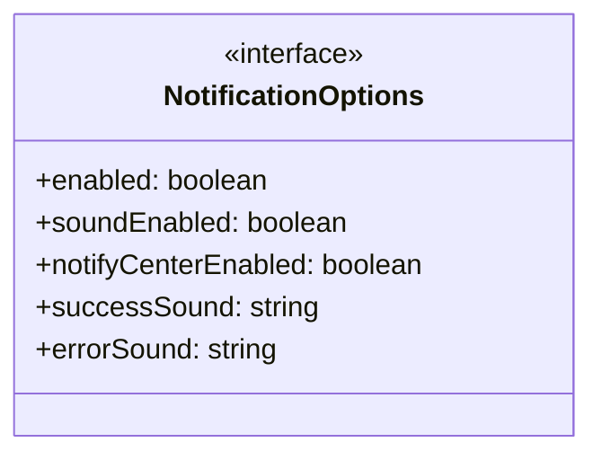

# kitty-status-integration

## 概要

`kitty-status-integration` モジュールのAPIリファレンス。

## インポート

```typescript
import { spawn, execSync } from 'child_process';
import { ExtensionAPI } from '@mariozechner/pi-coding-agent';
```

## エクスポート一覧

| 種別 | 名前 | 説明 |
|------|------|------|

## 図解

### クラス図



### 依存関係図

```mermaid
flowchart LR
  subgraph this[kitty-status-integration]
    main[Main Module]
  end
  subgraph external[外部ライブラリ]
    child_process[child_process]
    _mariozechner[@mariozechner]
  end
  main --> external
```

## 関数

### isKitty

```typescript
isKitty(): boolean
```

**戻り値**: `boolean`

### setTitle

```typescript
setTitle(title: string): void
```

**パラメータ**

| 名前 | 型 | 必須 |
|------|-----|------|
| title | `string` | はい |

**戻り値**: `void`

### notifyMacOS

```typescript
notifyMacOS(text: string, title: any): void
```

**パラメータ**

| 名前 | 型 | 必須 |
|------|-----|------|
| text | `string` | はい |
| title | `any` | はい |

**戻り値**: `void`

### playSound

```typescript
playSound(soundPath: string): void
```

**パラメータ**

| 名前 | 型 | 必須 |
|------|-----|------|
| soundPath | `string` | はい |

**戻り値**: `void`

### notifyKitty

```typescript
notifyKitty(text: string, duration: any): void
```

**パラメータ**

| 名前 | 型 | 必須 |
|------|-----|------|
| text | `string` | はい |
| duration | `any` | はい |

**戻り値**: `void`

### notify

```typescript
notify(text: string, duration: any, title: any, isError: any): void
```

**パラメータ**

| 名前 | 型 | 必須 |
|------|-----|------|
| text | `string` | はい |
| duration | `any` | はい |
| title | `any` | はい |
| isError | `any` | はい |

**戻り値**: `void`

### setWindow

```typescript
setWindow(title: string): void
```

**パラメータ**

| 名前 | 型 | 必須 |
|------|-----|------|
| title | `string` | はい |

**戻り値**: `void`

### restoreTitle

```typescript
restoreTitle(): void
```

**戻り値**: `void`

## インターフェース

### NotificationOptions

```typescript
interface NotificationOptions {
  enabled: boolean;
  soundEnabled: boolean;
  notifyCenterEnabled: boolean;
  successSound: string;
  errorSound: string;
}
```

---
*自動生成: 2026-02-17T22:16:16.473Z*
