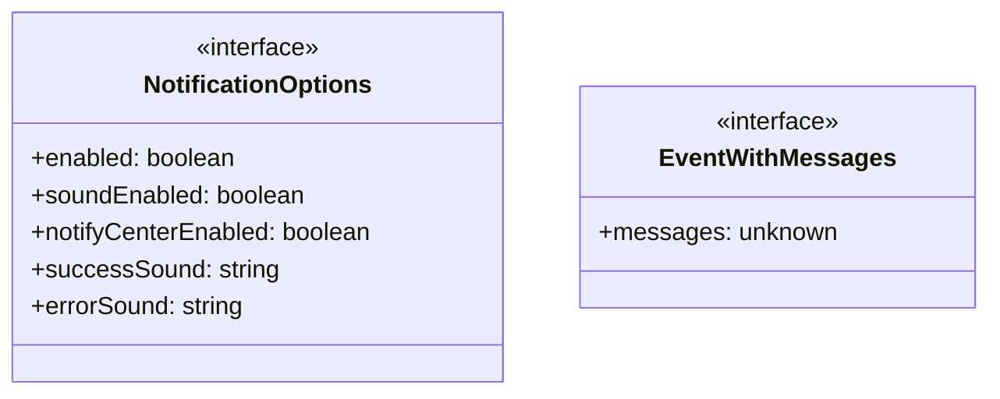
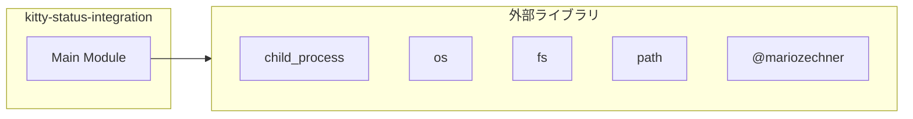
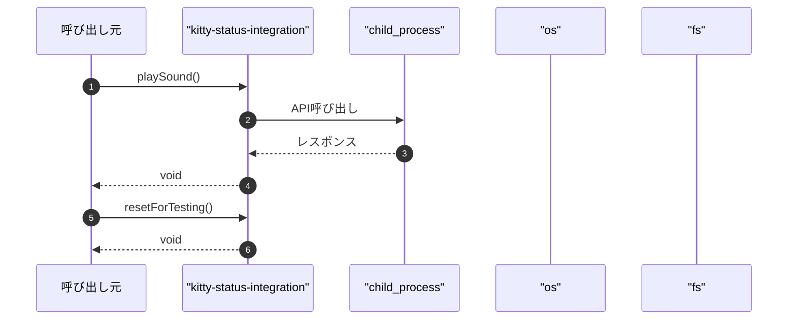

# kitty-status-integration

## 概要

`kitty-status-integration` モジュールのAPIリファレンス。

## インポート

```typescript
// from 'child_process': spawn
// from 'os': homedir
// from 'fs': closeSync, existsSync, openSync, ...
// from 'path': extname, isAbsolute, resolve
// from '@mariozechner/pi-coding-agent': ExtensionAPI
```

## エクスポート一覧

| 種別 | 名前 | 説明 |
|------|------|------|
| 関数 | `playSound` | - |
| 関数 | `resetForTesting` | テスト用のリセット関数 |

## 図解

### クラス図



### 依存関係図



### シーケンス図



## 関数

### wrapForTmuxPassthrough

```typescript
wrapForTmuxPassthrough(data: string): string
```

**パラメータ**

| 名前 | 型 | 必須 |
|------|-----|------|
| data | `string` | はい |

**戻り値**: `string`

### writeToTerminal

```typescript
writeToTerminal(data: string): void
```

**パラメータ**

| 名前 | 型 | 必須 |
|------|-----|------|
| data | `string` | はい |

**戻り値**: `void`

### closeTerminalIfNeeded

```typescript
closeTerminalIfNeeded(): void
```

**戻り値**: `void`

### isKitty

```typescript
isKitty(): boolean
```

**戻り値**: `boolean`

### setTitle

```typescript
setTitle(title: string): void
```

**パラメータ**

| 名前 | 型 | 必須 |
|------|-----|------|
| title | `string` | はい |

**戻り値**: `void`

### notifyMacOS

```typescript
notifyMacOS(text: string, title: any): void
```

**パラメータ**

| 名前 | 型 | 必須 |
|------|-----|------|
| text | `string` | はい |
| title | `any` | はい |

**戻り値**: `void`

### playSound

```typescript
playSound(soundPath: string): void
```

**パラメータ**

| 名前 | 型 | 必須 |
|------|-----|------|
| soundPath | `string` | はい |

**戻り値**: `void`

### notifyKitty

```typescript
notifyKitty(text: string, duration: any): void
```

**パラメータ**

| 名前 | 型 | 必須 |
|------|-----|------|
| text | `string` | はい |
| duration | `any` | はい |

**戻り値**: `void`

### notify

```typescript
notify(text: string, duration: any, title: any, isError: any): void
```

**パラメータ**

| 名前 | 型 | 必須 |
|------|-----|------|
| text | `string` | はい |
| duration | `any` | はい |
| title | `any` | はい |
| isError | `any` | はい |

**戻り値**: `void`

### emitKittyGraphics

```typescript
emitKittyGraphics(control: string, payload: any): void
```

**パラメータ**

| 名前 | 型 | 必須 |
|------|-----|------|
| control | `string` | はい |
| payload | `any` | はい |

**戻り値**: `void`

### clearKittyImages

```typescript
clearKittyImages(): void
```

**戻り値**: `void`

### setWindow

```typescript
setWindow(title: string): void
```

**パラメータ**

| 名前 | 型 | 必須 |
|------|-----|------|
| title | `string` | はい |

**戻り値**: `void`

### restoreTitle

```typescript
restoreTitle(): void
```

**戻り値**: `void`

### asToolResultMessage

```typescript
asToolResultMessage(raw: unknown): { role?: string; isError?: boolean } | null
```

**パラメータ**

| 名前 | 型 | 必須 |
|------|-----|------|
| raw | `unknown` | はい |

**戻り値**: `{ role?: string; isError?: boolean } | null`

### getToolResultStats

```typescript
getToolResultStats(messages: unknown[]): { toolCount: number; errorCount: number }
```

**パラメータ**

| 名前 | 型 | 必須 |
|------|-----|------|
| messages | `unknown[]` | はい |

**戻り値**: `{ toolCount: number; errorCount: number }`

### resetForTesting

```typescript
resetForTesting(): void
```

テスト用のリセット関数

**戻り値**: `void`

### hasMessages

```typescript
hasMessages(value: unknown): value is EventWithMessages
```

**パラメータ**

| 名前 | 型 | 必須 |
|------|-----|------|
| value | `unknown` | はい |

**戻り値**: `value is EventWithMessages`

## インターフェース

### NotificationOptions

```typescript
interface NotificationOptions {
  enabled: boolean;
  soundEnabled: boolean;
  notifyCenterEnabled: boolean;
  successSound: string;
  errorSound: string;
}
```

### EventWithMessages

```typescript
interface EventWithMessages {
  messages?: unknown[];
}
```

---
*自動生成: 2026-02-28T13:55:19.004Z*
