# loop

## 概要

`loop` モジュールのAPIリファレンス。

## インポート

```typescript
import { spawn } from 'node:child_process';
import { randomBytes } from 'node:crypto';
import { dnsLookup } from 'node:dns/promises';
import { appendFileSync, existsSync, mkdirSync... } from 'node:fs';
import { basename, isAbsolute, join... } from 'node:path';
// ... and 19 more imports
```

## エクスポート一覧

| 種別 | 名前 | 説明 |
|------|------|------|
| 関数 | `registerLoopExtension` | - |

## 図解

### クラス図

```mermaid
classDiagram
  class LoopConfig {
    <<interface>>
    +maxIterations: number
    +timeoutMs: number
    +requireCitation: boolean
    +verificationTimeoutMs: number
    +enableSemanticStagnation: boolean
  }
  class LoopIterationResult {
    <<interface>>
    +iteration: number
    +latencyMs: number
    +status: LoopStatus
    +goalStatus: LoopGoalStatus
    +goalEvidence: string
  }
  class LoopRunSummary {
    <<interface>>
    +runId: string
    +startedAt: string
    +finishedAt: string
    +task: string
    +completed: boolean
  }
  class LoopRunOutput {
    <<interface>>
    +summary: LoopRunSummary
    +finalOutput: string
    +iterations: LoopIterationResult[]
  }
  class LoopRunInput {
    <<interface>>
    +task: string
    +goal: string
    +verificationCommand: string
    +config: LoopConfig
    +references: LoopReference[]
  }
  class LoopProgress {
    <<interface>>
    +type: run_startiteration_startiteration_donerun_done
    +iteration: number
    +maxIterations: number
    +status: LoopStatus
    +latencyMs: number
  }
  class ParsedLoopCommand {
    <<interface>>
    +mode: helpstatusrun
    +task: string
    +goal: string
    +verifyCommand: string
    +refs: string[]
  }
  class LoopActivityIndicator {
    <<interface>>
    +updateFromProgress: progressLoopProgress>void
    +stop: >void
  }
  class ParsedLoopContract {
    <<interface>>
    +status: LoopStatus
    +goalStatus: LoopGoalStatus
    +goalEvidence: string
    +citations: string[]
    +summary: string
  }
  class VerificationPolicyConfig {
    <<interface>>
    +mode: VerificationPolicyMode
    +everyN: number
  }
  class ParsedVerificationCommand {
    <<interface>>
    +executable: string
    +args: string[]
    +error: string
  }
```



### 依存関係図

```mermaid
flowchart LR
  subgraph this[loop]
    main[Main Module]
  end
  subgraph local[ローカルモジュール]
    format_utils_js[format-utils.js]
    error_utils_js[error-utils.js]
    validation_utils_js[validation-utils.js]
    agent_types_js[agent-types.js]
    agent_utils_js[agent-utils.js]
  end
  main --> local
  subgraph external[外部ライブラリ]
    _mariozechner[@mariozechner]
    _mariozechner[@mariozechner]
    _mariozechner[@mariozechner]
  end
  main --> external
```

## 関数

### registerLoopExtension

```typescript
registerLoopExtension(pi: ExtensionAPI): void
```

**パラメータ**

| 名前 | 型 | 必須 |
|------|-----|------|
| pi | `ExtensionAPI` | はい |

**戻り値**: `void`

### runLoop

```typescript
async runLoop(input: LoopRunInput): Promise<LoopRunOutput>
```

**パラメータ**

| 名前 | 型 | 必須 |
|------|-----|------|
| input | `LoopRunInput` | はい |

**戻り値**: `Promise<LoopRunOutput>`

### normalizeLoopConfig

```typescript
normalizeLoopConfig(overrides: Partial<LoopConfig>): { ok: true; config: LoopConfig } | { ok: false; error: string }
```

**パラメータ**

| 名前 | 型 | 必須 |
|------|-----|------|
| overrides | `Partial<LoopConfig>` | はい |

**戻り値**: `{ ok: true; config: LoopConfig } | { ok: false; error: string }`

### parseLoopCommand

```typescript
parseLoopCommand(args: string | undefined): ParsedLoopCommand
```

**パラメータ**

| 名前 | 型 | 必須 |
|------|-----|------|
| args | `string | undefined` | はい |

**戻り値**: `ParsedLoopCommand`

### withArgError

```typescript
withArgError(error: string): ParsedLoopCommand
```

**パラメータ**

| 名前 | 型 | 必須 |
|------|-----|------|
| error | `string` | はい |

**戻り値**: `ParsedLoopCommand`

### tokenizeArgs

```typescript
tokenizeArgs(input: string): string[]
```

**パラメータ**

| 名前 | 型 | 必須 |
|------|-----|------|
| input | `string` | はい |

**戻り値**: `string[]`

### callModelViaPi

```typescript
async callModelViaPi(model: { provider: string; id: string; thinkingLevel: ThinkingLevel }, prompt: string, timeoutMs: number, signal?: AbortSignal): Promise<string>
```

**パラメータ**

| 名前 | 型 | 必須 |
|------|-----|------|
| model | `{ provider: string; id: string; thinkingLevel: ThinkingLevel }` | はい |
| prompt | `string` | はい |
| timeoutMs | `number` | はい |
| signal | `AbortSignal` | いいえ |

**戻り値**: `Promise<string>`

### startLoopActivityIndicator

```typescript
startLoopActivityIndicator(ctx: any, maxIterations: number): LoopActivityIndicator
```

**パラメータ**

| 名前 | 型 | 必須 |
|------|-----|------|
| ctx | `any` | はい |
| maxIterations | `number` | はい |

**戻り値**: `LoopActivityIndicator`

### render

```typescript
render(): void
```

**戻り値**: `void`

### formatLoopProgress

```typescript
formatLoopProgress(progress: LoopProgress): string
```

**パラメータ**

| 名前 | 型 | 必須 |
|------|-----|------|
| progress | `LoopProgress` | はい |

**戻り値**: `string`

### formatLoopResultText

```typescript
formatLoopResultText(summary: LoopRunSummary, finalOutput: string, warnings: string[]): string
```

**パラメータ**

| 名前 | 型 | 必須 |
|------|-----|------|
| summary | `LoopRunSummary` | はい |
| finalOutput | `string` | はい |
| warnings | `string[]` | はい |

**戻り値**: `string`

### formatLoopSummary

```typescript
formatLoopSummary(summary: LoopRunSummary): string
```

**パラメータ**

| 名前 | 型 | 必須 |
|------|-----|------|
| summary | `LoopRunSummary` | はい |

**戻り値**: `string`

### readLatestSummary

```typescript
readLatestSummary(cwd: string): LoopRunSummary | null
```

**パラメータ**

| 名前 | 型 | 必須 |
|------|-----|------|
| cwd | `string` | はい |

**戻り値**: `LoopRunSummary | null`

### writeLatestSummarySnapshot

```typescript
writeLatestSummarySnapshot(path: string, payload: string): void
```

**パラメータ**

| 名前 | 型 | 必須 |
|------|-----|------|
| path | `string` | はい |
| payload | `string` | はい |

**戻り値**: `void`

### appendJsonl

```typescript
appendJsonl(path: string, value: unknown): void
```

**パラメータ**

| 名前 | 型 | 必須 |
|------|-----|------|
| path | `string` | はい |
| value | `unknown` | はい |

**戻り値**: `void`

### normalizeRefSpec

```typescript
normalizeRefSpec(value: string): string
```

**パラメータ**

| 名前 | 型 | 必須 |
|------|-----|------|
| value | `string` | はい |

**戻り値**: `string`

### resolvePath

```typescript
resolvePath(cwd: string, pathLike: string): string
```

**パラメータ**

| 名前 | 型 | 必須 |
|------|-----|------|
| cwd | `string` | はい |
| pathLike | `string` | はい |

**戻り値**: `string`

### looksLikeUrl

```typescript
looksLikeUrl(value: string): boolean
```

**パラメータ**

| 名前 | 型 | 必須 |
|------|-----|------|
| value | `string` | はい |

**戻り値**: `boolean`

### looksLikeHtml

```typescript
looksLikeHtml(value: string): boolean
```

**パラメータ**

| 名前 | 型 | 必須 |
|------|-----|------|
| value | `string` | はい |

**戻り値**: `boolean`

### htmlToText

```typescript
htmlToText(value: string): string
```

**パラメータ**

| 名前 | 型 | 必須 |
|------|-----|------|
| value | `string` | はい |

**戻り値**: `string`

### truncateText

```typescript
truncateText(value: string, maxChars: number): string
```

**パラメータ**

| 名前 | 型 | 必須 |
|------|-----|------|
| value | `string` | はい |
| maxChars | `number` | はい |

**戻り値**: `string`

### toPreview

```typescript
toPreview(value: string, maxChars: number): string
```

**パラメータ**

| 名前 | 型 | 必須 |
|------|-----|------|
| value | `string` | はい |
| maxChars | `number` | はい |

**戻り値**: `string`

### normalizeOptionalText

```typescript
normalizeOptionalText(value: unknown): string | undefined
```

**パラメータ**

| 名前 | 型 | 必須 |
|------|-----|------|
| value | `unknown` | はい |

**戻り値**: `string | undefined`

### throwIfAborted

```typescript
throwIfAborted(signal: AbortSignal | undefined): void
```

**パラメータ**

| 名前 | 型 | 必須 |
|------|-----|------|
| signal | `AbortSignal | undefined` | はい |

**戻り値**: `void`

## インターフェース

### LoopConfig

```typescript
interface LoopConfig {
  maxIterations: number;
  timeoutMs: number;
  requireCitation: boolean;
  verificationTimeoutMs: number;
  enableSemanticStagnation?: boolean;
  semanticRepetitionThreshold?: number;
}
```

### LoopIterationResult

```typescript
interface LoopIterationResult {
  iteration: number;
  latencyMs: number;
  status: LoopStatus;
  goalStatus: LoopGoalStatus;
  goalEvidence: string;
  verification?: LoopVerificationResult;
  citations: string[];
  validationErrors: string[];
  output: string;
}
```

### LoopRunSummary

```typescript
interface LoopRunSummary {
  runId: string;
  startedAt: string;
  finishedAt: string;
  task: string;
  completed: boolean;
  stopReason: "model_done" | "max_iterations" | "stagnation" | "iteration_error";
  iterationCount: number;
  maxIterations: number;
  referenceCount: number;
  goal?: string;
  verificationCommand?: string;
  verificationTimeoutMs?: number;
  lastGoalStatus?: LoopGoalStatus;
  lastVerificationPassed?: boolean;
  model: {
    provider: string;
    id: string;
    thinkingLevel: ThinkingLevel;
  };
  config: LoopConfig;
  logFile: string;
  summaryFile: string;
  finalPreview: string;
  intentClassification?: {
    intent: TaskIntent;
    confidence: number;
  };
  semanticStagnation?: {
    detected: boolean;
    averageSimilarity: number;
    method: "embedding" | "exact" | "unavailable";
  };
}
```

### LoopRunOutput

```typescript
interface LoopRunOutput {
  summary: LoopRunSummary;
  finalOutput: string;
  iterations: LoopIterationResult[];
}
```

### LoopRunInput

```typescript
interface LoopRunInput {
  task: string;
  goal?: string;
  verificationCommand?: string;
  config: LoopConfig;
  references: LoopReference[];
  model: {
    provider: string;
    id: string;
    thinkingLevel: ThinkingLevel;
  };
  cwd: string;
  signal?: AbortSignal;
  onProgress?: (progress: LoopProgress) => void;
}
```

### LoopProgress

```typescript
interface LoopProgress {
  type: "run_start" | "iteration_start" | "iteration_done" | "run_done";
  iteration?: number;
  maxIterations: number;
  status?: LoopStatus;
  latencyMs?: number;
  validationErrors?: string[];
  taskPreview?: string;
  focusPreview?: string;
  commandPreview?: string;
  summaryPreview?: string;
}
```

### ParsedLoopCommand

```typescript
interface ParsedLoopCommand {
  mode: "help" | "status" | "run";
  task: string;
  goal?: string;
  verifyCommand?: string;
  refs: string[];
  refsFile?: string;
  configOverrides: Partial<LoopConfig>;
  error?: string;
}
```

### LoopActivityIndicator

```typescript
interface LoopActivityIndicator {
  updateFromProgress: (progress: LoopProgress) => void;
  stop: () => void;
}
```

### ParsedLoopContract

```typescript
interface ParsedLoopContract {
  status: LoopStatus;
  goalStatus: LoopGoalStatus;
  goalEvidence: string;
  citations: string[];
  summary: string;
  nextActions: string[];
  parseErrors: string[];
  usedStructuredBlock: boolean;
}
```

### VerificationPolicyConfig

```typescript
interface VerificationPolicyConfig {
  mode: VerificationPolicyMode;
  everyN: number;
}
```

### ParsedVerificationCommand

```typescript
interface ParsedVerificationCommand {
  executable: string;
  args: string[];
  error?: string;
}
```

## 型定義

### VerificationPolicyMode

```typescript
type VerificationPolicyMode = "always" | "done_only" | "every_n"
```

---
*自動生成: 2026-02-17T21:48:27.549Z*
