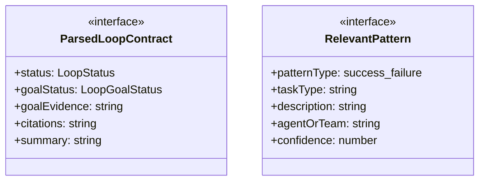
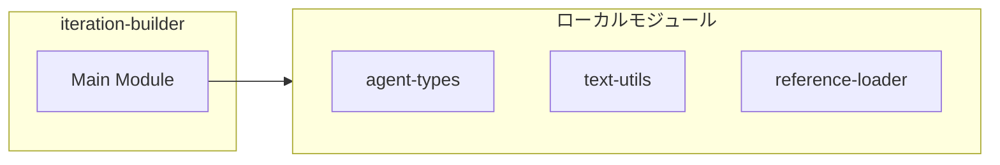
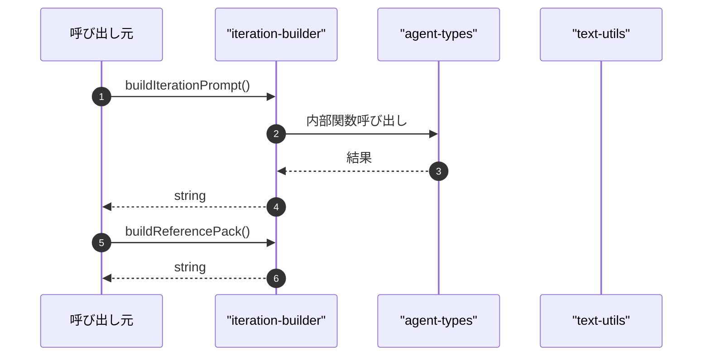

# iteration-builder

## 概要

`iteration-builder` モジュールのAPIリファレンス。

## インポート

```typescript
// from '../../lib/agent-types.js': ThinkingLevel
// from '../../lib/text-utils.js': truncateText, toPreview, normalizeOptionalText
// from './reference-loader': LoopReference
```

## エクスポート一覧

| 種別 | 名前 | 説明 |
|------|------|------|
| 関数 | `buildIterationPrompt` | - |
| 関数 | `buildReferencePack` | 参照情報をパック形式の文字列に変換 |
| 関数 | `buildIterationFocus` | 反復フォーカス構築 |
| 関数 | `buildLoopCommandPreview` | ループコマンドのプレビュー文字列を生成する |
| 関数 | `buildIterationFailureOutput` | イテレーション失敗時の出力を生成 |
| 関数 | `parseLoopContract` | ループ契約を解析 |
| 関数 | `extractLoopResultBody` | ループ結果の本文を抽出 |
| 関数 | `validateIteration` | 入力値を検証してエラーを返す |
| 関数 | `normalizeValidationFeedback` | 検証フィードバックを正規化 |
| 関数 | `buildDoneDeclarationFeedback` | Build feedback when done declaration is rejected |
| 関数 | `extractNextStepLine` | 次のステップ行を抽出する |
| 関数 | `extractSummaryLine` | 要約行を抽出する |
| 関数 | `normalizeLoopOutput` | 出力文字を正規化する |
| インターフェース | `ParsedLoopContract` | ループ契約解析結果 |
| インターフェース | `RelevantPattern` | 関連パターン情報 |
| 型 | `LoopStatus` | ループの進行状態を表す型 |
| 型 | `LoopGoalStatus` | ループの状態を表す型 |

## 図解

### クラス図



### 依存関係図



### 関数フロー

```mermaid
flowchart TD
  buildDoneDeclarationFeedback["buildDoneDeclarationFeedback()"]
  buildIterationFailureOutput["buildIterationFailureOutput()"]
  buildIterationFocus["buildIterationFocus()"]
  buildIterationPrompt["buildIterationPrompt()"]
  buildLoopCommandPreview["buildLoopCommandPreview()"]
  buildReferencePack["buildReferencePack()"]
  extractCitations["extractCitations()"]
  extractGoalEvidence["extractGoalEvidence()"]
  extractLoopResultBody["extractLoopResultBody()"]
  extractNextStepLine["extractNextStepLine()"]
  extractSummaryLine["extractSummaryLine()"]
  extractTaggedBlock["extractTaggedBlock()"]
  normalizeCitationList["normalizeCitationList()"]
  normalizeLoopStatus["normalizeLoopStatus()"]
  normalizeStringArray["normalizeStringArray()"]
  normalizeValidationFeedback["normalizeValidationFeedback()"]
  normalizeValidationIssue["normalizeValidationIssue()"]
  parseLoopContract["parseLoopContract()"]
  parseLoopGoalStatus["parseLoopGoalStatus()"]
  parseLoopJsonObject["parseLoopJsonObject()"]
  parseLoopStatus["parseLoopStatus()"]
  parseStructuredLoopGoalStatus["parseStructuredLoopGoalStatus()"]
  validateIteration["validateIteration()"]
  validationIssuePriority["validationIssuePriority()"]
  buildIterationFocus --> extractNextStepLine
  buildIterationPrompt --> buildReferencePack
  extractLoopResultBody --> extractTaggedBlock
  normalizeValidationFeedback --> normalizeValidationIssue
  normalizeValidationFeedback --> validationIssuePriority
  parseLoopContract --> extractCitations
  parseLoopContract --> extractGoalEvidence
  parseLoopContract --> extractNextStepLine
  parseLoopContract --> extractSummaryLine
  parseLoopContract --> normalizeCitationList
  parseLoopContract --> normalizeLoopStatus
  parseLoopContract --> normalizeStringArray
  parseLoopContract --> parseLoopGoalStatus
  parseLoopContract --> parseLoopJsonObject
  parseLoopContract --> parseLoopStatus
  parseLoopContract --> parseStructuredLoopGoalStatus
```



### シーケンス図



## 関数

### buildIterationPrompt

```typescript
buildIterationPrompt(input: {
  task: string;
  goal?: string;
  verificationCommand?: string;
  iteration: number;
  maxIterations: number;
  references: LoopReference[];
  previousOutput: string;
  validationFeedback: string[];
  relevantPatterns?: RelevantPattern[];
}): string
```

**パラメータ**

| 名前 | 型 | 必須 |
|------|-----|------|
| input | `object` | はい |
| &nbsp;&nbsp;↳ task | `string` | はい |
| &nbsp;&nbsp;↳ goal | `string` | いいえ |
| &nbsp;&nbsp;↳ verificationCommand | `string` | いいえ |
| &nbsp;&nbsp;↳ iteration | `number` | はい |
| &nbsp;&nbsp;↳ maxIterations | `number` | はい |
| &nbsp;&nbsp;↳ references | `LoopReference[]` | はい |
| &nbsp;&nbsp;↳ previousOutput | `string` | はい |
| &nbsp;&nbsp;↳ validationFeedback | `string[]` | はい |
| &nbsp;&nbsp;↳ relevantPatterns | `RelevantPattern[]` | いいえ |

**戻り値**: `string`

### buildReferencePack

```typescript
buildReferencePack(references: LoopReference[]): string
```

参照情報をパック形式の文字列に変換

**パラメータ**

| 名前 | 型 | 必須 |
|------|-----|------|
| references | `LoopReference[]` | はい |

**戻り値**: `string`

### buildIterationFocus

```typescript
buildIterationFocus(task: string, previousOutput: string, validationFeedback: string[]): string
```

反復フォーカス構築

**パラメータ**

| 名前 | 型 | 必須 |
|------|-----|------|
| task | `string` | はい |
| previousOutput | `string` | はい |
| validationFeedback | `string[]` | はい |

**戻り値**: `string`

### buildLoopCommandPreview

```typescript
buildLoopCommandPreview(model: {
  provider: string;
  id: string;
  thinkingLevel: ThinkingLevel;
}): string
```

ループコマンドのプレビュー文字列を生成する

**パラメータ**

| 名前 | 型 | 必須 |
|------|-----|------|
| model | `object` | はい |
| &nbsp;&nbsp;↳ provider | `string` | はい |
| &nbsp;&nbsp;↳ id | `string` | はい |
| &nbsp;&nbsp;↳ thinkingLevel | `ThinkingLevel` | はい |

**戻り値**: `string`

### buildIterationFailureOutput

```typescript
buildIterationFailureOutput(message: string): string
```

イテレーション失敗時の出力を生成

**パラメータ**

| 名前 | 型 | 必須 |
|------|-----|------|
| message | `string` | はい |

**戻り値**: `string`

### parseLoopContract

```typescript
parseLoopContract(output: string, hasGoal: boolean): ParsedLoopContract
```

ループ契約を解析

**パラメータ**

| 名前 | 型 | 必須 |
|------|-----|------|
| output | `string` | はい |
| hasGoal | `boolean` | はい |

**戻り値**: `ParsedLoopContract`

### extractLoopResultBody

```typescript
extractLoopResultBody(output: string): string
```

ループ結果の本文を抽出

**パラメータ**

| 名前 | 型 | 必須 |
|------|-----|------|
| output | `string` | はい |

**戻り値**: `string`

### validateIteration

```typescript
validateIteration(input: {
  status: LoopStatus;
  goal?: string;
  goalStatus: LoopGoalStatus;
  citations: string[];
  referenceCount: number;
  requireCitation: boolean;
  confidenceScore?: number;
}): string[]
```

入力値を検証してエラーを返す

**パラメータ**

| 名前 | 型 | 必須 |
|------|-----|------|
| input | `object` | はい |
| &nbsp;&nbsp;↳ status | `LoopStatus` | はい |
| &nbsp;&nbsp;↳ goal | `string` | いいえ |
| &nbsp;&nbsp;↳ goalStatus | `LoopGoalStatus` | はい |
| &nbsp;&nbsp;↳ citations | `string[]` | はい |
| &nbsp;&nbsp;↳ referenceCount | `number` | はい |
| &nbsp;&nbsp;↳ requireCitation | `boolean` | はい |
| &nbsp;&nbsp;↳ confidenceScore | `number` | いいえ |

**戻り値**: `string[]`

### normalizeValidationFeedback

```typescript
normalizeValidationFeedback(errors: string[]): string[]
```

検証フィードバックを正規化

**パラメータ**

| 名前 | 型 | 必須 |
|------|-----|------|
| errors | `string[]` | はい |

**戻り値**: `string[]`

### buildDoneDeclarationFeedback

```typescript
buildDoneDeclarationFeedback(observations: string[]): string[]
```

Build feedback when done declaration is rejected

Utopia/Dystopia perspective:
This is NOT a "punishment" or "correction" system that enforces correctness.
Instead, it provides information and invites the agent to make a conscious choice.

This supports "critical utopia" - an open process rather than a closed system.
The agent retains genuine freedom to choose how to proceed.

**パラメータ**

| 名前 | 型 | 必須 |
|------|-----|------|
| observations | `string[]` | はい |

**戻り値**: `string[]`

### parseLoopJsonObject

```typescript
parseLoopJsonObject(output: string): Record<string, unknown> | undefined
```

**パラメータ**

| 名前 | 型 | 必須 |
|------|-----|------|
| output | `string` | はい |

**戻り値**: `Record<string, unknown> | undefined`

### extractTaggedBlock

```typescript
extractTaggedBlock(output: string, tag: string): string | undefined
```

**パラメータ**

| 名前 | 型 | 必須 |
|------|-----|------|
| output | `string` | はい |
| tag | `string` | はい |

**戻り値**: `string | undefined`

### stripMarkdownCodeFence

```typescript
stripMarkdownCodeFence(value: string): string
```

**パラメータ**

| 名前 | 型 | 必須 |
|------|-----|------|
| value | `string` | はい |

**戻り値**: `string`

### parseLoopStatus

```typescript
parseLoopStatus(output: string): LoopStatus
```

**パラメータ**

| 名前 | 型 | 必須 |
|------|-----|------|
| output | `string` | はい |

**戻り値**: `LoopStatus`

### parseLoopGoalStatus

```typescript
parseLoopGoalStatus(output: string, hasGoal: boolean): LoopGoalStatus
```

**パラメータ**

| 名前 | 型 | 必須 |
|------|-----|------|
| output | `string` | はい |
| hasGoal | `boolean` | はい |

**戻り値**: `LoopGoalStatus`

### extractGoalEvidence

```typescript
extractGoalEvidence(output: string): string
```

**パラメータ**

| 名前 | 型 | 必須 |
|------|-----|------|
| output | `string` | はい |

**戻り値**: `string`

### extractCitations

```typescript
extractCitations(output: string): string[]
```

**パラメータ**

| 名前 | 型 | 必須 |
|------|-----|------|
| output | `string` | はい |

**戻り値**: `string[]`

### extractNextStepLine

```typescript
extractNextStepLine(output: string): string
```

次のステップ行を抽出する

**パラメータ**

| 名前 | 型 | 必須 |
|------|-----|------|
| output | `string` | はい |

**戻り値**: `string`

### extractSummaryLine

```typescript
extractSummaryLine(output: string): string
```

要約行を抽出する

**パラメータ**

| 名前 | 型 | 必須 |
|------|-----|------|
| output | `string` | はい |

**戻り値**: `string`

### normalizeLoopStatus

```typescript
normalizeLoopStatus(value: unknown): LoopStatus
```

**パラメータ**

| 名前 | 型 | 必須 |
|------|-----|------|
| value | `unknown` | はい |

**戻り値**: `LoopStatus`

### normalizeLoopGoalStatus

```typescript
normalizeLoopGoalStatus(value: unknown): LoopGoalStatus
```

**パラメータ**

| 名前 | 型 | 必須 |
|------|-----|------|
| value | `unknown` | はい |

**戻り値**: `LoopGoalStatus`

### parseStructuredLoopGoalStatus

```typescript
parseStructuredLoopGoalStatus(value: unknown): { status: LoopGoalStatus; valid: boolean }
```

**パラメータ**

| 名前 | 型 | 必須 |
|------|-----|------|
| value | `unknown` | はい |

**戻り値**: `{ status: LoopGoalStatus; valid: boolean }`

### normalizeStringArray

```typescript
normalizeStringArray(value: unknown): string[]
```

**パラメータ**

| 名前 | 型 | 必須 |
|------|-----|------|
| value | `unknown` | はい |

**戻り値**: `string[]`

### normalizeCitationId

```typescript
normalizeCitationId(value: unknown): string | undefined
```

**パラメータ**

| 名前 | 型 | 必須 |
|------|-----|------|
| value | `unknown` | はい |

**戻り値**: `string | undefined`

### normalizeCitationList

```typescript
normalizeCitationList(values: unknown[]): string[]
```

**パラメータ**

| 名前 | 型 | 必須 |
|------|-----|------|
| values | `unknown[]` | はい |

**戻り値**: `string[]`

### normalizeValidationIssue

```typescript
normalizeValidationIssue(issue: string): string
```

**パラメータ**

| 名前 | 型 | 必須 |
|------|-----|------|
| issue | `string` | はい |

**戻り値**: `string`

### validationIssuePriority

```typescript
validationIssuePriority(issue: string): number
```

**パラメータ**

| 名前 | 型 | 必須 |
|------|-----|------|
| issue | `string` | はい |

**戻り値**: `number`

### normalizeLoopOutput

```typescript
normalizeLoopOutput(value: string): string
```

出力文字を正規化する

**パラメータ**

| 名前 | 型 | 必須 |
|------|-----|------|
| value | `string` | はい |

**戻り値**: `string`

## インターフェース

### ParsedLoopContract

```typescript
interface ParsedLoopContract {
  status: LoopStatus;
  goalStatus: LoopGoalStatus;
  goalEvidence: string;
  citations: string[];
  summary: string;
  nextActions: string[];
  parseErrors: string[];
  usedStructuredBlock: boolean;
  confidenceScore?: number;
}
```

ループ契約解析結果

### RelevantPattern

```typescript
interface RelevantPattern {
  patternType: "success" | "failure" | "approach";
  taskType: string;
  description: string;
  agentOrTeam: string;
  confidence: number;
  keywords: string[];
}
```

関連パターン情報

## 型定義

### LoopStatus

```typescript
type LoopStatus = "continue" | "done" | "unknown"
```

ループの進行状態を表す型

### LoopGoalStatus

```typescript
type LoopGoalStatus = "met" | "not_met" | "unknown"
```

ループの状態を表す型

---
*自動生成: 2026-02-23T06:29:42.020Z*
