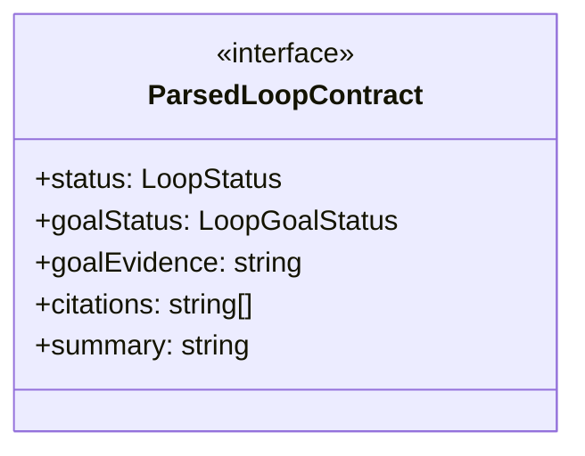
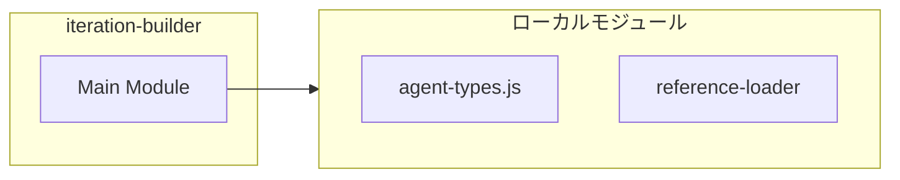
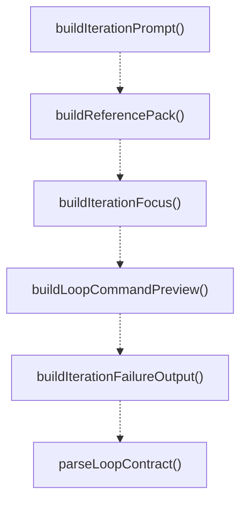
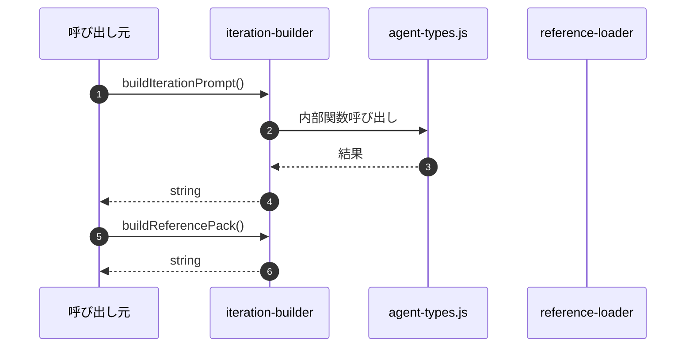

# iteration-builder

## 概要

`iteration-builder` モジュールのAPIリファレンス。

## インポート

```typescript
import { ThinkingLevel } from '../../lib/agent-types.js';
import { LoopReference } from './reference-loader';
```

## エクスポート一覧

| 種別 | 名前 | 説明 |
|------|------|------|
| 関数 | `buildIterationPrompt` | - |
| 関数 | `buildReferencePack` | - |
| 関数 | `buildIterationFocus` | - |
| 関数 | `buildLoopCommandPreview` | - |
| 関数 | `buildIterationFailureOutput` | - |
| 関数 | `parseLoopContract` | - |
| 関数 | `extractLoopResultBody` | - |
| 関数 | `validateIteration` | - |
| 関数 | `normalizeValidationFeedback` | - |
| 関数 | `buildDoneDeclarationFeedback` | - |
| 関数 | `extractNextStepLine` | - |
| 関数 | `extractSummaryLine` | - |
| 関数 | `normalizeLoopOutput` | - |
| インターフェース | `ParsedLoopContract` | - |
| 型 | `LoopStatus` | - |
| 型 | `LoopGoalStatus` | - |

## 図解

### クラス図



### 依存関係図



### 関数フロー



### シーケンス図



## 関数

### buildIterationPrompt

```typescript
buildIterationPrompt(input: {
  task: string;
  goal?: string;
  verificationCommand?: string;
  iteration: number;
  maxIterations: number;
  references: LoopReference[];
  previousOutput: string;
  validationFeedback: string[];
}): string
```

**パラメータ**

| 名前 | 型 | 必須 |
|------|-----|------|
| input | `{
  task: string;
  goal?: string;
  verificationCommand?: string;
  iteration: number;
  maxIterations: number;
  references: LoopReference[];
  previousOutput: string;
  validationFeedback: string[];
}` | はい |

**戻り値**: `string`

### buildReferencePack

```typescript
buildReferencePack(references: LoopReference[]): string
```

**パラメータ**

| 名前 | 型 | 必須 |
|------|-----|------|
| references | `LoopReference[]` | はい |

**戻り値**: `string`

### buildIterationFocus

```typescript
buildIterationFocus(task: string, previousOutput: string, validationFeedback: string[]): string
```

**パラメータ**

| 名前 | 型 | 必須 |
|------|-----|------|
| task | `string` | はい |
| previousOutput | `string` | はい |
| validationFeedback | `string[]` | はい |

**戻り値**: `string`

### buildLoopCommandPreview

```typescript
buildLoopCommandPreview(model: {
  provider: string;
  id: string;
  thinkingLevel: ThinkingLevel;
}): string
```

**パラメータ**

| 名前 | 型 | 必須 |
|------|-----|------|
| model | `{
  provider: string;
  id: string;
  thinkingLevel: ThinkingLevel;
}` | はい |

**戻り値**: `string`

### buildIterationFailureOutput

```typescript
buildIterationFailureOutput(message: string): string
```

**パラメータ**

| 名前 | 型 | 必須 |
|------|-----|------|
| message | `string` | はい |

**戻り値**: `string`

### parseLoopContract

```typescript
parseLoopContract(output: string, hasGoal: boolean): ParsedLoopContract
```

**パラメータ**

| 名前 | 型 | 必須 |
|------|-----|------|
| output | `string` | はい |
| hasGoal | `boolean` | はい |

**戻り値**: `ParsedLoopContract`

### extractLoopResultBody

```typescript
extractLoopResultBody(output: string): string
```

**パラメータ**

| 名前 | 型 | 必須 |
|------|-----|------|
| output | `string` | はい |

**戻り値**: `string`

### validateIteration

```typescript
validateIteration(input: {
  status: LoopStatus;
  goal?: string;
  goalStatus: LoopGoalStatus;
  citations: string[];
  referenceCount: number;
  requireCitation: boolean;
}): string[]
```

**パラメータ**

| 名前 | 型 | 必須 |
|------|-----|------|
| input | `{
  status: LoopStatus;
  goal?: string;
  goalStatus: LoopGoalStatus;
  citations: string[];
  referenceCount: number;
  requireCitation: boolean;
}` | はい |

**戻り値**: `string[]`

### normalizeValidationFeedback

```typescript
normalizeValidationFeedback(errors: string[]): string[]
```

**パラメータ**

| 名前 | 型 | 必須 |
|------|-----|------|
| errors | `string[]` | はい |

**戻り値**: `string[]`

### buildDoneDeclarationFeedback

```typescript
buildDoneDeclarationFeedback(errors: string[]): string[]
```

**パラメータ**

| 名前 | 型 | 必須 |
|------|-----|------|
| errors | `string[]` | はい |

**戻り値**: `string[]`

### parseLoopJsonObject

```typescript
parseLoopJsonObject(output: string): Record<string, unknown> | undefined
```

**パラメータ**

| 名前 | 型 | 必須 |
|------|-----|------|
| output | `string` | はい |

**戻り値**: `Record<string, unknown> | undefined`

### extractTaggedBlock

```typescript
extractTaggedBlock(output: string, tag: string): string | undefined
```

**パラメータ**

| 名前 | 型 | 必須 |
|------|-----|------|
| output | `string` | はい |
| tag | `string` | はい |

**戻り値**: `string | undefined`

### stripMarkdownCodeFence

```typescript
stripMarkdownCodeFence(value: string): string
```

**パラメータ**

| 名前 | 型 | 必須 |
|------|-----|------|
| value | `string` | はい |

**戻り値**: `string`

### parseLoopStatus

```typescript
parseLoopStatus(output: string): LoopStatus
```

**パラメータ**

| 名前 | 型 | 必須 |
|------|-----|------|
| output | `string` | はい |

**戻り値**: `LoopStatus`

### parseLoopGoalStatus

```typescript
parseLoopGoalStatus(output: string, hasGoal: boolean): LoopGoalStatus
```

**パラメータ**

| 名前 | 型 | 必須 |
|------|-----|------|
| output | `string` | はい |
| hasGoal | `boolean` | はい |

**戻り値**: `LoopGoalStatus`

### extractGoalEvidence

```typescript
extractGoalEvidence(output: string): string
```

**パラメータ**

| 名前 | 型 | 必須 |
|------|-----|------|
| output | `string` | はい |

**戻り値**: `string`

### extractCitations

```typescript
extractCitations(output: string): string[]
```

**パラメータ**

| 名前 | 型 | 必須 |
|------|-----|------|
| output | `string` | はい |

**戻り値**: `string[]`

### extractNextStepLine

```typescript
extractNextStepLine(output: string): string
```

**パラメータ**

| 名前 | 型 | 必須 |
|------|-----|------|
| output | `string` | はい |

**戻り値**: `string`

### extractSummaryLine

```typescript
extractSummaryLine(output: string): string
```

**パラメータ**

| 名前 | 型 | 必須 |
|------|-----|------|
| output | `string` | はい |

**戻り値**: `string`

### normalizeLoopStatus

```typescript
normalizeLoopStatus(value: unknown): LoopStatus
```

**パラメータ**

| 名前 | 型 | 必須 |
|------|-----|------|
| value | `unknown` | はい |

**戻り値**: `LoopStatus`

### normalizeLoopGoalStatus

```typescript
normalizeLoopGoalStatus(value: unknown): LoopGoalStatus
```

**パラメータ**

| 名前 | 型 | 必須 |
|------|-----|------|
| value | `unknown` | はい |

**戻り値**: `LoopGoalStatus`

### parseStructuredLoopGoalStatus

```typescript
parseStructuredLoopGoalStatus(value: unknown): { status: LoopGoalStatus; valid: boolean }
```

**パラメータ**

| 名前 | 型 | 必須 |
|------|-----|------|
| value | `unknown` | はい |

**戻り値**: `{ status: LoopGoalStatus; valid: boolean }`

### normalizeStringArray

```typescript
normalizeStringArray(value: unknown): string[]
```

**パラメータ**

| 名前 | 型 | 必須 |
|------|-----|------|
| value | `unknown` | はい |

**戻り値**: `string[]`

### normalizeCitationId

```typescript
normalizeCitationId(value: unknown): string | undefined
```

**パラメータ**

| 名前 | 型 | 必須 |
|------|-----|------|
| value | `unknown` | はい |

**戻り値**: `string | undefined`

### normalizeCitationList

```typescript
normalizeCitationList(values: unknown[]): string[]
```

**パラメータ**

| 名前 | 型 | 必須 |
|------|-----|------|
| values | `unknown[]` | はい |

**戻り値**: `string[]`

### normalizeValidationIssue

```typescript
normalizeValidationIssue(issue: string): string
```

**パラメータ**

| 名前 | 型 | 必須 |
|------|-----|------|
| issue | `string` | はい |

**戻り値**: `string`

### validationIssuePriority

```typescript
validationIssuePriority(issue: string): number
```

**パラメータ**

| 名前 | 型 | 必須 |
|------|-----|------|
| issue | `string` | はい |

**戻り値**: `number`

### normalizeOptionalText

```typescript
normalizeOptionalText(value: unknown): string | undefined
```

**パラメータ**

| 名前 | 型 | 必須 |
|------|-----|------|
| value | `unknown` | はい |

**戻り値**: `string | undefined`

### truncateText

```typescript
truncateText(value: string, maxChars: number): string
```

**パラメータ**

| 名前 | 型 | 必須 |
|------|-----|------|
| value | `string` | はい |
| maxChars | `number` | はい |

**戻り値**: `string`

### toPreview

```typescript
toPreview(value: string, maxChars: number): string
```

**パラメータ**

| 名前 | 型 | 必須 |
|------|-----|------|
| value | `string` | はい |
| maxChars | `number` | はい |

**戻り値**: `string`

### normalizeLoopOutput

```typescript
normalizeLoopOutput(value: string): string
```

**パラメータ**

| 名前 | 型 | 必須 |
|------|-----|------|
| value | `string` | はい |

**戻り値**: `string`

## インターフェース

### ParsedLoopContract

```typescript
interface ParsedLoopContract {
  status: LoopStatus;
  goalStatus: LoopGoalStatus;
  goalEvidence: string;
  citations: string[];
  summary: string;
  nextActions: string[];
  parseErrors: string[];
  usedStructuredBlock: boolean;
}
```

## 型定義

### LoopStatus

```typescript
type LoopStatus = "continue" | "done" | "unknown"
```

### LoopGoalStatus

```typescript
type LoopGoalStatus = "met" | "not_met" | "unknown"
```

---
*自動生成: 2026-02-17T21:54:59.663Z*
