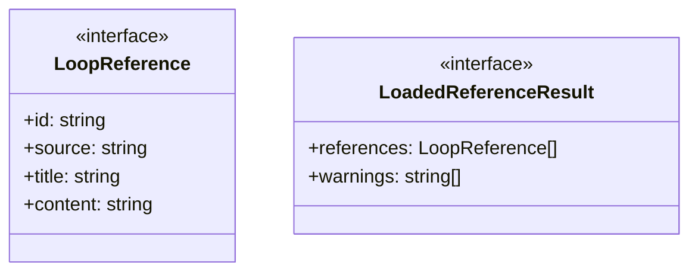
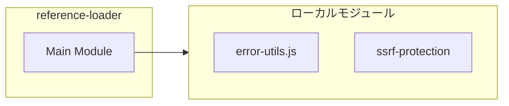

# reference-loader

## 概要

`reference-loader` モジュールのAPIリファレンス。

## インポート

```typescript
import { existsSync, readFileSync, statSync } from 'node:fs';
import { basename, isAbsolute, join... } from 'node:path';
import { toErrorMessage } from '../../lib/error-utils.js';
import { validateUrlForSsrf } from './ssrf-protection';
```

## エクスポート一覧

| 種別 | 名前 | 説明 |
|------|------|------|
| 関数 | `loadReferences` | - |
| 関数 | `fetchTextFromUrl` | - |
| インターフェース | `LoopReference` | - |
| インターフェース | `LoadedReferenceResult` | - |

## 図解

### クラス図



### 依存関係図



### 関数フロー


## 関数

### loadReferences

```typescript
async loadReferences(input: { refs: string[]; refsFile?: string; cwd: string }, signal?: AbortSignal): Promise<LoadedReferenceResult>
```

**パラメータ**

| 名前 | 型 | 必須 |
|------|-----|------|
| input | `{ refs: string[]; refsFile?: string; cwd: string }` | はい |
| signal | `AbortSignal` | いいえ |

**戻り値**: `Promise<LoadedReferenceResult>`

### loadSingleReference

```typescript
async loadSingleReference(spec: string, cwd: string, signal?: AbortSignal): Promise<{ source: string; title: string; content: string }>
```

**パラメータ**

| 名前 | 型 | 必須 |
|------|-----|------|
| spec | `string` | はい |
| cwd | `string` | はい |
| signal | `AbortSignal` | いいえ |

**戻り値**: `Promise<{ source: string; title: string; content: string }>`

### fetchTextFromUrl

```typescript
async fetchTextFromUrl(url: string, signal?: AbortSignal): Promise<string>
```

**パラメータ**

| 名前 | 型 | 必須 |
|------|-----|------|
| url | `string` | はい |
| signal | `AbortSignal` | いいえ |

**戻り値**: `Promise<string>`

### relayAbort

```typescript
relayAbort(): void
```

**戻り値**: `void`

### normalizeRefSpec

```typescript
normalizeRefSpec(value: string): string
```

**パラメータ**

| 名前 | 型 | 必須 |
|------|-----|------|
| value | `string` | はい |

**戻り値**: `string`

### resolvePath

```typescript
resolvePath(cwd: string, pathLike: string): string
```

**パラメータ**

| 名前 | 型 | 必須 |
|------|-----|------|
| cwd | `string` | はい |
| pathLike | `string` | はい |

**戻り値**: `string`

### looksLikeUrl

```typescript
looksLikeUrl(value: string): boolean
```

**パラメータ**

| 名前 | 型 | 必須 |
|------|-----|------|
| value | `string` | はい |

**戻り値**: `boolean`

### looksLikeHtml

```typescript
looksLikeHtml(value: string): boolean
```

**パラメータ**

| 名前 | 型 | 必須 |
|------|-----|------|
| value | `string` | はい |

**戻り値**: `boolean`

### htmlToText

```typescript
htmlToText(value: string): string
```

**パラメータ**

| 名前 | 型 | 必須 |
|------|-----|------|
| value | `string` | はい |

**戻り値**: `string`

### truncateText

```typescript
truncateText(value: string, maxChars: number): string
```

**パラメータ**

| 名前 | 型 | 必須 |
|------|-----|------|
| value | `string` | はい |
| maxChars | `number` | はい |

**戻り値**: `string`

### toPreview

```typescript
toPreview(value: string, maxChars: number): string
```

**パラメータ**

| 名前 | 型 | 必須 |
|------|-----|------|
| value | `string` | はい |
| maxChars | `number` | はい |

**戻り値**: `string`

### throwIfAborted

```typescript
throwIfAborted(signal: AbortSignal | undefined): void
```

**パラメータ**

| 名前 | 型 | 必須 |
|------|-----|------|
| signal | `AbortSignal | undefined` | はい |

**戻り値**: `void`

## インターフェース

### LoopReference

```typescript
interface LoopReference {
  id: string;
  source: string;
  title: string;
  content: string;
}
```

### LoadedReferenceResult

```typescript
interface LoadedReferenceResult {
  references: LoopReference[];
  warnings: string[];
}
```

---
*自動生成: 2026-02-17T21:48:27.537Z*
