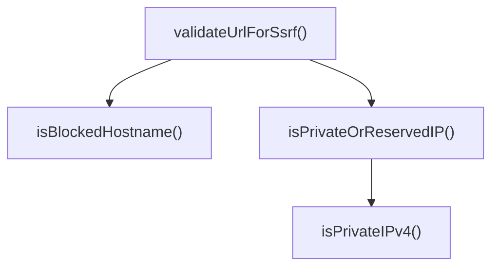
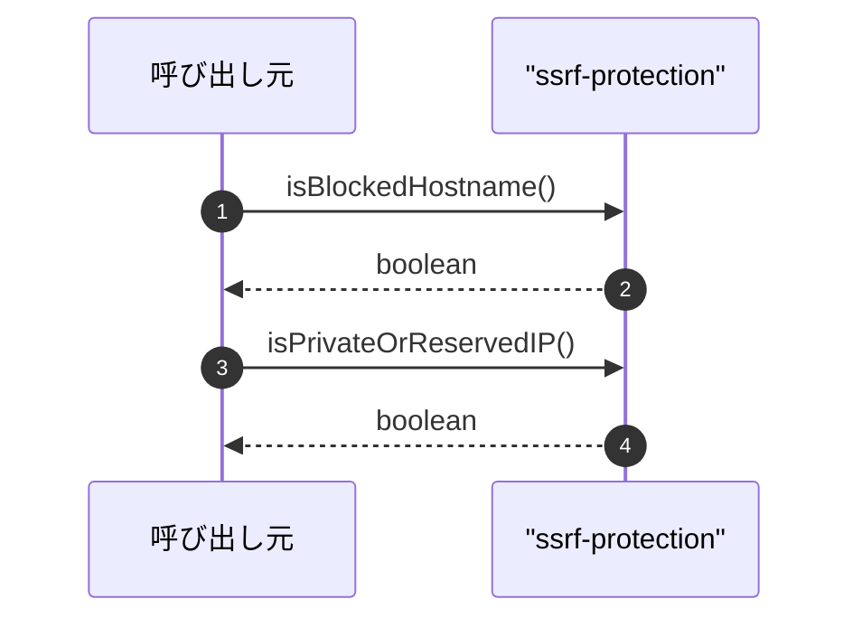

# ssrf-protection

## 概要

`ssrf-protection` モジュールのAPIリファレンス。

## インポート

```typescript
// from 'node:dns/promises': dnsLookup
```

## エクスポート一覧

| 種別 | 名前 | 説明 |
|------|------|------|
| 関数 | `isBlockedHostname` | ホスト名を判定 |
| 関数 | `isPrivateOrReservedIP` | プライベート・予約済みIP判定 |
| 関数 | `validateUrlForSsrf` | SSRF保護のためURLを検証する |

## 図解

### 関数フロー



### シーケンス図



## 関数

### isBlockedHostname

```typescript
isBlockedHostname(hostname: string): boolean
```

ホスト名を判定

**パラメータ**

| 名前 | 型 | 必須 |
|------|-----|------|
| hostname | `string` | はい |

**戻り値**: `boolean`

### isPrivateIPv4

```typescript
isPrivateIPv4(ip: string): boolean
```

Check if an IPv4 address is private or reserved.

**パラメータ**

| 名前 | 型 | 必須 |
|------|-----|------|
| ip | `string` | はい |

**戻り値**: `boolean`

### isPrivateOrReservedIP

```typescript
isPrivateOrReservedIP(ip: string): boolean
```

プライベート・予約済みIP判定

**パラメータ**

| 名前 | 型 | 必須 |
|------|-----|------|
| ip | `string` | はい |

**戻り値**: `boolean`

### validateUrlForSsrf

```typescript
async validateUrlForSsrf(urlString: string): Promise<void>
```

SSRF保護のためURLを検証する

**パラメータ**

| 名前 | 型 | 必須 |
|------|-----|------|
| urlString | `string` | はい |

**戻り値**: `Promise<void>`

---
*自動生成: 2026-02-18T15:54:41.207Z*
