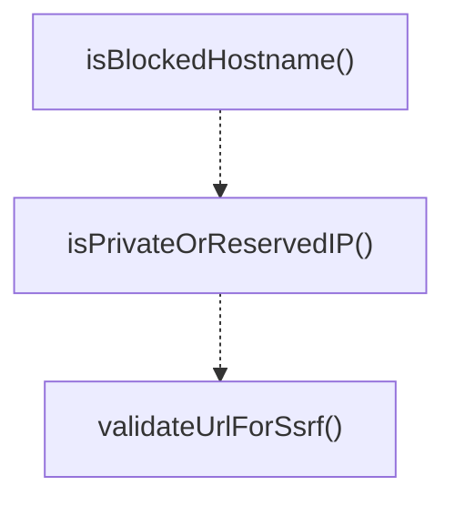
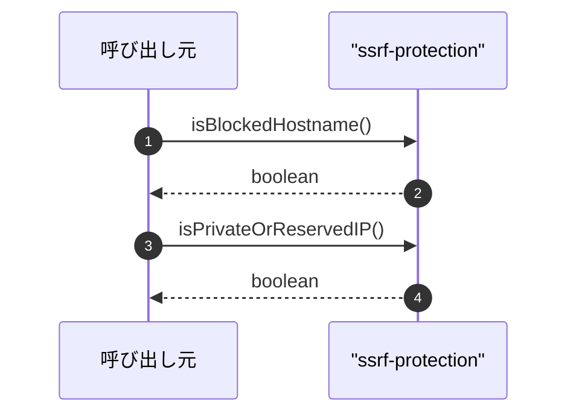

# ssrf-protection

## 概要

`ssrf-protection` モジュールのAPIリファレンス。

## インポート

```typescript
import { dnsLookup } from 'node:dns/promises';
```

## エクスポート一覧

| 種別 | 名前 | 説明 |
|------|------|------|
| 関数 | `isBlockedHostname` | Check if a hostname matches blocked patterns. |
| 関数 | `isPrivateOrReservedIP` | Check if an IP address is private or reserved. |
| 関数 | `validateUrlForSsrf` | Validate URL for SSRF protection. |

## 図解

### 関数フロー



### シーケンス図



## 関数

### isBlockedHostname

```typescript
isBlockedHostname(hostname: string): boolean
```

Check if a hostname matches blocked patterns.

**パラメータ**

| 名前 | 型 | 必須 |
|------|-----|------|
| hostname | `string` | はい |

**戻り値**: `boolean`

### isPrivateIPv4

```typescript
isPrivateIPv4(ip: string): boolean
```

Check if an IPv4 address is private or reserved.

**パラメータ**

| 名前 | 型 | 必須 |
|------|-----|------|
| ip | `string` | はい |

**戻り値**: `boolean`

### isPrivateOrReservedIP

```typescript
isPrivateOrReservedIP(ip: string): boolean
```

Check if an IP address is private or reserved.
Blocks:
- 10.0.0.0/8 (Private network)
- 172.16.0.0/12 (Private network)
- 192.168.0.0/16 (Private network)
- 127.0.0.0/8 (Loopback)
- 169.254.0.0/16 (Link-local)
- 0.0.0.0/8 (Current network)
- 224.0.0.0/4 (Multicast)
- 240.0.0.0/4 (Reserved)
- ::1 (IPv6 loopback)
- fe80::/10 (IPv6 link-local)
- fc00::/7 (IPv6 unique local)

**パラメータ**

| 名前 | 型 | 必須 |
|------|-----|------|
| ip | `string` | はい |

**戻り値**: `boolean`

### validateUrlForSsrf

```typescript
async validateUrlForSsrf(urlString: string): Promise<void>
```

Validate URL for SSRF protection.
Throws an error if the URL points to a blocked resource.

**パラメータ**

| 名前 | 型 | 必須 |
|------|-----|------|
| urlString | `string` | はい |

**戻り値**: `Promise<void>`

---
*自動生成: 2026-02-18T00:15:35.524Z*
