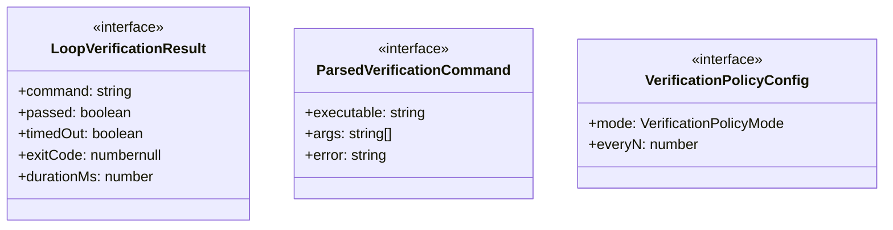
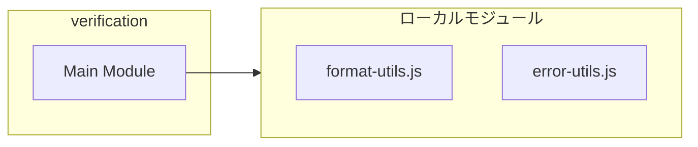
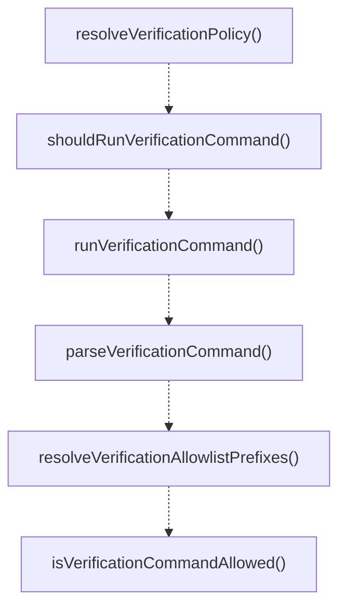
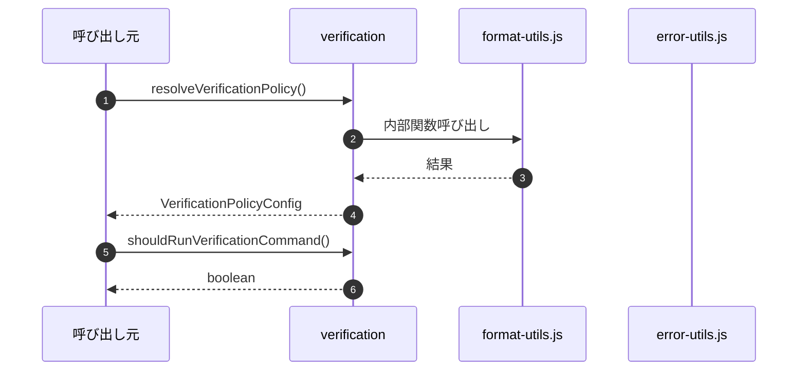

# verification

## 概要

`verification` モジュールのAPIリファレンス。

## インポート

```typescript
import { spawn } from 'node:child_process';
import { formatDuration } from '../../lib/format-utils.js';
import { toErrorMessage } from '../../lib/error-utils.js';
```

## エクスポート一覧

| 種別 | 名前 | 説明 |
|------|------|------|
| 関数 | `resolveVerificationPolicy` | - |
| 関数 | `shouldRunVerificationCommand` | - |
| 関数 | `runVerificationCommand` | - |
| 関数 | `parseVerificationCommand` | - |
| 関数 | `resolveVerificationAllowlistPrefixes` | - |
| 関数 | `isVerificationCommandAllowed` | - |
| 関数 | `buildVerificationValidationFeedback` | - |
| インターフェース | `LoopVerificationResult` | - |
| インターフェース | `ParsedVerificationCommand` | - |
| インターフェース | `VerificationPolicyConfig` | - |
| 型 | `VerificationPolicyMode` | - |

## 図解

### クラス図



### 依存関係図



### 関数フロー



### シーケンス図



## 関数

### resolveVerificationPolicy

```typescript
resolveVerificationPolicy(): VerificationPolicyConfig
```

**戻り値**: `VerificationPolicyConfig`

### shouldRunVerificationCommand

```typescript
shouldRunVerificationCommand(input: {
  iteration: number;
  maxIterations: number;
  status: "continue" | "done" | "unknown";
  policy: VerificationPolicyConfig;
}): boolean
```

**パラメータ**

| 名前 | 型 | 必須 |
|------|-----|------|
| input | `{
  iteration: number;
  maxIterations: number;
  status: "continue" | "done" | "unknown";
  policy: VerificationPolicyConfig;
}` | はい |

**戻り値**: `boolean`

### runVerificationCommand

```typescript
async runVerificationCommand(input: {
  command: string;
  cwd: string;
  timeoutMs: number;
  signal?: AbortSignal;
}): Promise<LoopVerificationResult>
```

**パラメータ**

| 名前 | 型 | 必須 |
|------|-----|------|
| input | `{
  command: string;
  cwd: string;
  timeoutMs: number;
  signal?: AbortSignal;
}` | はい |

**戻り値**: `Promise<LoopVerificationResult>`

### finish

```typescript
finish(partial: {
      passed: boolean;
      timedOut: boolean;
      exitCode: number | null;
      error?: string;
    }): void
```

**パラメータ**

| 名前 | 型 | 必須 |
|------|-----|------|
| partial | `{
      passed: boolean;
      timedOut: boolean;
      exitCode: number | null;
      error?: string;
    }` | はい |

**戻り値**: `void`

### killSafely

```typescript
killSafely(sig: NodeJS.Signals): void
```

**パラメータ**

| 名前 | 型 | 必須 |
|------|-----|------|
| sig | `NodeJS.Signals` | はい |

**戻り値**: `void`

### onAbort

```typescript
onAbort(): void
```

**戻り値**: `void`

### cleanup

```typescript
cleanup(): void
```

**戻り値**: `void`

### parseVerificationCommand

```typescript
parseVerificationCommand(command: string): ParsedVerificationCommand
```

**パラメータ**

| 名前 | 型 | 必須 |
|------|-----|------|
| command | `string` | はい |

**戻り値**: `ParsedVerificationCommand`

### tokenizeArgs

```typescript
tokenizeArgs(input: string): string[]
```

**パラメータ**

| 名前 | 型 | 必須 |
|------|-----|------|
| input | `string` | はい |

**戻り値**: `string[]`

### resolveVerificationAllowlistPrefixes

```typescript
resolveVerificationAllowlistPrefixes(): string[][]
```

**戻り値**: `string[][]`

### isVerificationCommandAllowed

```typescript
isVerificationCommandAllowed(command: ParsedVerificationCommand, allowlistPrefixes: string[][]): boolean
```

**パラメータ**

| 名前 | 型 | 必須 |
|------|-----|------|
| command | `ParsedVerificationCommand` | はい |
| allowlistPrefixes | `string[][]` | はい |

**戻り値**: `boolean`

### formatAllowlistPreview

```typescript
formatAllowlistPreview(prefixes: string[][]): string
```

**パラメータ**

| 名前 | 型 | 必須 |
|------|-----|------|
| prefixes | `string[][]` | はい |

**戻り値**: `string`

### truncateText

```typescript
truncateText(value: string, maxChars: number): string
```

**パラメータ**

| 名前 | 型 | 必須 |
|------|-----|------|
| value | `string` | はい |
| maxChars | `number` | はい |

**戻り値**: `string`

### redactSensitiveText

```typescript
redactSensitiveText(value: string): string
```

**パラメータ**

| 名前 | 型 | 必須 |
|------|-----|------|
| value | `string` | はい |

**戻り値**: `string`

### buildVerificationValidationFeedback

```typescript
buildVerificationValidationFeedback(result: LoopVerificationResult): string[]
```

**パラメータ**

| 名前 | 型 | 必須 |
|------|-----|------|
| result | `LoopVerificationResult` | はい |

**戻り値**: `string[]`

### toPreview

```typescript
toPreview(value: string, maxChars: number): string
```

**パラメータ**

| 名前 | 型 | 必須 |
|------|-----|------|
| value | `string` | はい |
| maxChars | `number` | はい |

**戻り値**: `string`

## インターフェース

### LoopVerificationResult

```typescript
interface LoopVerificationResult {
  command: string;
  passed: boolean;
  timedOut: boolean;
  exitCode: number | null;
  durationMs: number;
  stdout: string;
  stderr: string;
  error?: string;
}
```

### ParsedVerificationCommand

```typescript
interface ParsedVerificationCommand {
  executable: string;
  args: string[];
  error?: string;
}
```

### VerificationPolicyConfig

```typescript
interface VerificationPolicyConfig {
  mode: VerificationPolicyMode;
  everyN: number;
}
```

## 型定義

### VerificationPolicyMode

```typescript
type VerificationPolicyMode = "always" | "done_only" | "every_n"
```

---
*自動生成: 2026-02-17T21:54:59.667Z*
