# mcp-client

## 概要

`mcp-client` モジュールのAPIリファレンス。

## インポート

```typescript
// from '@mariozechner/pi-ai': Type
// from '@mariozechner/pi-coding-agent': ExtensionAPI
// from '../lib/mcp/connection-manager.js': mcpManager, McpConnectionType
// from '../lib/mcp/config-loader.js': loadMcpConfig, getEnabledServers, getConfigPath
// from '../lib/mcp/tool-bridge.js': formatToolResult, formatResourceContent, formatToolList, ...
// ... and 2 more imports
```

## エクスポート一覧

| 種別 | 名前 | 説明 |
|------|------|------|

## ユーザーフロー

このモジュールが提供するツールと、その実行フローを示します。

### mcp_connect

Connect to an MCP (Model Context Protocol) server. Supports HTTP, SSE, and stdio transports with optional authentication.

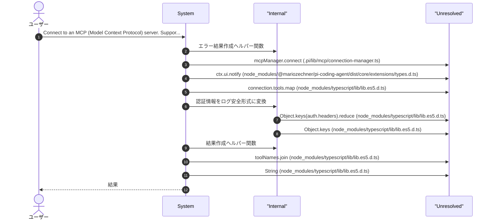

### mcp_disconnect

Disconnect from an MCP server. This releases the connection and frees resources.

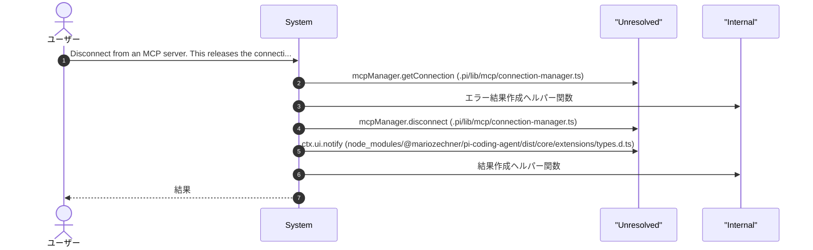

### mcp_list_connections

List all active MCP server connections and their status.

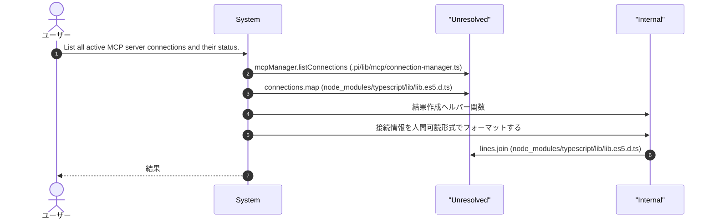

### mcp_list_tools

List available tools from a connected MCP server. Supports pagination for large datasets.

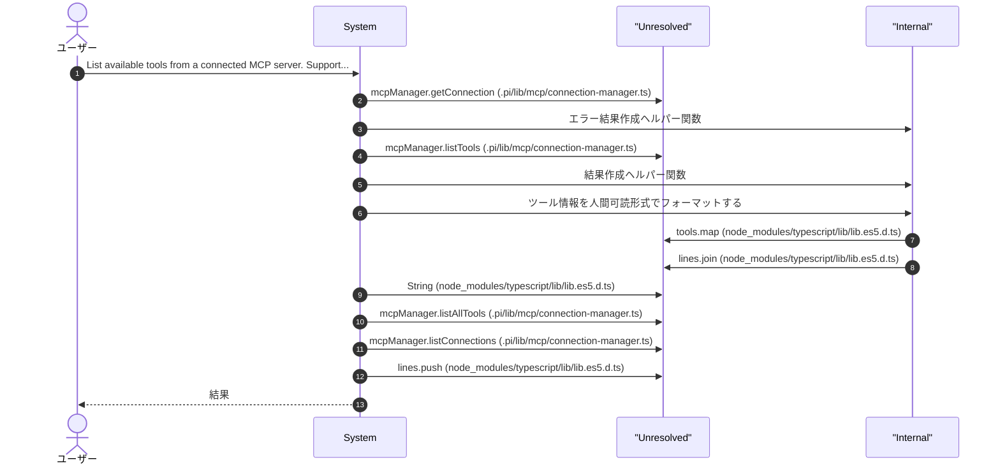

### mcp_call_tool

Execute a tool on a connected MCP server. The tool must be available on the specified connection.

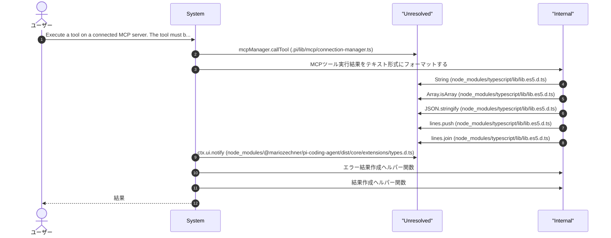

### mcp_list_resources

List available resources from a connected MCP server. Resources are read-only data like files, configurations, or documents.

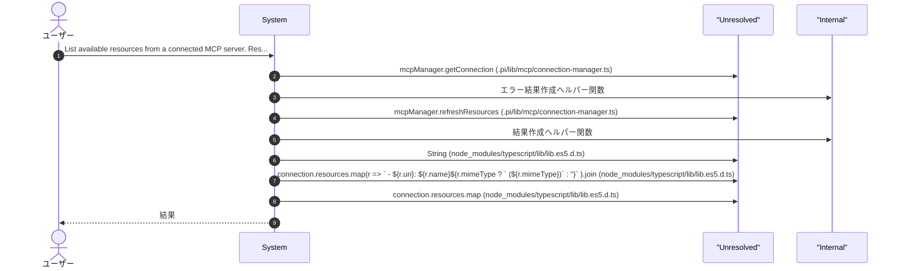

### mcp_read_resource

Read a resource from a connected MCP server. Use mcp_list_resources to discover available resource URIs.

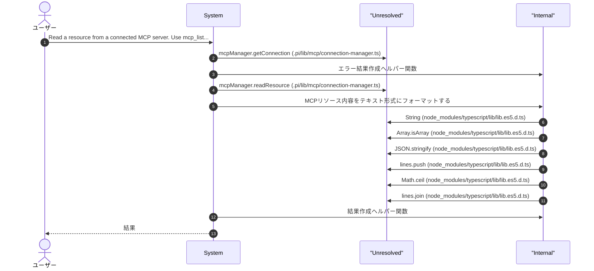

### mcp_reload_config

Reload MCP server configuration from .pi/mcp-servers.json and auto-connect enabled servers.

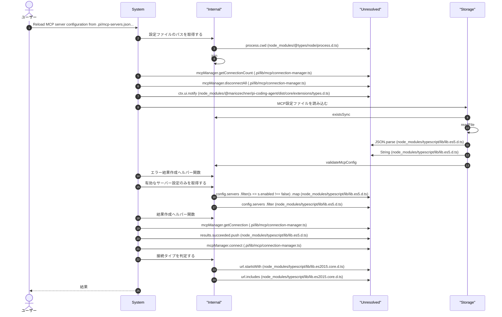

### mcp_register_notification_handler

Register a handler for MCP notifications (tools/list_changed, resources/list_changed, etc.).

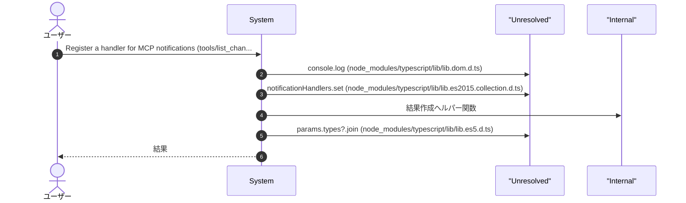

### mcp_set_roots

Set root directories that MCP servers can access. Servers may use roots to resolve relative paths or understand project context.

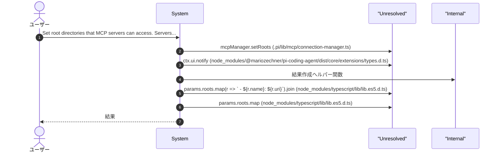

### mcp_list_prompts

List available prompt templates from a connected MCP server.

```mermaid
sequenceDiagram
  autonumber
  actor User as ユーザー
  participant System as System
  participant Unresolved as "Unresolved"
  participant Internal as "Internal"

  User->>System: List available prompt templates from a connected MCP server.
  System->>Unresolved: mcpManager.listPrompts (.pi/lib/mcp/connection-manager.ts)
  System->>Internal: 結果作成ヘルパー関数
  System->>Unresolved: prompts.map(p => {           const args = p.arguments?.map(a => `${a.name}${a.required ? '*' : ''}`).join(', ') || 'no args';           return `  - ${p.name}: ${p.description || 'No description'} [${args}]`;         }).join (node_modules/typescript/lib/lib.es5.d.ts)
  System->>Unresolved: prompts.map (node_modules/typescript/lib/lib.es5.d.ts)
  System->>Unresolved: String (node_modules/typescript/lib/lib.es5.d.ts)
  System->>Internal: エラー結果作成ヘルパー関数
  System-->>User: 結果

```

### mcp_get_prompt

Get and expand a prompt template from a connected MCP server.

```mermaid
sequenceDiagram
  autonumber
  actor User as ユーザー
  participant System as System
  participant Unresolved as "Unresolved"
  participant Internal as "Internal"

  User->>System: Get and expand a prompt template from a connected MCP ser...
  System->>Unresolved: mcpManager.getPrompt (.pi/lib/mcp/connection-manager.ts)
  System->>Unresolved: result.messages.map(m => {           const content = m.content.type === 'text' ? m.content.text : `[${m.content.type}]`;           return `[${m.role}]: ${content}`;         }).join (node_modules/typescript/lib/lib.es5.d.ts)
  System->>Unresolved: result.messages.map (node_modules/typescript/lib/lib.es5.d.ts)
  System->>Internal: 結果作成ヘルパー関数
  System->>Unresolved: String (node_modules/typescript/lib/lib.es5.d.ts)
  System->>Internal: エラー結果作成ヘルパー関数
  System-->>User: 結果

```

### mcp_subscribe_resource

Subscribe to resource update notifications from a connected MCP server.

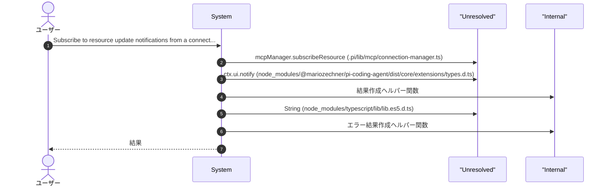

### mcp_unsubscribe_resource

Unsubscribe from resource update notifications.

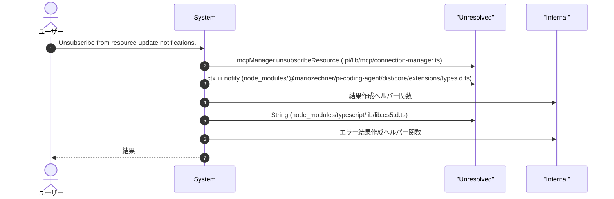

### mcp_list_subscriptions

List active resource subscriptions for a connection.

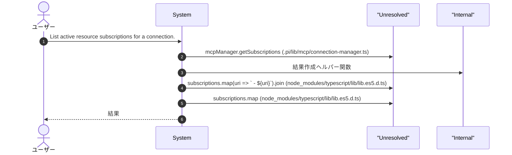

### mcp_ping

Check connection health by pinging the MCP server.

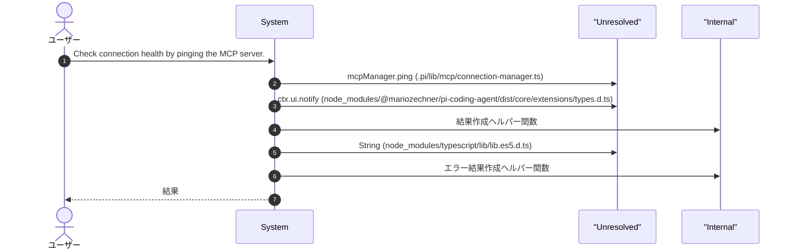

### mcp_complete

Get argument completions for a prompt or resource reference.

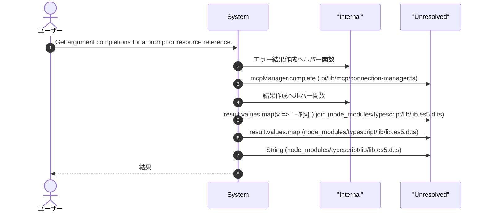

### mcp_get_instructions

Get server instructions from a connected MCP server. Instructions provide guidance on how to use the server's tools and resources.

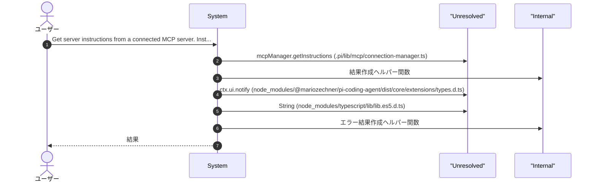

### mcp_list_resource_templates

List resource templates from a connected MCP server. Resource templates are URI patterns that can be used to construct resource URIs.

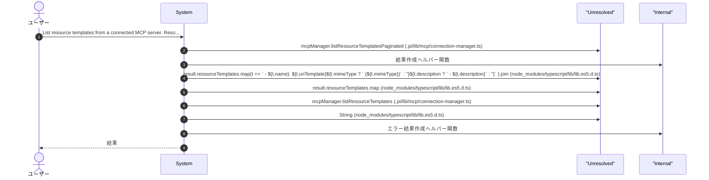

### mcp_set_logging_level

Set the logging level for a connected MCP server. Controls the verbosity of server log messages.

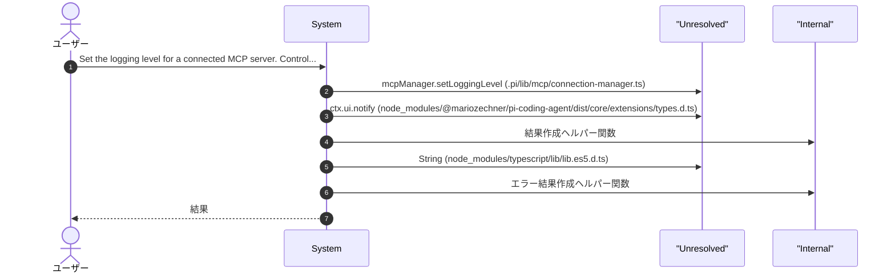

### mcp_register_sampling_handler

Register a handler for sampling requests from MCP servers. Allows servers to request LLM sampling via the client.

```mermaid
sequenceDiagram
  autonumber
  actor User as ユーザー
  participant System as System
  participant Unresolved as "Unresolved"
  participant Internal as "Internal"

  User->>System: Register a handler for sampling requests from MCP servers...
  System->>Unresolved: mcpManager.setSamplingHandler (.pi/lib/mcp/connection-manager.ts)
  System->>Unresolved: ctx.ui.notify (node_modules/@mariozechner/pi-coding-agent/dist/core/extensions/types.d.ts)
  System->>Internal: 結果作成ヘルパー関数
  System->>Unresolved: console.log (node_modules/typescript/lib/lib.dom.d.ts)
  System->>Unresolved: request.systemPrompt?.substring (node_modules/typescript/lib/lib.es5.d.ts)
  System-->>User: 結果

```

### mcp_register_elicitation_handler

Register a handler for elicitation requests from MCP servers. Allows servers to request information collection (forms, URLs) from the client.

```mermaid
sequenceDiagram
  autonumber
  actor User as ユーザー
  participant System as System
  participant Unresolved as "Unresolved"
  participant Internal as "Internal"

  User->>System: Register a handler for elicitation requests from MCP serv...
  System->>Unresolved: mcpManager.setElicitationHandler (.pi/lib/mcp/connection-manager.ts)
  System->>Unresolved: ctx.ui.notify (node_modules/@mariozechner/pi-coding-agent/dist/core/extensions/types.d.ts)
  System->>Internal: 結果作成ヘルパー関数
  System->>Unresolved: console.log (node_modules/typescript/lib/lib.dom.d.ts)
  System->>Unresolved: request.fields.map (node_modules/typescript/lib/lib.es5.d.ts)
  System-->>User: 結果

```

## 図解

### 依存関係図

```mermaid
flowchart LR
  subgraph this[mcp-client]
    main[Main Module]
  end
  subgraph local[ローカルモジュール]
    connection_manager["connection-manager"]
    config_loader["config-loader"]
    tool_bridge["tool-bridge"]
    auth_provider["auth-provider"]
    types["types"]
  end
  main --> local
  subgraph external[外部ライブラリ]
    _mariozechner["@mariozechner"]
    _mariozechner["@mariozechner"]
  end
  main --> external
```

### シーケンス図

```mermaid
sequenceDiagram
  autonumber
  participant Caller as 呼び出し元
  participant mcp_client as "mcp-client"
  participant mariozechner as "@mariozechner"
  participant connection_manager as "connection-manager"
  participant config_loader as "config-loader"

```

## 関数

### makeSuccessResult

```typescript
makeSuccessResult(text: string, details: Record<string, unknown>): { content: Array<{ type: "text"; text: string }>; details: Record<string, unknown> }
```

結果作成ヘルパー関数

**パラメータ**

| 名前 | 型 | 必須 |
|------|-----|------|
| text | `string` | はい |
| details | `Record<string, unknown>` | はい |

**戻り値**: `{ content: Array<{ type: "text"; text: string }>; details: Record<string, unknown> }`

### makeErrorResult

```typescript
makeErrorResult(text: string, details: Record<string, unknown>): { content: Array<{ type: "text"; text: string }>; details: Record<string, unknown>; isError: boolean }
```

エラー結果作成ヘルパー関数

**パラメータ**

| 名前 | 型 | 必須 |
|------|-----|------|
| text | `string` | はい |
| details | `Record<string, unknown>` | はい |

**戻り値**: `{ content: Array<{ type: "text"; text: string }>; details: Record<string, unknown>; isError: boolean }`

### dispatchNotification

```typescript
dispatchNotification(notification: McpNotification): void
```

内部通知ディスパッチャー

**パラメータ**

| 名前 | 型 | 必須 |
|------|-----|------|
| notification | `McpNotification` | はい |

**戻り値**: `void`

### autoConnectFromConfig

```typescript
async autoConnectFromConfig(ctx: { ui: { notify: (msg: string, type: "info" | "warning" | "error") => void } }): Promise<{ succeeded: string[]; failed: Array<{ id: string; error: string }> }>
```

設定ファイルから自動接続を実行

**パラメータ**

| 名前 | 型 | 必須 |
|------|-----|------|
| ctx | `object` | はい |
| &nbsp;&nbsp;↳ ui | `{ notify: (msg: string, type: "info" | "warning" | "error") => void }` | はい |

**戻り値**: `Promise<{ succeeded: string[]; failed: Array<{ id: string; error: string }> }>`

### detectConnectionType

```typescript
detectConnectionType(url: string): McpConnectionType | undefined
```

接続タイプを判定する

**パラメータ**

| 名前 | 型 | 必須 |
|------|-----|------|
| url | `string` | はい |

**戻り値**: `McpConnectionType | undefined`

### handler

```typescript
handler(notification: McpNotification): void
```

**パラメータ**

| 名前 | 型 | 必須 |
|------|-----|------|
| notification | `McpNotification` | はい |

**戻り値**: `void`

### handler

```typescript
async handler(request: any, connectionId: any): void
```

**パラメータ**

| 名前 | 型 | 必須 |
|------|-----|------|
| request | `any` | はい |
| connectionId | `any` | はい |

**戻り値**: `void`

### handler

```typescript
async handler(request: any, connectionId: any): void
```

**パラメータ**

| 名前 | 型 | 必須 |
|------|-----|------|
| request | `any` | はい |
| connectionId | `any` | はい |

**戻り値**: `void`

---
*自動生成: 2026-02-28T13:55:19.187Z*
