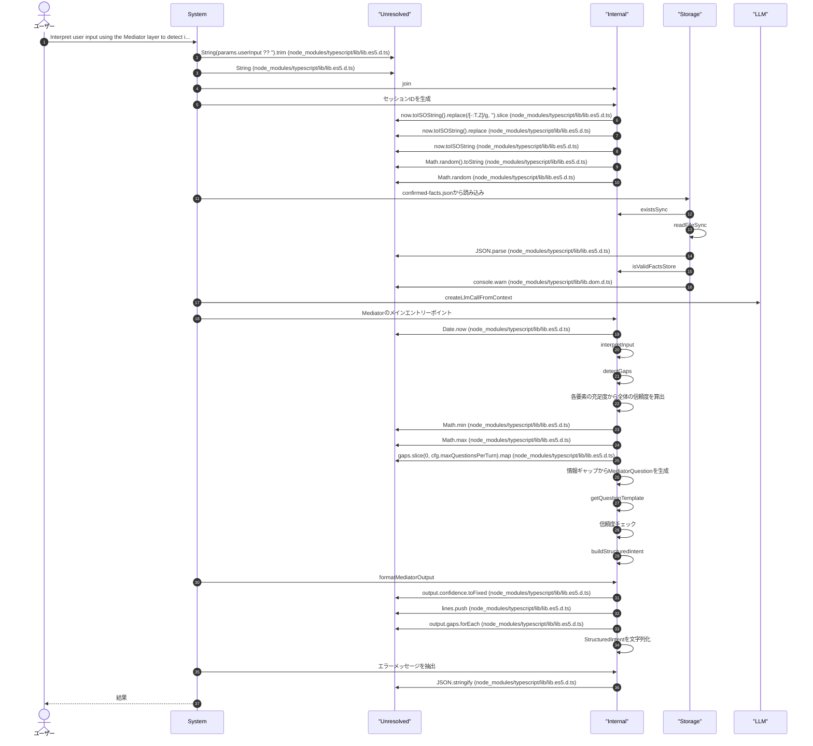
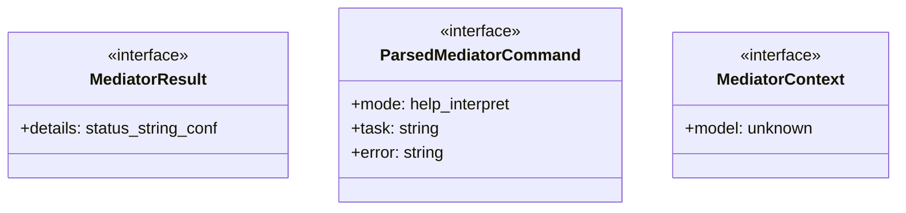
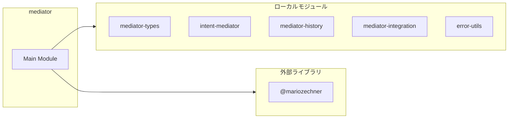
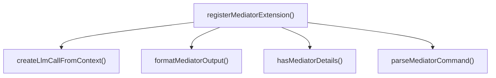

# mediator

## 概要

`mediator` モジュールのAPIリファレンス。

## インポート

```typescript
// from '@mariozechner/pi-ai': Type
// from '@mariozechner/pi-coding-agent': ExtensionAPI
// from '@mariozechner/pi-tui': Text
// from '../lib/mediator-types.js': MediatorInput, MediatorOutput, StructuredIntent, ...
// from '../lib/intent-mediator.js': mediate, mediateWithAnswers, createMediatorSession, ...
// ... and 5 more imports
```

## エクスポート一覧

| 種別 | 名前 | 説明 |
|------|------|------|
| 関数 | `registerMediatorExtension` | - |

## ユーザーフロー

このモジュールが提供するツールと、その実行フローを示します。

### mediator_interpret

Interpret user input using the Mediator layer to detect information gaps and generate clarification questions.



## 図解

### クラス図



### 依存関係図



### 関数フロー



## 関数

### registerMediatorExtension

```typescript
registerMediatorExtension(pi: ExtensionAPI): void
```

**パラメータ**

| 名前 | 型 | 必須 |
|------|-----|------|
| pi | `ExtensionAPI` | はい |

**戻り値**: `void`

### hasMediatorDetails

```typescript
hasMediatorDetails(value: unknown): value is MediatorResult
```

**パラメータ**

| 名前 | 型 | 必須 |
|------|-----|------|
| value | `unknown` | はい |

**戻り値**: `value is MediatorResult`

### parseMediatorCommand

```typescript
parseMediatorCommand(args: string | undefined): ParsedMediatorCommand
```

**パラメータ**

| 名前 | 型 | 必須 |
|------|-----|------|
| args | `string | undefined` | はい |

**戻り値**: `ParsedMediatorCommand`

### formatMediatorOutput

```typescript
formatMediatorOutput(output: MediatorOutput, originalInput: string): string
```

**パラメータ**

| 名前 | 型 | 必須 |
|------|-----|------|
| output | `MediatorOutput` | はい |
| originalInput | `string` | はい |

**戻り値**: `string`

### createLlmCallFromContext

```typescript
createLlmCallFromContext(ctx: MediatorContext): LlmCallFunction
```

**パラメータ**

| 名前 | 型 | 必須 |
|------|-----|------|
| ctx | `MediatorContext` | はい |

**戻り値**: `LlmCallFunction`

## インターフェース

### MediatorResult

```typescript
interface MediatorResult {
  details?: { status?: string; confidence?: number };
}
```

### ParsedMediatorCommand

```typescript
interface ParsedMediatorCommand {
  mode: "help" | "interpret" | "history" | "clear";
  task?: string;
  error?: string;
}
```

### MediatorContext

```typescript
interface MediatorContext {
  model?: unknown;
}
```

---
*自動生成: 2026-02-28T13:55:19.214Z*
