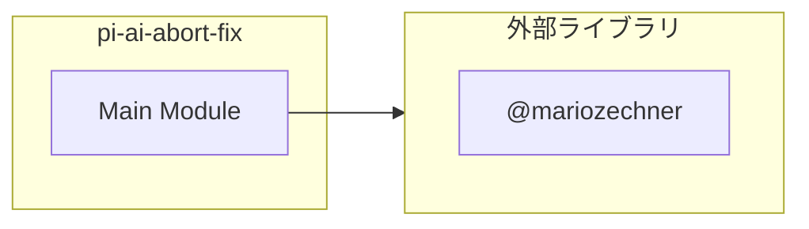
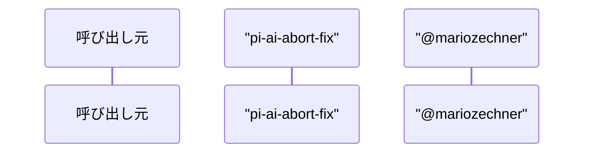

# pi-ai-abort-fix

## 概要

`pi-ai-abort-fix` モジュールのAPIリファレンス。

## インポート

```typescript
// from 'node:fs/promises': readFile, writeFile
// from 'node:module': createRequire
// from 'node:path': dirname, join
// from 'node:fs': existsSync
// from 'node:os': homedir
// ... and 1 more imports
```

## エクスポート一覧

| 種別 | 名前 | 説明 |
|------|------|------|

## 図解

### 依存関係図



### シーケンス図



## 関数

### patchFile

```typescript
async patchFile(requireFn: NodeRequire, target: PatchTarget): Promise<"patched" | "already" | "skip">
```

**パラメータ**

| 名前 | 型 | 必須 |
|------|-----|------|
| requireFn | `NodeRequire` | はい |
| target | `PatchTarget` | はい |

**戻り値**: `Promise<"patched" | "already" | "skip">`

### patchResolvedFilePath

```typescript
async patchResolvedFilePath(path: string, target: PatchTarget): Promise<"patched" | "already" | "skip">
```

**パラメータ**

| 名前 | 型 | 必須 |
|------|-----|------|
| path | `string` | はい |
| target | `PatchTarget` | はい |

**戻り値**: `Promise<"patched" | "already" | "skip">`

### uniqueNonEmpty

```typescript
uniqueNonEmpty(values: Array<string | undefined>): string[]
```

**パラメータ**

| 名前 | 型 | 必須 |
|------|-----|------|
| values | `Array<string | undefined>` | はい |

**戻り値**: `string[]`

### safeCreateRequire

```typescript
safeCreateRequire(basePath: string): NodeRequire | undefined
```

**パラメータ**

| 名前 | 型 | 必須 |
|------|-----|------|
| basePath | `string` | はい |

**戻り値**: `NodeRequire | undefined`

### collectResolverBases

```typescript
collectResolverBases(requireFn: NodeRequire): string[]
```

**パラメータ**

| 名前 | 型 | 必須 |
|------|-----|------|
| requireFn | `NodeRequire` | はい |

**戻り値**: `string[]`

### collectResolvers

```typescript
collectResolvers(requireFn: NodeRequire): NodeRequire[]
```

**パラメータ**

| 名前 | 型 | 必須 |
|------|-----|------|
| requireFn | `NodeRequire` | はい |

**戻り値**: `NodeRequire[]`

### listDirsSafe

```typescript
async listDirsSafe(path: string): Promise<string[]>
```

**パラメータ**

| 名前 | 型 | 必須 |
|------|-----|------|
| path | `string` | はい |

**戻り値**: `Promise<string[]>`

### collectDirectNodeModulesRoots

```typescript
async collectDirectNodeModulesRoots(): Promise<string[]>
```

**戻り値**: `Promise<string[]>`

### resolveCandidatePiAiProviderPaths

```typescript
resolveCandidatePiAiProviderPaths(root: string): string[]
```

**パラメータ**

| 名前 | 型 | 必須 |
|------|-----|------|
| root | `string` | はい |

**戻り値**: `string[]`

## 型定義

### PatchTarget

```typescript
type PatchTarget = {
  modulePath: string;
  marker: string;
  before: string;
  after: string;
}
```

---
*自動生成: 2026-02-24T17:08:02.315Z*
