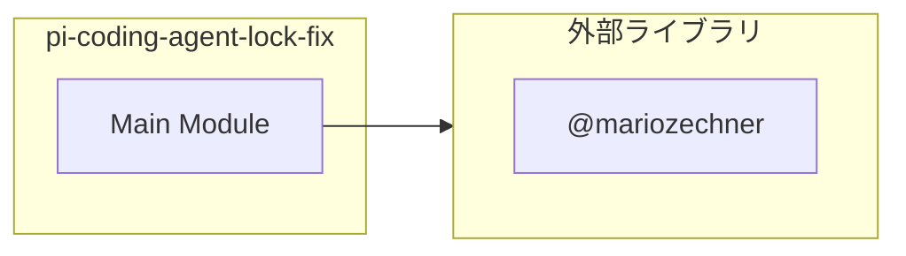
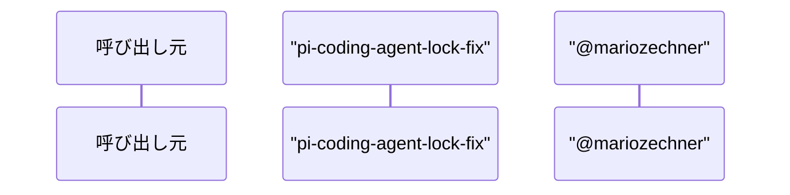

# pi-coding-agent-lock-fix

## 概要

`pi-coding-agent-lock-fix` モジュールのAPIリファレンス。

## インポート

```typescript
// from 'node:fs/promises': readFile, writeFile
// from 'node:module': createRequire
// from '@mariozechner/pi-coding-agent': ExtensionAPI
```

## エクスポート一覧

| 種別 | 名前 | 説明 |
|------|------|------|

## 図解

### 依存関係図



### シーケンス図



## 関数

### patchFile

```typescript
async patchFile(requireFn: NodeRequire, target: PatchTarget): Promise<"patched" | "already" | "skip">
```

**パラメータ**

| 名前 | 型 | 必須 |
|------|-----|------|
| requireFn | `NodeRequire` | はい |
| target | `PatchTarget` | はい |

**戻り値**: `Promise<"patched" | "already" | "skip">`

## 型定義

### PatchTarget

```typescript
type PatchTarget = {
  modulePath: string;
  marker: string;
  repairs?: Array<{
    before: string;
    after: string;
  }>;
  steps: Array<{
    before: string;
    after: string;
  }>;
}
```

---
*自動生成: 2026-02-23T06:29:42.072Z*
