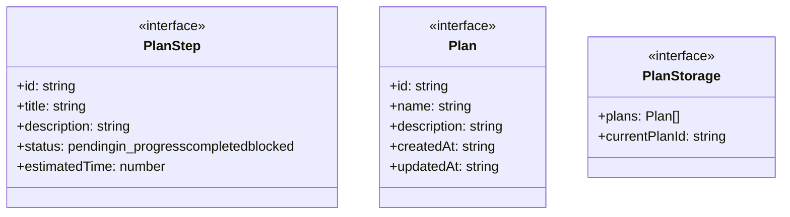
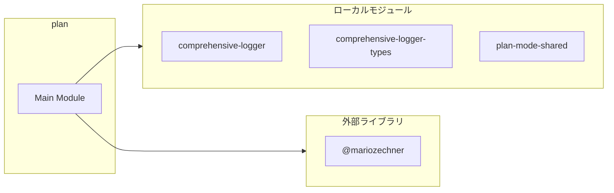

# plan

## 概要

`plan` モジュールのAPIリファレンス。

## インポート

```typescript
import { existsSync, readFileSync, writeFileSync... } from 'node:fs';
import { join } from 'node:path';
import { Type } from '@mariozechner/pi-ai';
import { ExtensionAPI } from '@mariozechner/pi-coding-agent';
import { AgentMessage } from '@mariozechner/pi-agent-core';
// ... and 3 more imports
```

## エクスポート一覧

| 種別 | 名前 | 説明 |
|------|------|------|

## 図解

### クラス図



### 依存関係図



## 関数

### isCustomMessage

```typescript
isCustomMessage(msg: AgentMessage): msg is AgentMessage & { customType: string }
```

CustomMessage型かどうかを判定する型ガード関数
CustomMessageは role: "custom" と customType プロパティを持つ

**パラメータ**

| 名前 | 型 | 必須 |
|------|-----|------|
| msg | `AgentMessage` | はい |

**戻り値**: `msg is AgentMessage & { customType: string }`

### ensurePlanDir

```typescript
ensurePlanDir(): void
```

**戻り値**: `void`

### loadStorage

```typescript
loadStorage(): PlanStorage
```

**戻り値**: `PlanStorage`

### saveStorage

```typescript
saveStorage(storage: PlanStorage): void
```

**パラメータ**

| 名前 | 型 | 必須 |
|------|-----|------|
| storage | `PlanStorage` | はい |

**戻り値**: `void`

### generateId

```typescript
generateId(): string
```

**戻り値**: `string`

### createPlan

```typescript
createPlan(name: string, description?: string): Plan
```

**パラメータ**

| 名前 | 型 | 必須 |
|------|-----|------|
| name | `string` | はい |
| description | `string` | いいえ |

**戻り値**: `Plan`

### findPlanById

```typescript
findPlanById(storage: PlanStorage, planId: string): Plan | undefined
```

**パラメータ**

| 名前 | 型 | 必須 |
|------|-----|------|
| storage | `PlanStorage` | はい |
| planId | `string` | はい |

**戻り値**: `Plan | undefined`

### findStepById

```typescript
findStepById(plan: Plan, stepId: string): PlanStep | undefined
```

**パラメータ**

| 名前 | 型 | 必須 |
|------|-----|------|
| plan | `Plan` | はい |
| stepId | `string` | はい |

**戻り値**: `PlanStep | undefined`

### addStepToPlan

```typescript
addStepToPlan(plan: Plan, title: string, description?: string, dependencies?: string[]): PlanStep
```

**パラメータ**

| 名前 | 型 | 必須 |
|------|-----|------|
| plan | `Plan` | はい |
| title | `string` | はい |
| description | `string` | いいえ |
| dependencies | `string[]` | いいえ |

**戻り値**: `PlanStep`

### updateStepStatus

```typescript
updateStepStatus(plan: Plan, stepId: string, status: PlanStep["status"]): boolean
```

**パラメータ**

| 名前 | 型 | 必須 |
|------|-----|------|
| plan | `Plan` | はい |
| stepId | `string` | はい |
| status | `PlanStep["status"]` | はい |

**戻り値**: `boolean`

### getReadySteps

```typescript
getReadySteps(plan: Plan): PlanStep[]
```

**パラメータ**

| 名前 | 型 | 必須 |
|------|-----|------|
| plan | `Plan` | はい |

**戻り値**: `PlanStep[]`

### formatPlanSummary

```typescript
formatPlanSummary(plan: Plan): string
```

**パラメータ**

| 名前 | 型 | 必須 |
|------|-----|------|
| plan | `Plan` | はい |

**戻り値**: `string`

### formatPlanList

```typescript
formatPlanList(plans: Plan[]): string
```

**パラメータ**

| 名前 | 型 | 必須 |
|------|-----|------|
| plans | `Plan[]` | はい |

**戻り値**: `string`

### syncPlanModeEnv

```typescript
syncPlanModeEnv(enabled: boolean): void
```

**パラメータ**

| 名前 | 型 | 必須 |
|------|-----|------|
| enabled | `boolean` | はい |

**戻り値**: `void`

### savePlanModeState

```typescript
savePlanModeState(enabled: boolean): void
```

**パラメータ**

| 名前 | 型 | 必須 |
|------|-----|------|
| enabled | `boolean` | はい |

**戻り値**: `void`

### loadPlanModeState

```typescript
loadPlanModeState(): boolean
```

**戻り値**: `boolean`

### togglePlanMode

```typescript
togglePlanMode(ctx: any): void
```

**パラメータ**

| 名前 | 型 | 必須 |
|------|-----|------|
| ctx | `any` | はい |

**戻り値**: `void`

## インターフェース

### PlanStep

```typescript
interface PlanStep {
  id: string;
  title: string;
  description?: string;
  status: "pending" | "in_progress" | "completed" | "blocked";
  estimatedTime?: number;
  dependencies?: string[];
}
```

### Plan

```typescript
interface Plan {
  id: string;
  name: string;
  description?: string;
  createdAt: string;
  updatedAt: string;
  status: "draft" | "active" | "completed" | "cancelled";
  steps: PlanStep[];
}
```

### PlanStorage

```typescript
interface PlanStorage {
  plans: Plan[];
  currentPlanId?: string;
}
```

---
*自動生成: 2026-02-17T22:24:18.816Z*
