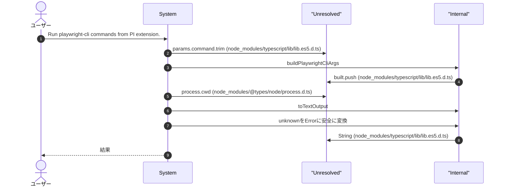
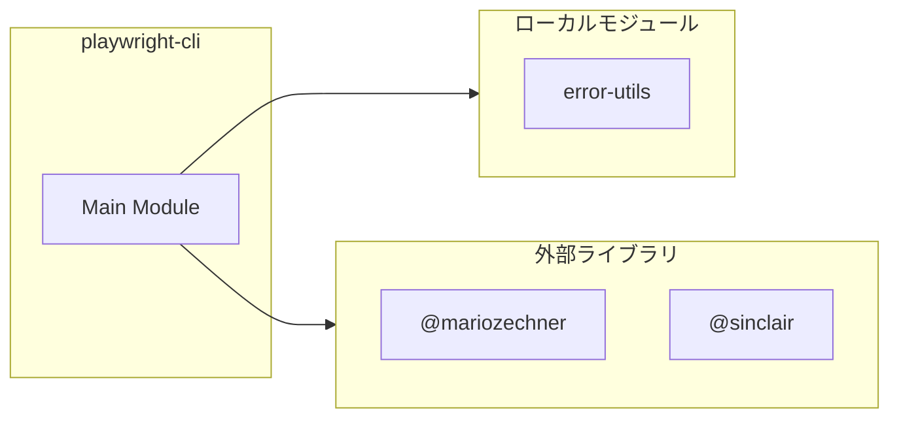

# playwright-cli

## 概要

`playwright-cli` モジュールのAPIリファレンス。

## インポート

```typescript
// from 'node:child_process': execFile
// from 'node:util': promisify
// from '@mariozechner/pi-coding-agent': ExtensionAPI
// from '@sinclair/typebox': Type
// from '../lib/error-utils.js': toError
```

## エクスポート一覧

| 種別 | 名前 | 説明 |
|------|------|------|
| 関数 | `buildPlaywrightCliArgs` | - |

## ユーザーフロー

このモジュールが提供するツールと、その実行フローを示します。

### playwright_cli

Run playwright-cli commands from PI extension.



## 図解

### 依存関係図



## 関数

### buildPlaywrightCliArgs

```typescript
buildPlaywrightCliArgs(params: PlaywrightCliParamsType): string[]
```

**パラメータ**

| 名前 | 型 | 必須 |
|------|-----|------|
| params | `PlaywrightCliParamsType` | はい |

**戻り値**: `string[]`

### toTextOutput

```typescript
toTextOutput(stdout: string, stderr: string): string
```

**パラメータ**

| 名前 | 型 | 必須 |
|------|-----|------|
| stdout | `string` | はい |
| stderr | `string` | はい |

**戻り値**: `string`

## 型定義

### PlaywrightCliParamsType

```typescript
type PlaywrightCliParamsType = {
  command: string;
  args?: string[];
  session?: string;
  config?: string;
  timeout_ms?: number;
  cwd?: string;
}
```

---
*自動生成: 2026-02-28T13:55:19.229Z*
