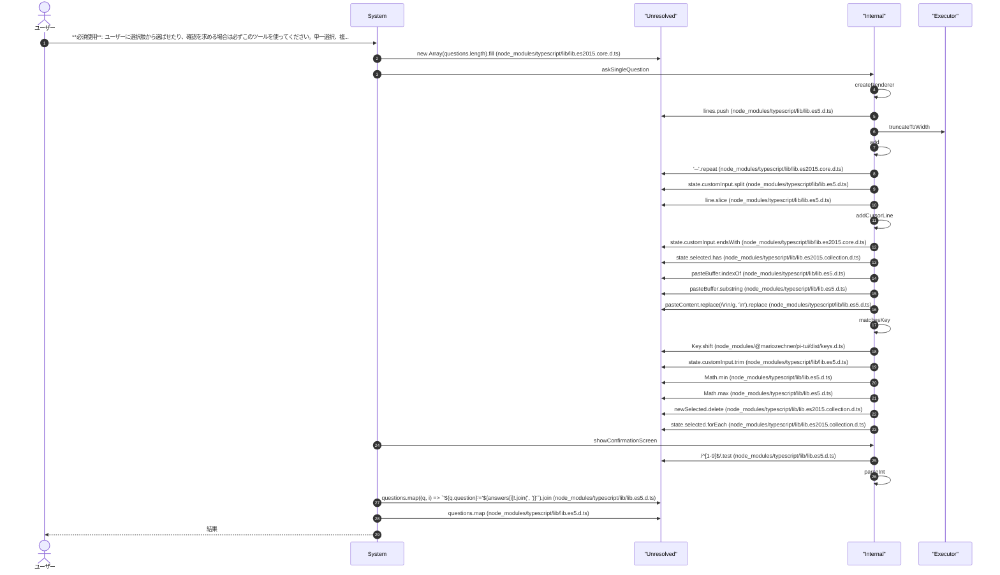
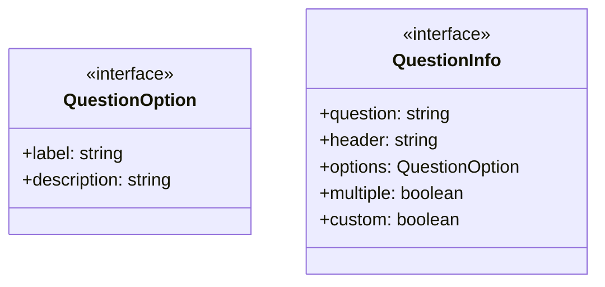
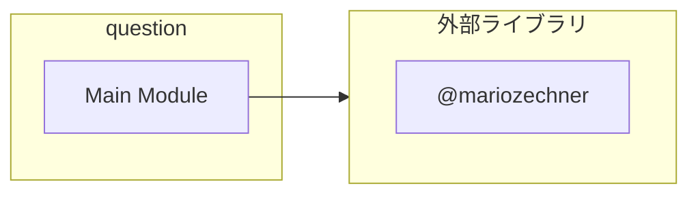
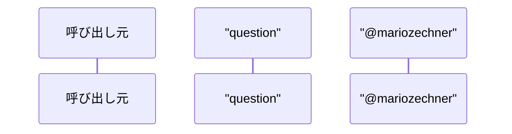

# question

## 概要

`question` モジュールのAPIリファレンス。

## インポート

```typescript
// from '@mariozechner/pi-ai': Type
// from '@mariozechner/pi-coding-agent': ExtensionAPI
// from '@mariozechner/pi-tui': Text, truncateToWidth, CURSOR_MARKER
// from '@mariozechner/pi-tui': matchesKey, Key
```

## エクスポート一覧

| 種別 | 名前 | 説明 |
|------|------|------|

## ユーザーフロー

このモジュールが提供するツールと、その実行フローを示します。

### question

**必須使用**: ユーザーに選択肢から選ばせたり、確認を求める場合は必ずこのツールを使ってください。単一選択、複数選択、自由記述に対応。



## 図解

### クラス図



### 依存関係図



### シーケンス図



## 関数

### createRenderer

```typescript
createRenderer(initialState: TState, renderFn: (state: TState, width: number, theme: any) => string[]): void
```

**パラメータ**

| 名前 | 型 | 必須 |
|------|-----|------|
| initialState | `TState` | はい |
| renderFn | `(state: TState, width: number, theme: any) => s...` | はい |

**戻り値**: `void`

### askSingleQuestion

```typescript
async askSingleQuestion(question: QuestionInfo, ctx: any): Promise<Answer | null>
```

**パラメータ**

| 名前 | 型 | 必須 |
|------|-----|------|
| question | `QuestionInfo` | はい |
| ctx | `any` | はい |

**戻り値**: `Promise<Answer | null>`

### add

```typescript
add(s: string): void
```

**パラメータ**

| 名前 | 型 | 必須 |
|------|-----|------|
| s | `string` | はい |

**戻り値**: `void`

### addCursorLine

```typescript
addCursorLine(s: string): void
```

**パラメータ**

| 名前 | 型 | 必須 |
|------|-----|------|
| s | `string` | はい |

**戻り値**: `void`

### showConfirmationScreen

```typescript
async showConfirmationScreen(questions: QuestionInfo[], answers: Answer[], ctx: any): Promise<ConfirmAction>
```

**パラメータ**

| 名前 | 型 | 必須 |
|------|-----|------|
| questions | `QuestionInfo[]` | はい |
| answers | `Answer[]` | はい |
| ctx | `any` | はい |

**戻り値**: `Promise<ConfirmAction>`

### add

```typescript
add(s: string): void
```

**パラメータ**

| 名前 | 型 | 必須 |
|------|-----|------|
| s | `string` | はい |

**戻り値**: `void`

## インターフェース

### QuestionOption

```typescript
interface QuestionOption {
  label: string;
  description?: string;
}
```

### QuestionInfo

```typescript
interface QuestionInfo {
  question: string;
  header: string;
  options: QuestionOption[];
  multiple?: boolean;
  custom?: boolean;
}
```

## 型定義

### Answer

```typescript
type Answer = string[]
```

### ConfirmAction

```typescript
type ConfirmAction = { type: "confirm" } | { type: "edit"; questionIndex: number } | { type: "cancel" }
```

---
*自動生成: 2026-02-18T18:06:17.318Z*
