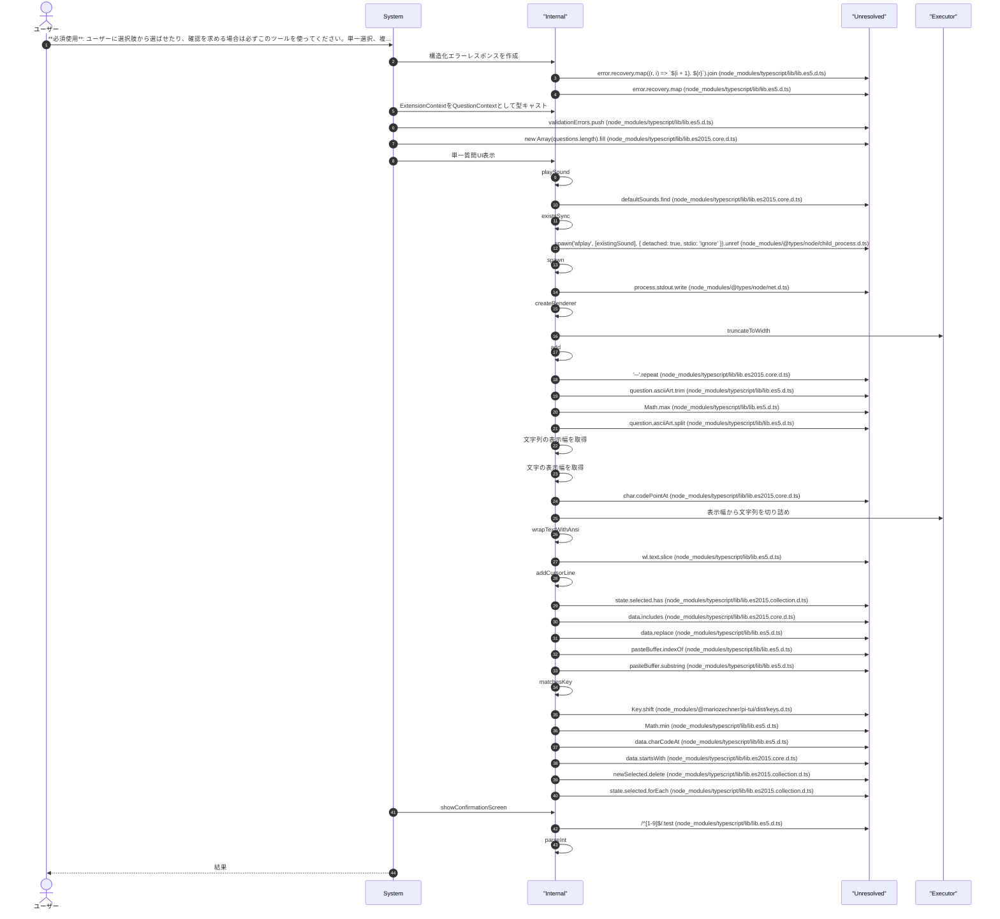
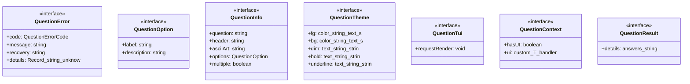
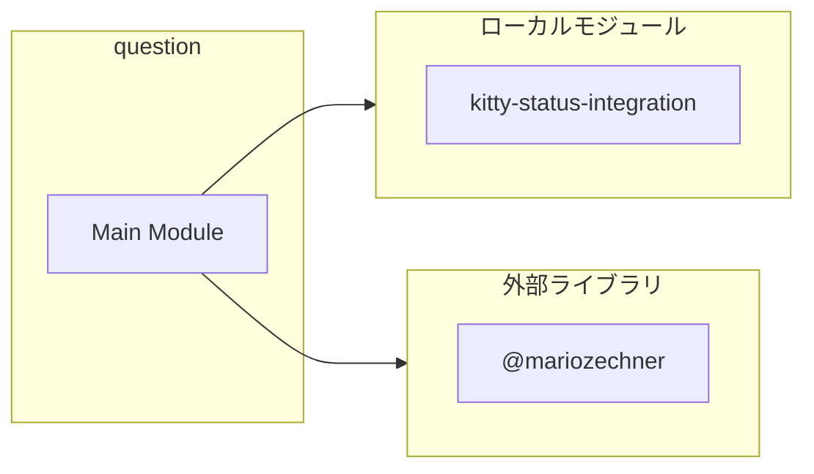
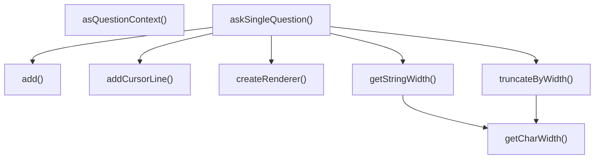
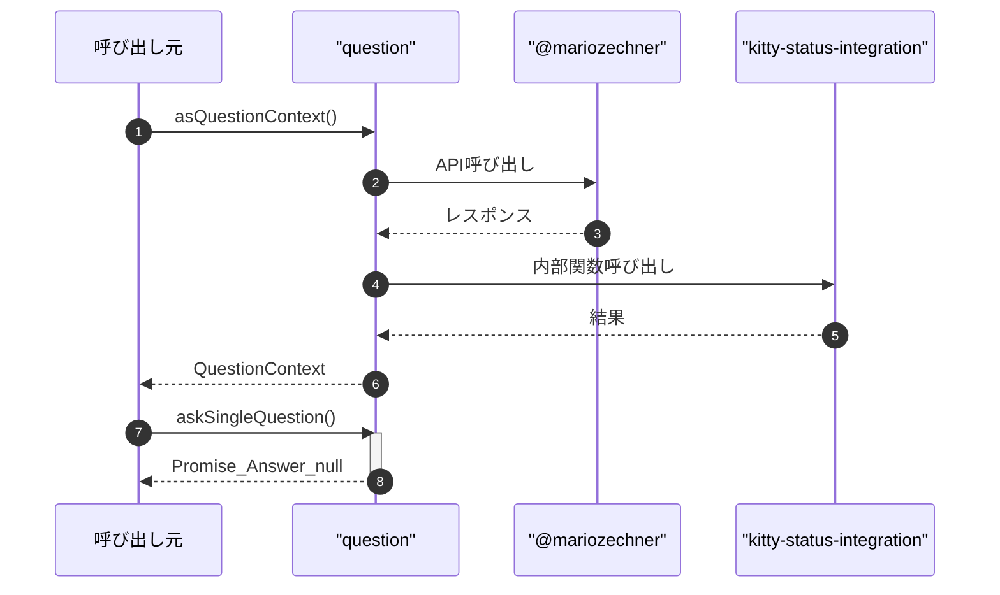

# question

## 概要

`question` モジュールのAPIリファレンス。

## インポート

```typescript
// from '@mariozechner/pi-ai': Type
// from '@mariozechner/pi-coding-agent': ExtensionAPI, ExtensionContext
// from '@mariozechner/pi-tui': Text, truncateToWidth, wrapTextWithAnsi, ...
// from '@mariozechner/pi-tui': matchesKey, Key
// from './kitty-status-integration.js': playSound
```

## エクスポート一覧

| 種別 | 名前 | 説明 |
|------|------|------|
| 関数 | `asQuestionContext` | ExtensionContextをQuestionContextとして型キャスト |
| 関数 | `askSingleQuestion` | 単一の質問をユーザーに表示して回答を取得する |
| インターフェース | `QuestionOption` | 質問の選択肢 |
| インターフェース | `QuestionInfo` | 質問情報 |
| インターフェース | `QuestionContext` | 質問用コンテキスト |
| 型 | `Answer` | 回答（選択されたラベルの配列） |

## ユーザーフロー

このモジュールが提供するツールと、その実行フローを示します。

### question

**必須使用**: ユーザーに選択肢から選ばせたり、確認を求める場合は必ずこのツールを使ってください。単一選択、複数選択、自由記述に対応。



## 図解

### クラス図



### 依存関係図



### 関数フロー



### シーケンス図



## 関数

### createErrorResponse

```typescript
createErrorResponse(error: QuestionError): { content: { type: "text"; text: string }[]; details: { answers: never[]; error: QuestionError } }
```

構造化エラーレスポンスを作成

**パラメータ**

| 名前 | 型 | 必須 |
|------|-----|------|
| error | `QuestionError` | はい |

**戻り値**: `{ content: { type: "text"; text: string }[]; details: { answers: never[]; error: QuestionError } }`

### asQuestionContext

```typescript
asQuestionContext(ctx: ExtensionContext): QuestionContext
```

ExtensionContextをQuestionContextとして型キャスト
実行時にはpi SDKのTheme型とQuestionThemeは互換性があるため安全
（両者とも同じメソッドシグネチャを持つ）

**パラメータ**

| 名前 | 型 | 必須 |
|------|-----|------|
| ctx | `ExtensionContext` | はい |

**戻り値**: `QuestionContext`

### getCharWidth

```typescript
getCharWidth(char: string): number
```

文字の表示幅を取得
CJK文字は幅2、それ以外は幅1

**パラメータ**

| 名前 | 型 | 必須 |
|------|-----|------|
| char | `string` | はい |

**戻り値**: `number`

### getStringWidth

```typescript
getStringWidth(str: string): number
```

文字列の表示幅を取得

**パラメータ**

| 名前 | 型 | 必須 |
|------|-----|------|
| str | `string` | はい |

**戻り値**: `number`

### truncateByWidth

```typescript
truncateByWidth(str: string, maxWidth: number): string
```

表示幅から文字列を切り詰め

**パラメータ**

| 名前 | 型 | 必須 |
|------|-----|------|
| str | `string` | はい |
| maxWidth | `number` | はい |

**戻り値**: `string`

### createRenderer

```typescript
createRenderer(initialState: TState, renderFn: (state: TState, width: number, theme: QuestionTheme) => string[]): void
```

**パラメータ**

| 名前 | 型 | 必須 |
|------|-----|------|
| initialState | `TState` | はい |
| renderFn | `(state: TState, width: number, theme: QuestionT...` | はい |

**戻り値**: `void`

### askSingleQuestion

```typescript
async askSingleQuestion(question: QuestionInfo, ctx: QuestionContext): Promise<Answer | null>
```

単一の質問をユーザーに表示して回答を取得する

**パラメータ**

| 名前 | 型 | 必須 |
|------|-----|------|
| question | `QuestionInfo` | はい |
| ctx | `QuestionContext` | はい |

**戻り値**: `Promise<Answer | null>`

### add

```typescript
add(s: string): void
```

**パラメータ**

| 名前 | 型 | 必須 |
|------|-----|------|
| s | `string` | はい |

**戻り値**: `void`

### addCursorLine

```typescript
addCursorLine(s: string): void
```

**パラメータ**

| 名前 | 型 | 必須 |
|------|-----|------|
| s | `string` | はい |

**戻り値**: `void`

### showConfirmationScreen

```typescript
async showConfirmationScreen(questions: QuestionInfo[], answers: Answer[], ctx: QuestionContext): Promise<ConfirmAction>
```

**パラメータ**

| 名前 | 型 | 必須 |
|------|-----|------|
| questions | `QuestionInfo[]` | はい |
| answers | `Answer[]` | はい |
| ctx | `QuestionContext` | はい |

**戻り値**: `Promise<ConfirmAction>`

### add

```typescript
add(s: string): void
```

**パラメータ**

| 名前 | 型 | 必須 |
|------|-----|------|
| s | `string` | はい |

**戻り値**: `void`

### hasQuestionDetails

```typescript
hasQuestionDetails(value: unknown): value is QuestionResult
```

**パラメータ**

| 名前 | 型 | 必須 |
|------|-----|------|
| value | `unknown` | はい |

**戻り値**: `value is QuestionResult`

## インターフェース

### QuestionError

```typescript
interface QuestionError {
  code: QuestionErrorCode;
  message: string;
  recovery: string[];
  details?: Record<string, unknown>;
}
```

構造化エラー情報

### QuestionOption

```typescript
interface QuestionOption {
  label: string;
  description?: string;
}
```

質問の選択肢

### QuestionInfo

```typescript
interface QuestionInfo {
  question: string;
  header: string;
  asciiArt?: string;
  options: QuestionOption[];
  multiple?: boolean;
  custom?: boolean;
}
```

質問情報

### QuestionTheme

```typescript
interface QuestionTheme {
  fg: (color: string, text: string) => string;
  bg: (color: string, text: string) => string;
  dim: (text: string) => string;
  bold: (text: string) => string;
  underline: (text: string) => string;
}
```

### QuestionTui

```typescript
interface QuestionTui {
  requestRender: () => void;
}
```

### QuestionContext

```typescript
interface QuestionContext {
  hasUI: boolean;
  ui: {
		custom: <T>(handler: (
			tui: QuestionTui,
			theme: QuestionTheme,
			_kb: unknown,
			done: (value: T) => void
		) => QuestionCustomController) => Promise<T>;
		notify: (message: string, type: string) => void;
	};
}
```

質問用コンテキスト
ExtensionContextから必要なUI機能を抽出

### QuestionResult

```typescript
interface QuestionResult {
  details?: { answers?: string[][] };
}
```

## 型定義

### Answer

```typescript
type Answer = string[]
```

回答（選択されたラベルの配列）

### QuestionCustomController

```typescript
type QuestionCustomController = {
	render: (w: number) => string[];
	invalidate: () => void;
	handleInput: (data: string) => void;
}
```

### ConfirmAction

```typescript
type ConfirmAction = { type: "confirm" } | { type: "edit"; questionIndex: number } | { type: "cancel" }
```

---
*自動生成: 2026-02-28T13:55:19.262Z*
