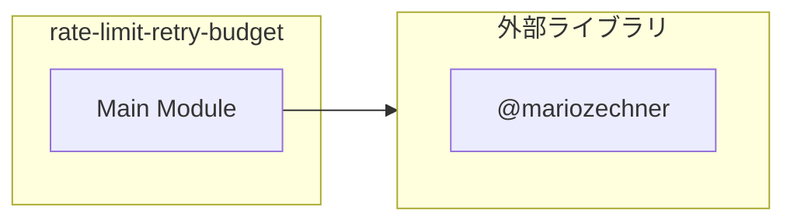
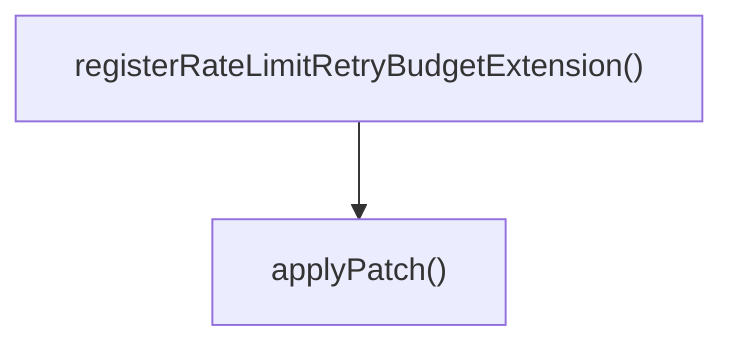
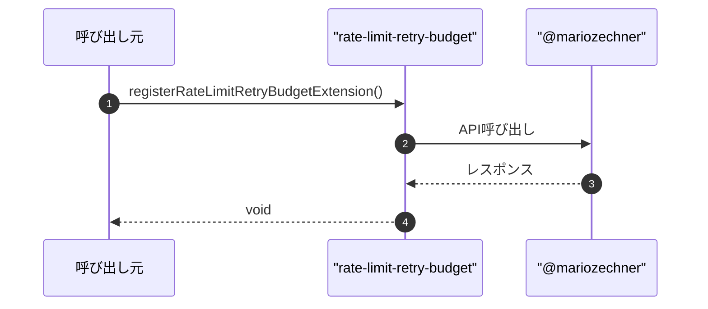

# rate-limit-retry-budget

## 概要

`rate-limit-retry-budget` モジュールのAPIリファレンス。

## インポート

```typescript
// from 'node:fs/promises': readFile, writeFile
// from 'node:module': createRequire
// from '@mariozechner/pi-coding-agent': ExtensionAPI
```

## エクスポート一覧

| 種別 | 名前 | 説明 |
|------|------|------|
| 関数 | `registerRateLimitRetryBudgetExtension` | リトライ予算拡張登録 |

## 図解

### 依存関係図



### 関数フロー



### シーケンス図



## 関数

### applyPatch

```typescript
async applyPatch(requireFn: NodeRequire): Promise<"patched" | "already" | "skip">
```

**パラメータ**

| 名前 | 型 | 必須 |
|------|-----|------|
| requireFn | `NodeRequire` | はい |

**戻り値**: `Promise<"patched" | "already" | "skip">`

### registerRateLimitRetryBudgetExtension

```typescript
registerRateLimitRetryBudgetExtension(pi: ExtensionAPI): void
```

リトライ予算拡張登録

**パラメータ**

| 名前 | 型 | 必須 |
|------|-----|------|
| pi | `ExtensionAPI` | はい |

**戻り値**: `void`

## 型定義

### Replacement

```typescript
type Replacement = {
  marker: string;
  beforeCandidates: string[];
  after: string;
}
```

---
*自動生成: 2026-02-24T17:08:02.327Z*
