# repo-audit-orchestrator

## 概要

`repo-audit-orchestrator` モジュールのAPIリファレンス。

## インポート

```typescript
// from '@mariozechner/pi-ai': Type
// from '@mariozechner/pi-coding-agent': ExtensionAPI
// from '../lib/verification-workflow.js': resolveVerificationConfigV2, shouldTriggerVerification, VerificationMode, ...
```

## エクスポート一覧

| 種別 | 名前 | 説明 |
|------|------|------|
| 関数 | `registerRepoAuditOrchestrator` | RepoAuditオーケストレーターを登録 |
| インターフェース | `RepoAuditConfig` | RepoAudit設定 |
| インターフェース | `AuditTask` | 監査タスク |
| インターフェース | `ExplorationDemand` | 探索需要 |
| インターフェース | `CachedFinding` | キャッシュされた発見 |
| インターフェース | `Hypothesis` | 仮説 |
| インターフェース | `Finding` | 発見事項 |
| インターフェース | `Verdict` | 判定 |
| インターフェース | `AuditResult` | 監査結果 |
| インターフェース | `PhaseUpdate` | フェーズ更新イベント |

## ユーザーフロー

このモジュールが提供するツールと、その実行フローを示します。

### repo_audit

RepoAuditスタイルのコード監査（3層アーキテクチャ: Initiator/Explorer/Validator）


## 図解

### クラス図

```mermaid
classDiagram
  class AgentMemory {
    -cache: Map_string_CachedFin
    -config: maxSize_number_ttl
    +set()
    +get()
    +findByQuery()
    +getStats()
    -invalidateOldest()
  }
  class RepoAuditConfig {
    <<interface>>
    +verificationMode: VerificationMode
    +maxExplorationDepth: number
    +explorationTimeout: number
    +validatorTimeout: number
    +cacheTTL: number
  }
  class AuditTask {
    <<interface>>
    +target: string
    +scope: file_module_rep
    +focus: security_perform
  }
  class ExplorationDemand {
    <<interface>>
    +id: string
    +type: trace_variable_tr
    +description: string
    +context: string
    +status: pending_running
  }
  class CachedFinding {
    <<interface>>
    +demandId: string
    +query: string
    +result: string
    +timestamp: number
    +confidence: number
  }
  class Hypothesis {
    <<interface>>
    +description: string
    +confidence: number
    +causalChain: string
    +demands: ExplorationDemand
  }
  class Finding {
    <<interface>>
    +location: string
    +issue: string
    +severity: low_medium_high
    +evidence: string
    +relatedDemands: string
  }
  class Verdict {
    <<interface>>
    +passed: boolean
    +confidence: number
    +warnings: string
    +recommendations: string
    +verificationDetails: triggered_boolean_t
  }
  class AuditResult {
    <<interface>>
    +hypothesis: Hypothesis
    +findings: Finding
    +verdict: Verdict
    +metadata: duration
  }
  class PhaseUpdate {
    <<interface>>
    +phase: initiator_explore
    +status: running_completed
    +message: string
    +progress: number
  }
```



### 依存関係図


### 関数フロー


### シーケンス図


## 関数

### runInitiatorPhase

```typescript
async runInitiatorPhase(task: AuditTask, _ctx: unknown, onUpdate?: (update: PhaseUpdate) => void): Promise<Hypothesis>
```

Initiatorフェーズ: 仮説生成

**パラメータ**

| 名前 | 型 | 必須 |
|------|-----|------|
| task | `AuditTask` | はい |
| _ctx | `unknown` | はい |
| onUpdate | `(update: PhaseUpdate) => void` | いいえ |

**戻り値**: `Promise<Hypothesis>`

### runExplorerPhase

```typescript
async runExplorerPhase(task: AuditTask, hypothesis: Hypothesis, config: RepoAuditConfig, _ctx: unknown, onUpdate?: (update: PhaseUpdate) => void): Promise<{ findings: Finding[]; resolvedDemands: number }>
```

Explorerフェーズ: 需要駆動探索

**パラメータ**

| 名前 | 型 | 必須 |
|------|-----|------|
| task | `AuditTask` | はい |
| hypothesis | `Hypothesis` | はい |
| config | `RepoAuditConfig` | はい |
| _ctx | `unknown` | はい |
| onUpdate | `(update: PhaseUpdate) => void` | いいえ |

**戻り値**: `Promise<{ findings: Finding[]; resolvedDemands: number }>`

### runValidatorPhase

```typescript
async runValidatorPhase(findings: Finding[], hypothesis: Hypothesis, config: RepoAuditConfig, _ctx: unknown, onUpdate?: (update: PhaseUpdate) => void): Promise<Verdict>
```

Validatorフェーズ: 検証

**パラメータ**

| 名前 | 型 | 必須 |
|------|-----|------|
| findings | `Finding[]` | はい |
| hypothesis | `Hypothesis` | はい |
| config | `RepoAuditConfig` | はい |
| _ctx | `unknown` | はい |
| onUpdate | `(update: PhaseUpdate) => void` | いいえ |

**戻り値**: `Promise<Verdict>`

### generateInitialHypotheses

```typescript
generateInitialHypotheses(target: string, scope: string, focus: string[]): string[]
```

初期仮説を生成

**パラメータ**

| 名前 | 型 | 必須 |
|------|-----|------|
| target | `string` | はい |
| scope | `string` | はい |
| focus | `string[]` | はい |

**戻り値**: `string[]`

### generateInitialDemands

```typescript
generateInitialDemands(target: string, scope: string): ExplorationDemand[]
```

初期探索需要を生成

**パラメータ**

| 名前 | 型 | 必須 |
|------|-----|------|
| target | `string` | はい |
| scope | `string` | はい |

**戻り値**: `ExplorationDemand[]`

### createDemand

```typescript
createDemand(type: ExplorationDemand["type"], description: string, context: string): ExplorationDemand
```

**パラメータ**

| 名前 | 型 | 必須 |
|------|-----|------|
| type | `ExplorationDemand["type"]` | はい |
| description | `string` | はい |
| context | `string` | はい |

**戻り値**: `ExplorationDemand`

### resolveDemand

```typescript
async resolveDemand(demand: ExplorationDemand, task: AuditTask, config: RepoAuditConfig): Promise<{
  resolved: boolean;
  finding?: Finding;
  childDemands?: ExplorationDemand[];
}>
```

探索需要を解決

**パラメータ**

| 名前 | 型 | 必須 |
|------|-----|------|
| demand | `ExplorationDemand` | はい |
| task | `AuditTask` | はい |
| config | `RepoAuditConfig` | はい |

**戻り値**: `Promise<{
  resolved: boolean;
  finding?: Finding;
  childDemands?: ExplorationDemand[];
}>`

### buildVerificationOutput

```typescript
buildVerificationOutput(hypothesis: Hypothesis, findings: Finding[]): string
```

検証用出力を構築

**パラメータ**

| 名前 | 型 | 必須 |
|------|-----|------|
| hypothesis | `Hypothesis` | はい |
| findings | `Finding[]` | はい |

**戻り値**: `string`

### calculateOverallConfidence

```typescript
calculateOverallConfidence(hypothesis: Hypothesis, findings: Finding[]): number
```

全体的な信頼度を計算

**パラメータ**

| 名前 | 型 | 必須 |
|------|-----|------|
| hypothesis | `Hypothesis` | はい |
| findings | `Finding[]` | はい |

**戻り値**: `number`

### runInspectorPatterns

```typescript
runInspectorPatterns(output: string, findings: Finding[]): string[]
```

Inspectorパターンを実行

**パラメータ**

| 名前 | 型 | 必須 |
|------|-----|------|
| output | `string` | はい |
| findings | `Finding[]` | はい |

**戻り値**: `string[]`

### runChallengerPatterns

```typescript
runChallengerPatterns(hypothesis: Hypothesis, findings: Finding[]): { warnings: string[]; recommendations: string[] }
```

Challengerパターンを実行

**パラメータ**

| 名前 | 型 | 必須 |
|------|-----|------|
| hypothesis | `Hypothesis` | はい |
| findings | `Finding[]` | はい |

**戻り値**: `{ warnings: string[]; recommendations: string[] }`

### registerRepoAuditOrchestrator

```typescript
registerRepoAuditOrchestrator(pi: ExtensionAPI): void
```

RepoAuditオーケストレーターを登録

**パラメータ**

| 名前 | 型 | 必須 |
|------|-----|------|
| pi | `ExtensionAPI` | はい |

**戻り値**: `void`

## クラス

### AgentMemory

エージェントメモリ
RepoAuditのAgent Memory概念を実装

**プロパティ**

| 名前 | 型 | 可視性 |
|------|-----|--------|
| cache | `Map<string, CachedFinding>` | private |
| config | `{ maxSize: number; ttl: number }` | private |

**メソッド**

| 名前 | シグネチャ |
|------|------------|
| set | `set(demandId, query, result, confidence, source): void` |
| get | `get(demandId): CachedFinding | null` |
| findByQuery | `findByQuery(query): CachedFinding | null` |
| getStats | `getStats(): { size: number; hits: number }` |
| invalidateOldest | `invalidateOldest(): void` |

## インターフェース

### RepoAuditConfig

```typescript
interface RepoAuditConfig {
  verificationMode: VerificationMode;
  maxExplorationDepth: number;
  explorationTimeout: number;
  validatorTimeout: number;
  cacheTTL: number;
  parallelDemands: number;
}
```

RepoAudit設定

### AuditTask

```typescript
interface AuditTask {
  target: string;
  scope: "file" | "module" | "repository";
  focus?: ("security" | "performance" | "correctness" | "maintainability")[];
}
```

監査タスク

### ExplorationDemand

```typescript
interface ExplorationDemand {
  id: string;
  type: "trace-variable" | "trace-call" | "check-contract" | "find-similar" | "validate-assumption";
  description: string;
  context: string;
  status: "pending" | "running" | "resolved" | "failed";
  result?: string;
  childDemands?: string[];
}
```

探索需要

### CachedFinding

```typescript
interface CachedFinding {
  demandId: string;
  query: string;
  result: string;
  timestamp: number;
  confidence: number;
  source: string;
}
```

キャッシュされた発見

### Hypothesis

```typescript
interface Hypothesis {
  description: string;
  confidence: number;
  causalChain: string[];
  demands: ExplorationDemand[];
}
```

仮説

### Finding

```typescript
interface Finding {
  location: string;
  issue: string;
  severity: "low" | "medium" | "high" | "critical";
  evidence: string[];
  relatedDemands: string[];
}
```

発見事項

### Verdict

```typescript
interface Verdict {
  passed: boolean;
  confidence: number;
  warnings: string[];
  recommendations: string[];
  verificationDetails?: {
    triggered: boolean;
    triggerReason: string;
    inspectorFindings?: string[];
    challengerFindings?: string[];
  };
}
```

判定

### AuditResult

```typescript
interface AuditResult {
  hypothesis: Hypothesis;
  findings: Finding[];
  verdict: Verdict;
  metadata: {
    /** 総所要時間 */
    duration: number;
    /** フェーズ別所要時間 */
    phases: {
      initiator: number;
      explorer: number;
      validator: number;
    };
    /** キャッシュヒット数 */
    cacheHits: number;
    /** 総需要数 */
    totalDemands: number;
    /** 解決需要数 */
    resolvedDemands: number;
  };
}
```

監査結果

### PhaseUpdate

```typescript
interface PhaseUpdate {
  phase: "initiator" | "explorer" | "validator";
  status: "running" | "completed" | "failed";
  message: string;
  progress?: number;
}
```

フェーズ更新イベント

---
*自動生成: 2026-02-28T13:55:19.483Z*
