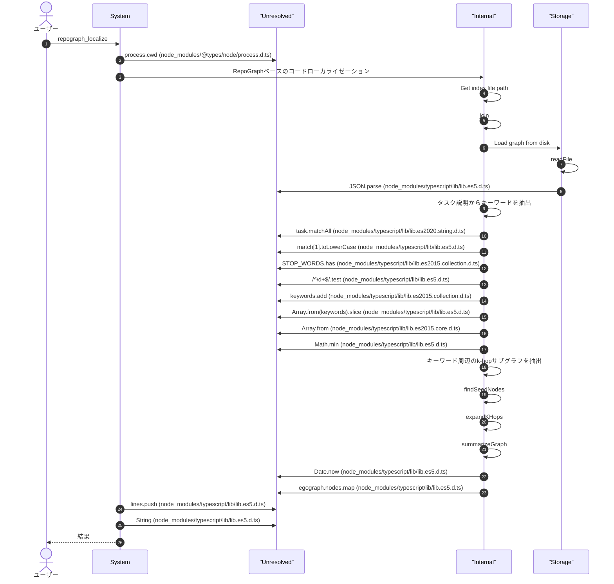
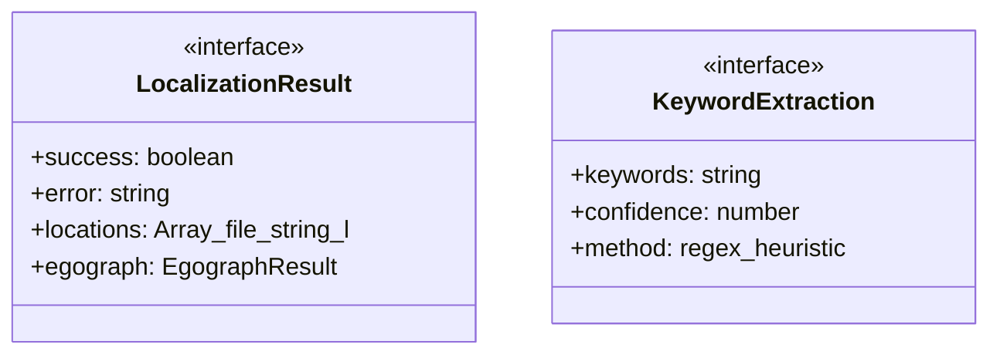
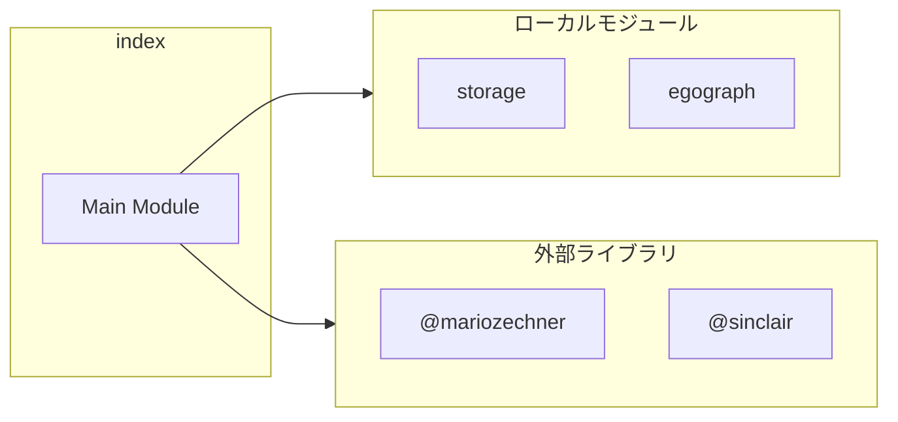
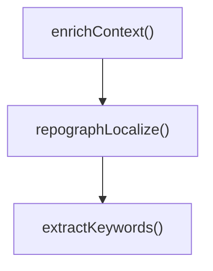
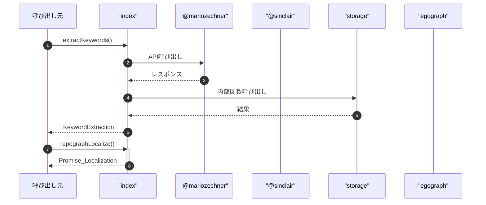

# index

## 概要

`index` モジュールのAPIリファレンス。

## インポート

```typescript
// from '@mariozechner/pi-coding-agent': ExtensionAPI
// from '@sinclair/typebox': Type
// from '../search/repograph/storage.js': loadRepoGraph, getRepoGraphPath
// from '../search/repograph/egograph.js': extractEgograph, formatEgograph
// from '../search/repograph/egograph.js': EgographOptions, EgographResult
```

## エクスポート一覧

| 種別 | 名前 | 説明 |
|------|------|------|
| 関数 | `extractKeywords` | Extract keywords from a task description |
| 関数 | `repographLocalize` | Perform RepoGraph-based localization for a task |
| 関数 | `enrichContext` | Enrich context with RepoGraph localization data |
| インターフェース | `LocalizationResult` | Localization result from RepoGraph |
| インターフェース | `KeywordExtraction` | Keyword extraction result |

## ユーザーフロー

このモジュールが提供するツールと、その実行フローを示します。

### repograph_localize




## 図解

### クラス図



### 依存関係図



### 関数フロー



### シーケンス図



## 関数

### extractKeywords

```typescript
extractKeywords(task: string): KeywordExtraction
```

Extract keywords from a task description

**パラメータ**

| 名前 | 型 | 必須 |
|------|-----|------|
| task | `string` | はい |

**戻り値**: `KeywordExtraction`

### repographLocalize

```typescript
async repographLocalize(task: string, cwd: string, options?: {
		/** Number of hops for egograph (default: 2) */
		k?: number;
		/** Maximum nodes to return (default: 50) */
		maxNodes?: number;
		/** Include egograph in result */
		includeEgograph?: boolean;
	}): Promise<LocalizationResult>
```

Perform RepoGraph-based localization for a task

**パラメータ**

| 名前 | 型 | 必須 |
|------|-----|------|
| task | `string` | はい |
| cwd | `string` | はい |
| options | `object` | いいえ |
| &nbsp;&nbsp;↳ k | `number` | いいえ |
| &nbsp;&nbsp;↳ maxNodes | `number` | いいえ |
| &nbsp;&nbsp;↳ includeEgograph | `boolean` | いいえ |

**戻り値**: `Promise<LocalizationResult>`

### enrichContext

```typescript
async enrichContext(task: string, cwd: string): Promise<string>
```

Enrich context with RepoGraph localization data

**パラメータ**

| 名前 | 型 | 必須 |
|------|-----|------|
| task | `string` | はい |
| cwd | `string` | はい |

**戻り値**: `Promise<string>`

## インターフェース

### LocalizationResult

```typescript
interface LocalizationResult {
  success: boolean;
  error?: string;
  locations: Array<{
		file: string;
		line: number;
		symbolName: string;
		nodeType: "def" | "ref" | "import";
		relevance: number;
	}>;
  egograph?: EgographResult;
}
```

Localization result from RepoGraph

### KeywordExtraction

```typescript
interface KeywordExtraction {
  keywords: string[];
  confidence: number;
  method: "regex" | "heuristic";
}
```

Keyword extraction result

---
*自動生成: 2026-02-24T17:08:02.335Z*
