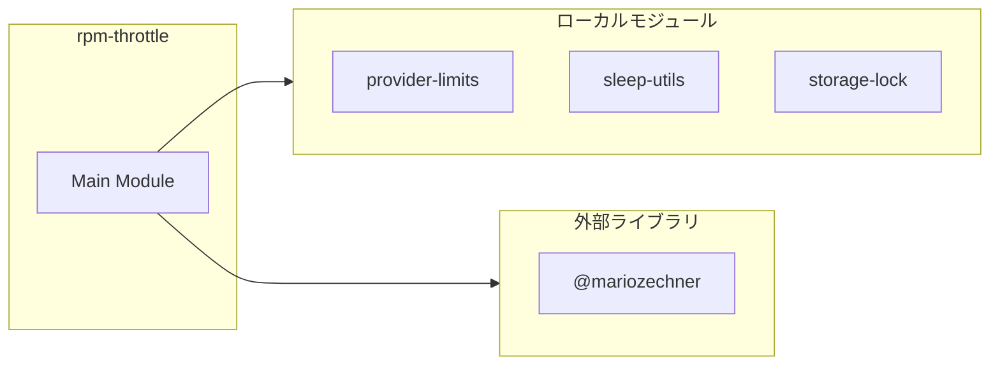
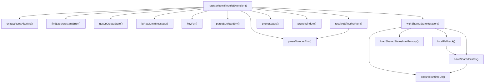

# rpm-throttle

## 概要

`rpm-throttle` モジュールのAPIリファレンス。

## インポート

```typescript
// from '@mariozechner/pi-coding-agent': ExtensionAPI
// from 'node:fs': existsSync, mkdirSync, readFileSync, ...
// from 'node:os': homedir
// from 'node:path': join
// from '../lib/provider-limits.js': detectTier, getRpmLimit
// ... and 2 more imports
```

## エクスポート一覧

| 種別 | 名前 | 説明 |
|------|------|------|
| 関数 | `registerRpmThrottleExtension` | RPMスロットル拡張登録 |

## 図解

### 依存関係図



### 関数フロー



## 関数

### parseNumberEnv

```typescript
parseNumberEnv(name: string, fallback: number): number
```

**パラメータ**

| 名前 | 型 | 必須 |
|------|-----|------|
| name | `string` | はい |
| fallback | `number` | はい |

**戻り値**: `number`

### parseBooleanEnv

```typescript
parseBooleanEnv(name: string, fallback: boolean): boolean
```

**パラメータ**

| 名前 | 型 | 必須 |
|------|-----|------|
| name | `string` | はい |
| fallback | `boolean` | はい |

**戻り値**: `boolean`

### keyFor

```typescript
keyFor(provider: string, model: string): string
```

**パラメータ**

| 名前 | 型 | 必須 |
|------|-----|------|
| provider | `string` | はい |
| model | `string` | はい |

**戻り値**: `string`

### getOrCreateState

```typescript
getOrCreateState(key: string, nowMs: number): BucketState
```

**パラメータ**

| 名前 | 型 | 必須 |
|------|-----|------|
| key | `string` | はい |
| nowMs | `number` | はい |

**戻り値**: `BucketState`

### ensureRuntimeDir

```typescript
ensureRuntimeDir(): void
```

**戻り値**: `void`

### loadSharedStatesIntoMemory

```typescript
loadSharedStatesIntoMemory(nowMs: number): void
```

**パラメータ**

| 名前 | 型 | 必須 |
|------|-----|------|
| nowMs | `number` | はい |

**戻り値**: `void`

### saveSharedStates

```typescript
saveSharedStates(nowMs: number): void
```

**パラメータ**

| 名前 | 型 | 必須 |
|------|-----|------|
| nowMs | `number` | はい |

**戻り値**: `void`

### withSharedStateMutation

```typescript
withSharedStateMutation(nowMs: number, mutator: () => T): T
```

**パラメータ**

| 名前 | 型 | 必須 |
|------|-----|------|
| nowMs | `number` | はい |
| mutator | `() => T` | はい |

**戻り値**: `T`

### localFallback

```typescript
localFallback(): void
```

**戻り値**: `void`

### pruneStates

```typescript
pruneStates(nowMs: number): void
```

**パラメータ**

| 名前 | 型 | 必須 |
|------|-----|------|
| nowMs | `number` | はい |

**戻り値**: `void`

### pruneWindow

```typescript
pruneWindow(state: BucketState, nowMs: number, windowMs: number): void
```

**パラメータ**

| 名前 | 型 | 必須 |
|------|-----|------|
| state | `BucketState` | はい |
| nowMs | `number` | はい |
| windowMs | `number` | はい |

**戻り値**: `void`

### isRateLimitMessage

```typescript
isRateLimitMessage(text: string): boolean
```

**パラメータ**

| 名前 | 型 | 必須 |
|------|-----|------|
| text | `string` | はい |

**戻り値**: `boolean`

### extractRetryAfterMs

```typescript
extractRetryAfterMs(text: string): number | undefined
```

**パラメータ**

| 名前 | 型 | 必須 |
|------|-----|------|
| text | `string` | はい |

**戻り値**: `number | undefined`

### resolveEffectiveRpm

```typescript
resolveEffectiveRpm(provider: string, model: string): number
```

**パラメータ**

| 名前 | 型 | 必須 |
|------|-----|------|
| provider | `string` | はい |
| model | `string` | はい |

**戻り値**: `number`

### findLastAssistantError

```typescript
findLastAssistantError(messages: unknown): string | undefined
```

**パラメータ**

| 名前 | 型 | 必須 |
|------|-----|------|
| messages | `unknown` | はい |

**戻り値**: `string | undefined`

### registerRpmThrottleExtension

```typescript
registerRpmThrottleExtension(pi: ExtensionAPI): void
```

RPMスロットル拡張登録

**パラメータ**

| 名前 | 型 | 必須 |
|------|-----|------|
| pi | `ExtensionAPI` | はい |

**戻り値**: `void`

## 型定義

### BucketState

```typescript
type BucketState = {
  requestStartsMs: number[];
  cooldownUntilMs: number;
  lastAccessedMs: number;
}
```

### SharedStateRecord

```typescript
type SharedStateRecord = {
  version: number;
  updatedAt: string;
  states: Record<string, BucketState>;
}
```

---
*自動生成: 2026-02-28T13:55:19.639Z*
