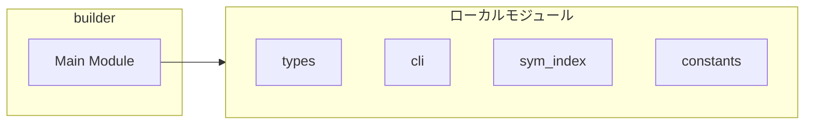
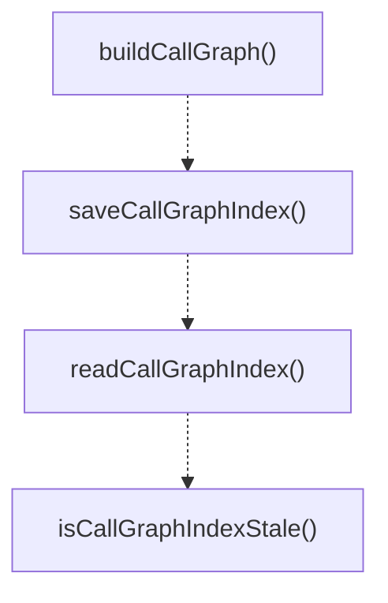
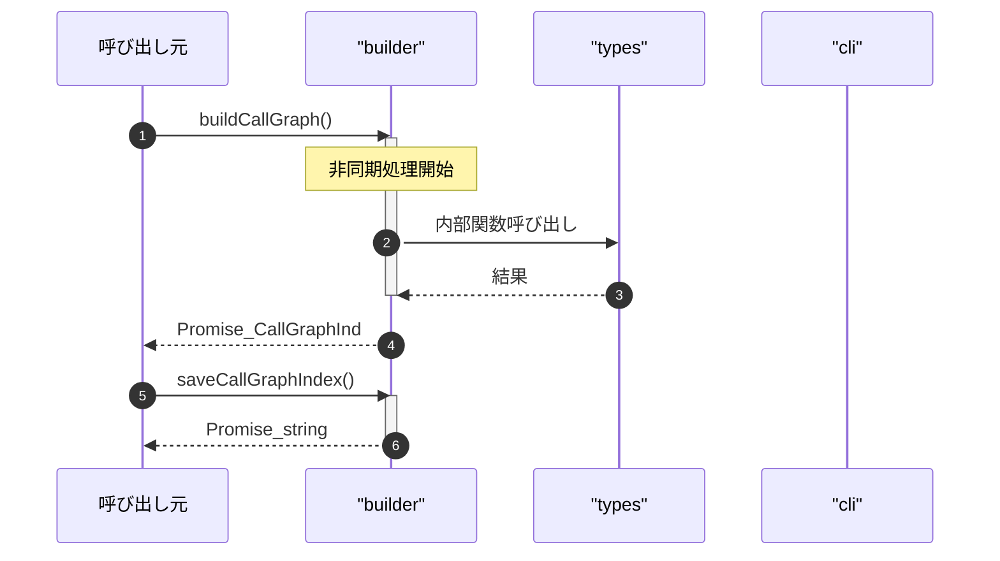

# builder

## 概要

`builder` モジュールのAPIリファレンス。

## インポート

```typescript
import { join, dirname } from 'node:path';
import { mkdir, writeFile, readFile... } from 'node:fs/promises';
import { CallGraphIndex, CallGraphNode, CallGraphEdge... } from './types.js';
import { execute } from '../utils/cli.js';
import { readSymbolIndex } from '../tools/sym_index.js';
// ... and 2 more imports
```

## エクスポート一覧

| 種別 | 名前 | 説明 |
|------|------|------|
| 関数 | `buildCallGraph` | プロジェクトのコールグラフを構築する |
| 関数 | `saveCallGraphIndex` | コールグラフのインデックスをファイルに保存します。 |
| 関数 | `readCallGraphIndex` | コールグラフのインデックスを読み込む |
| 関数 | `isCallGraphIndexStale` | コールグラフインデックスが古いか確認 |

## 図解

### 依存関係図



### 関数フロー



### シーケンス図



## 関数

### getCallGraphDir

```typescript
getCallGraphDir(cwd: string): string
```

**パラメータ**

| 名前 | 型 | 必須 |
|------|-----|------|
| cwd | `string` | はい |

**戻り値**: `string`

### getCallGraphIndexPath

```typescript
getCallGraphIndexPath(cwd: string): string
```

**パラメータ**

| 名前 | 型 | 必須 |
|------|-----|------|
| cwd | `string` | はい |

**戻り値**: `string`

### fileExists

```typescript
async fileExists(path: string): Promise<boolean>
```

**パラメータ**

| 名前 | 型 | 必須 |
|------|-----|------|
| path | `string` | はい |

**戻り値**: `Promise<boolean>`

### mapKind

```typescript
mapKind(ctagsKind: string): CallGraphNodeKind
```

Map ctags kind to CallGraphNodeKind

**パラメータ**

| 名前 | 型 | 必須 |
|------|-----|------|
| ctagsKind | `string` | はい |

**戻り値**: `CallGraphNodeKind`

### getFunctionDefinitions

```typescript
async getFunctionDefinitions(cwd: string): Promise<FunctionDefinition[]>
```

Get function definitions from symbol index.
Filters for callable symbols only.

**パラメータ**

| 名前 | 型 | 必須 |
|------|-----|------|
| cwd | `string` | はい |

**戻り値**: `Promise<FunctionDefinition[]>`

### generateNodeId

```typescript
generateNodeId(def: FunctionDefinition): string
```

Generate unique node ID

**パラメータ**

| 名前 | 型 | 必須 |
|------|-----|------|
| def | `FunctionDefinition` | はい |

**戻り値**: `string`

### extractFunctionBody

```typescript
async extractFunctionBody(def: FunctionDefinition, cwd: string): Promise<{ body: string; startLine: number; endLine: number } | null>
```

Extract function body using ripgrep with context.
Returns lines between function definition and next function/class at same or lower indentation.

**パラメータ**

| 名前 | 型 | 必須 |
|------|-----|------|
| def | `FunctionDefinition` | はい |
| cwd | `string` | はい |

**戻り値**: `Promise<{ body: string; startLine: number; endLine: number } | null>`

### buildCallPattern

```typescript
buildCallPattern(functionName: string): string
```

Build regex pattern for function calls.
Matches functionName( but excludes declarations and property access.

**パラメータ**

| 名前 | 型 | 必須 |
|------|-----|------|
| functionName | `string` | はい |

**戻り値**: `string`

### findCallsToFunction

```typescript
async findCallsToFunction(functionName: string, cwd: string, limit: any): Promise<DetectedCall[]>
```

Find all calls to a specific function using ripgrep.

**パラメータ**

| 名前 | 型 | 必須 |
|------|-----|------|
| functionName | `string` | はい |
| cwd | `string` | はい |
| limit | `any` | はい |

**戻り値**: `Promise<DetectedCall[]>`

### findCallsInFile

```typescript
async findCallsInFile(filePath: string, startLine: number, endLine: number, cwd: string, knownFunctions: Set<string>): Promise<DetectedCall[]>
```

Find all function calls within a specific file and line range.
Used to find calls made by a specific function.

**パラメータ**

| 名前 | 型 | 必須 |
|------|-----|------|
| filePath | `string` | はい |
| startLine | `number` | はい |
| endLine | `number` | はい |
| cwd | `string` | はい |
| knownFunctions | `Set<string>` | はい |

**戻り値**: `Promise<DetectedCall[]>`

### calculateConfidence

```typescript
calculateConfidence(call: DetectedCall, callerDef: FunctionDefinition, allDefinitions: Map<string, FunctionDefinition>): number
```

Calculate confidence score for a call relationship.

**パラメータ**

| 名前 | 型 | 必須 |
|------|-----|------|
| call | `DetectedCall` | はい |
| callerDef | `FunctionDefinition` | はい |
| allDefinitions | `Map<string, FunctionDefinition>` | はい |

**戻り値**: `number`

### buildCallGraph

```typescript
async buildCallGraph(path: string, cwd: string): Promise<CallGraphIndex>
```

プロジェクトのコールグラフを構築する

**パラメータ**

| 名前 | 型 | 必須 |
|------|-----|------|
| path | `string` | はい |
| cwd | `string` | はい |

**戻り値**: `Promise<CallGraphIndex>`

### saveCallGraphIndex

```typescript
async saveCallGraphIndex(index: CallGraphIndex, cwd: string): Promise<string>
```

コールグラフのインデックスをファイルに保存します。

**パラメータ**

| 名前 | 型 | 必須 |
|------|-----|------|
| index | `CallGraphIndex` | はい |
| cwd | `string` | はい |

**戻り値**: `Promise<string>`

### readCallGraphIndex

```typescript
async readCallGraphIndex(cwd: string): Promise<CallGraphIndex | null>
```

コールグラフのインデックスを読み込む

**パラメータ**

| 名前 | 型 | 必須 |
|------|-----|------|
| cwd | `string` | はい |

**戻り値**: `Promise<CallGraphIndex | null>`

### isCallGraphIndexStale

```typescript
async isCallGraphIndexStale(cwd: string): Promise<boolean>
```

コールグラフインデックスが古いか確認

**パラメータ**

| 名前 | 型 | 必須 |
|------|-----|------|
| cwd | `string` | はい |

**戻り値**: `Promise<boolean>`

---
*自動生成: 2026-02-18T07:48:44.564Z*
