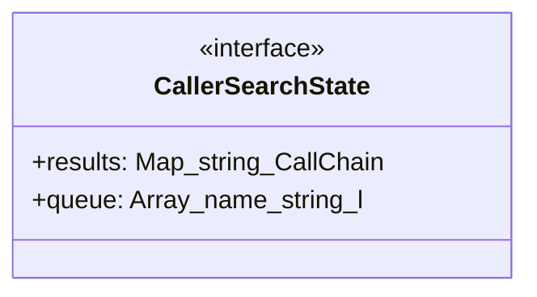
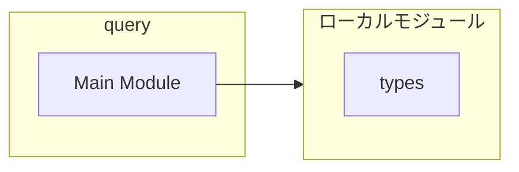
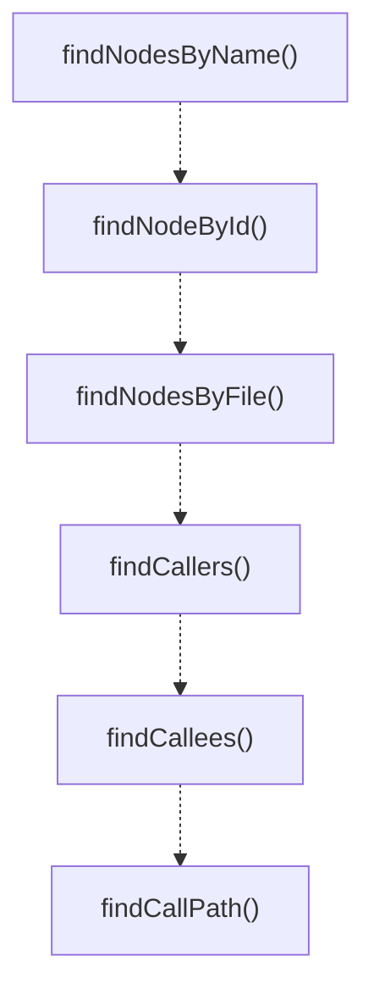
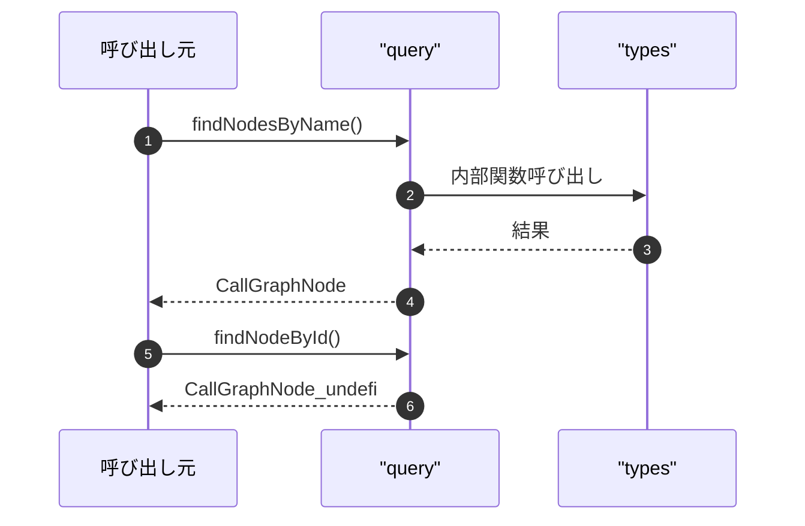

# query

## 概要

`query` モジュールのAPIリファレンス。

## インポート

```typescript
import { CallGraphIndex, CallGraphNode, CallGraphEdge... } from './types.js';
```

## エクスポート一覧

| 種別 | 名前 | 説明 |
|------|------|------|
| 関数 | `findNodesByName` | 名前を指定してノードを検索する |
| 関数 | `findNodeById` | IDに一致するノードを検索する。 |
| 関数 | `findNodesByFile` | ファイルパスでノードを検索 |
| 関数 | `findCallers` | 指定されたシンボルを呼び出す全ての関数を検索します。 |
| 関数 | `findCallees` | 指定されたシンボルから呼ばれる関数を検索する |
| 関数 | `findCallPath` | 2つのシンボル間の呼び出し経路を探索する |
| 関数 | `getNodeStats` | 呼び出しグラフのノード統計情報を取得する |

## 図解

### クラス図



### 依存関係図



### 関数フロー



### シーケンス図



## 関数

### findNodesByName

```typescript
findNodesByName(index: CallGraphIndex, symbolName: string): CallGraphNode[]
```

名前を指定してノードを検索する

**パラメータ**

| 名前 | 型 | 必須 |
|------|-----|------|
| index | `CallGraphIndex` | はい |
| symbolName | `string` | はい |

**戻り値**: `CallGraphNode[]`

### findNodeById

```typescript
findNodeById(index: CallGraphIndex, nodeId: string): CallGraphNode | undefined
```

IDに一致するノードを検索する。

**パラメータ**

| 名前 | 型 | 必須 |
|------|-----|------|
| index | `CallGraphIndex` | はい |
| nodeId | `string` | はい |

**戻り値**: `CallGraphNode | undefined`

### findNodesByFile

```typescript
findNodesByFile(index: CallGraphIndex, filePath: string): CallGraphNode[]
```

ファイルパスでノードを検索

**パラメータ**

| 名前 | 型 | 必須 |
|------|-----|------|
| index | `CallGraphIndex` | はい |
| filePath | `string` | はい |

**戻り値**: `CallGraphNode[]`

### findCallers

```typescript
findCallers(index: CallGraphIndex, symbolName: string, depth: number, limit: number): CallChainResult[]
```

指定されたシンボルを呼び出す全ての関数を検索します。

**パラメータ**

| 名前 | 型 | 必須 |
|------|-----|------|
| index | `CallGraphIndex` | はい |
| symbolName | `string` | はい |
| depth | `number` | はい |
| limit | `number` | はい |

**戻り値**: `CallChainResult[]`

### findCallees

```typescript
findCallees(index: CallGraphIndex, symbolName: string, depth: number, limit: number): CallChainResult[]
```

指定されたシンボルから呼ばれる関数を検索する

**パラメータ**

| 名前 | 型 | 必須 |
|------|-----|------|
| index | `CallGraphIndex` | はい |
| symbolName | `string` | はい |
| depth | `number` | はい |
| limit | `number` | はい |

**戻り値**: `CallChainResult[]`

### findCallPath

```typescript
findCallPath(index: CallGraphIndex, fromSymbol: string, toSymbol: string, maxDepth: number): CallGraphNode[] | null
```

2つのシンボル間の呼び出し経路を探索する

**パラメータ**

| 名前 | 型 | 必須 |
|------|-----|------|
| index | `CallGraphIndex` | はい |
| fromSymbol | `string` | はい |
| toSymbol | `string` | はい |
| maxDepth | `number` | はい |

**戻り値**: `CallGraphNode[] | null`

### getNodeStats

```typescript
getNodeStats(index: CallGraphIndex, symbolName: string): {
	node: CallGraphNode | null;
	directCallers: number;
	directCallees: number;
	totalCallers: number;
	totalCallees: number;
}
```

呼び出しグラフのノード統計情報を取得する

**パラメータ**

| 名前 | 型 | 必須 |
|------|-----|------|
| index | `CallGraphIndex` | はい |
| symbolName | `string` | はい |

**戻り値**: `{
	node: CallGraphNode | null;
	directCallers: number;
	directCallees: number;
	totalCallers: number;
	totalCallees: number;
}`

## インターフェース

### CallerSearchState

```typescript
interface CallerSearchState {
  results: Map<string, CallChainResult>;
  queue: Array<{ name: string; level: number; callSite?: CallGraphEdge["callSite"]; confidence: number }>;
}
```

---
*自動生成: 2026-02-18T07:17:30.269Z*
