# types

## 概要

`types` モジュールのAPIリファレンス。

## エクスポート一覧

| 種別 | 名前 | 説明 |
|------|------|------|
| インターフェース | `CallGraphNode` | 呼び出し可能なノード（関数など）を表します |
| インターフェース | `CallSite` | 呼び出し箇所の位置情報を表します |
| インターフェース | `CallGraphEdge` | 呼び出し元から呼び出し先への関係を表します |
| インターフェース | `CallGraphMetadata` | コールグラフのメタデータ情報を表します |
| インターフェース | `CallGraphIndex` | コールグラフ全体のインデックス情報を表します |
| インターフェース | `CallGraphIndexInput` | インデックス入力定義 |
| インターフェース | `CallGraphIndexOutput` | - |
| インターフェース | `FindCallersInput` | - |
| インターフェース | `FindCalleesInput` | - |
| インターフェース | `CallChainResult` | 呼び出しチェーンの結果 |
| インターフェース | `FindCallersOutput` | 呼び出し元検索結果 |
| インターフェース | `FindCalleesOutput` | 被呼び出し検索結果 |
| インターフェース | `FunctionDefinition` | 関数定義情報 |
| インターフェース | `DetectedCall` | 検出された呼び出し |
| 型 | `CallGraphNodeKind` | 呼び出し可能なシンボルの種類 |

## 図解

### クラス図

```mermaid
classDiagram
  class CallGraphNode {
    <<interface>>
    +id: string
    +name: string
    +file: string
    +line: number
    +kind: CallGraphNodeKind
  }
  class CallSite {
    <<interface>>
    +file: string
    +line: number
    +column: number
  }
  class CallGraphEdge {
    <<interface>>
    +caller: string
    +callee: string
    +callSite: CallSite
    +confidence: number
  }
  class CallGraphMetadata {
    <<interface>>
    +indexedAt: number
    +parserBackend: ripgrep
    +fileCount: number
    +nodeCount: number
    +edgeCount: number
  }
  class CallGraphIndex {
    <<interface>>
    +nodes: CallGraphNode
    +edges: CallGraphEdge
    +metadata: CallGraphMetadata
  }
  class CallGraphIndexInput {
    <<interface>>
    +path: string
    +force: boolean
    +cwd: string
  }
  class CallGraphIndexOutput {
    <<interface>>
    +nodeCount: number
    +edgeCount: number
    +outputPath: string
    +error: string
  }
  class FindCallersInput {
    <<interface>>
    +symbolName: string
    +depth: number
    +limit: number
    +cwd: string
  }
  class FindCalleesInput {
    <<interface>>
    +symbolName: string
    +depth: number
    +limit: number
    +cwd: string
  }
  class CallChainResult {
    <<interface>>
    +node: CallGraphNode
    +depth: number
    +callSite: CallSite
    +confidence: number
  }
  class FindCallersOutput {
    <<interface>>
    +symbolName: string
    +total: number
    +truncated: boolean
    +results: CallChainResult
    +error: string
  }
  class FindCalleesOutput {
    <<interface>>
    +symbolName: string
    +total: number
    +truncated: boolean
    +results: CallChainResult
    +error: string
  }
  class FunctionDefinition {
    <<interface>>
    +name: string
    +file: string
    +line: number
    +kind: CallGraphNodeKind
    +scope: string
  }
  class DetectedCall {
    <<interface>>
    +name: string
    +file: string
    +line: number
    +column: number
    +text: string
  }
```



## インターフェース

### CallGraphNode

```typescript
interface CallGraphNode {
  id: string;
  name: string;
  file: string;
  line: number;
  kind: CallGraphNodeKind;
  scope?: string;
  signature?: string;
}
```

呼び出し可能なノード（関数など）を表します

### CallSite

```typescript
interface CallSite {
  file: string;
  line: number;
  column: number;
}
```

呼び出し箇所の位置情報を表します

### CallGraphEdge

```typescript
interface CallGraphEdge {
  caller: string;
  callee: string;
  callSite: CallSite;
  confidence: number;
}
```

呼び出し元から呼び出し先への関係を表します

### CallGraphMetadata

```typescript
interface CallGraphMetadata {
  indexedAt: number;
  parserBackend: "ripgrep";
  fileCount: number;
  nodeCount: number;
  edgeCount: number;
  version: number;
}
```

コールグラフのメタデータ情報を表します

### CallGraphIndex

```typescript
interface CallGraphIndex {
  nodes: CallGraphNode[];
  edges: CallGraphEdge[];
  metadata: CallGraphMetadata;
}
```

コールグラフ全体のインデックス情報を表します

### CallGraphIndexInput

```typescript
interface CallGraphIndexInput {
  path?: string;
  force?: boolean;
  cwd?: string;
}
```

インデックス入力定義

### CallGraphIndexOutput

```typescript
interface CallGraphIndexOutput {
  nodeCount: number;
  edgeCount: number;
  outputPath: string;
  error?: string;
}
```

### FindCallersInput

```typescript
interface FindCallersInput {
  symbolName: string;
  depth?: number;
  limit?: number;
  cwd?: string;
}
```

### FindCalleesInput

```typescript
interface FindCalleesInput {
  symbolName: string;
  depth?: number;
  limit?: number;
  cwd?: string;
}
```

### CallChainResult

```typescript
interface CallChainResult {
  node: CallGraphNode;
  depth: number;
  callSite?: CallSite;
  confidence: number;
}
```

呼び出しチェーンの結果

### FindCallersOutput

```typescript
interface FindCallersOutput {
  symbolName: string;
  total: number;
  truncated: boolean;
  results: CallChainResult[];
  error?: string;
}
```

呼び出し元検索結果

### FindCalleesOutput

```typescript
interface FindCalleesOutput {
  symbolName: string;
  total: number;
  truncated: boolean;
  results: CallChainResult[];
  error?: string;
}
```

被呼び出し検索結果

### FunctionDefinition

```typescript
interface FunctionDefinition {
  name: string;
  file: string;
  line: number;
  kind: CallGraphNodeKind;
  scope?: string;
  body?: string;
  bodyStartLine?: number;
  bodyEndLine?: number;
}
```

関数定義情報

### DetectedCall

```typescript
interface DetectedCall {
  name: string;
  file: string;
  line: number;
  column: number;
  text: string;
}
```

検出された呼び出し

## 型定義

### CallGraphNodeKind

```typescript
type CallGraphNodeKind = "function" | "method" | "arrow" | "const"
```

呼び出し可能なシンボルの種類

---
*自動生成: 2026-02-23T06:29:42.096Z*
