# types

## 概要

`types` モジュールのAPIリファレンス。

## エクスポート一覧

| 種別 | 名前 | 説明 |
|------|------|------|
| インターフェース | `CallGraphNode` | Call Graph Node - Represents a function/method def |
| インターフェース | `CallSite` | Call site location |
| インターフェース | `CallGraphEdge` | Call Graph Edge - Represents a function call relat |
| インターフェース | `CallGraphMetadata` | Metadata about the call graph index |
| インターフェース | `CallGraphIndex` | Complete Call Graph Index |
| インターフェース | `CallGraphIndexInput` | Input for call_graph_index tool |
| インターフェース | `CallGraphIndexOutput` | Output for call_graph_index tool |
| インターフェース | `FindCallersInput` | Input for find_callers tool |
| インターフェース | `FindCalleesInput` | Input for find_callees tool |
| インターフェース | `CallChainResult` | Caller/Callee result with chain information |
| インターフェース | `FindCallersOutput` | Output for find_callers/find_callees tools |
| インターフェース | `FindCalleesOutput` | - |
| インターフェース | `FunctionDefinition` | Intermediate structure for building call graph |
| インターフェース | `DetectedCall` | Detected function call within source code |
| 型 | `CallGraphNodeKind` | Kind of callable symbol |

## 図解

### クラス図

```mermaid
classDiagram
  class CallGraphNode {
    <<interface>>
    +id: string
    +name: string
    +file: string
    +line: number
    +kind: CallGraphNodeKind
  }
  class CallSite {
    <<interface>>
    +file: string
    +line: number
    +column: number
  }
  class CallGraphEdge {
    <<interface>>
    +caller: string
    +callee: string
    +callSite: CallSite
    +confidence: number
  }
  class CallGraphMetadata {
    <<interface>>
    +indexedAt: number
    +parserBackend: ripgrep
    +fileCount: number
    +nodeCount: number
    +edgeCount: number
  }
  class CallGraphIndex {
    <<interface>>
    +nodes: CallGraphNode[]
    +edges: CallGraphEdge[]
    +metadata: CallGraphMetadata
  }
  class CallGraphIndexInput {
    <<interface>>
    +path: string
    +force: boolean
    +cwd: string
  }
  class CallGraphIndexOutput {
    <<interface>>
    +nodeCount: number
    +edgeCount: number
    +outputPath: string
    +error: string
  }
  class FindCallersInput {
    <<interface>>
    +symbolName: string
    +depth: number
    +limit: number
    +cwd: string
  }
  class FindCalleesInput {
    <<interface>>
    +symbolName: string
    +depth: number
    +limit: number
    +cwd: string
  }
  class CallChainResult {
    <<interface>>
    +node: CallGraphNode
    +depth: number
    +callSite: CallSite
    +confidence: number
  }
  class FindCallersOutput {
    <<interface>>
    +symbolName: string
    +total: number
    +truncated: boolean
    +results: CallChainResult[]
    +error: string
  }
  class FindCalleesOutput {
    <<interface>>
    +symbolName: string
    +total: number
    +truncated: boolean
    +results: CallChainResult[]
    +error: string
  }
  class FunctionDefinition {
    <<interface>>
    +name: string
    +file: string
    +line: number
    +kind: CallGraphNodeKind
    +scope: string
  }
  class DetectedCall {
    <<interface>>
    +name: string
    +file: string
    +line: number
    +column: number
    +text: string
  }
```



## インターフェース

### CallGraphNode

```typescript
interface CallGraphNode {
  id: string;
  name: string;
  file: string;
  line: number;
  kind: CallGraphNodeKind;
  scope?: string;
  signature?: string;
}
```

Call Graph Node - Represents a function/method definition

### CallSite

```typescript
interface CallSite {
  file: string;
  line: number;
  column: number;
}
```

Call site location

### CallGraphEdge

```typescript
interface CallGraphEdge {
  caller: string;
  callee: string;
  callSite: CallSite;
  confidence: number;
}
```

Call Graph Edge - Represents a function call relationship

### CallGraphMetadata

```typescript
interface CallGraphMetadata {
  indexedAt: number;
  parserBackend: "ripgrep";
  fileCount: number;
  nodeCount: number;
  edgeCount: number;
  version: number;
}
```

Metadata about the call graph index

### CallGraphIndex

```typescript
interface CallGraphIndex {
  nodes: CallGraphNode[];
  edges: CallGraphEdge[];
  metadata: CallGraphMetadata;
}
```

Complete Call Graph Index

### CallGraphIndexInput

```typescript
interface CallGraphIndexInput {
  path?: string;
  force?: boolean;
  cwd?: string;
}
```

Input for call_graph_index tool

### CallGraphIndexOutput

```typescript
interface CallGraphIndexOutput {
  nodeCount: number;
  edgeCount: number;
  outputPath: string;
  error?: string;
}
```

Output for call_graph_index tool

### FindCallersInput

```typescript
interface FindCallersInput {
  symbolName: string;
  depth?: number;
  limit?: number;
  cwd?: string;
}
```

Input for find_callers tool

### FindCalleesInput

```typescript
interface FindCalleesInput {
  symbolName: string;
  depth?: number;
  limit?: number;
  cwd?: string;
}
```

Input for find_callees tool

### CallChainResult

```typescript
interface CallChainResult {
  node: CallGraphNode;
  depth: number;
  callSite?: CallSite;
  confidence: number;
}
```

Caller/Callee result with chain information

### FindCallersOutput

```typescript
interface FindCallersOutput {
  symbolName: string;
  total: number;
  truncated: boolean;
  results: CallChainResult[];
  error?: string;
}
```

Output for find_callers/find_callees tools

### FindCalleesOutput

```typescript
interface FindCalleesOutput {
  symbolName: string;
  total: number;
  truncated: boolean;
  results: CallChainResult[];
  error?: string;
}
```

### FunctionDefinition

```typescript
interface FunctionDefinition {
  name: string;
  file: string;
  line: number;
  kind: CallGraphNodeKind;
  scope?: string;
  body?: string;
  bodyStartLine?: number;
  bodyEndLine?: number;
}
```

Intermediate structure for building call graph

### DetectedCall

```typescript
interface DetectedCall {
  name: string;
  file: string;
  line: number;
  column: number;
  text: string;
}
```

Detected function call within source code

## 型定義

### CallGraphNodeKind

```typescript
type CallGraphNodeKind = "function" | "method" | "arrow" | "const"
```

Kind of callable symbol

---
*自動生成: 2026-02-17T21:54:59.687Z*
