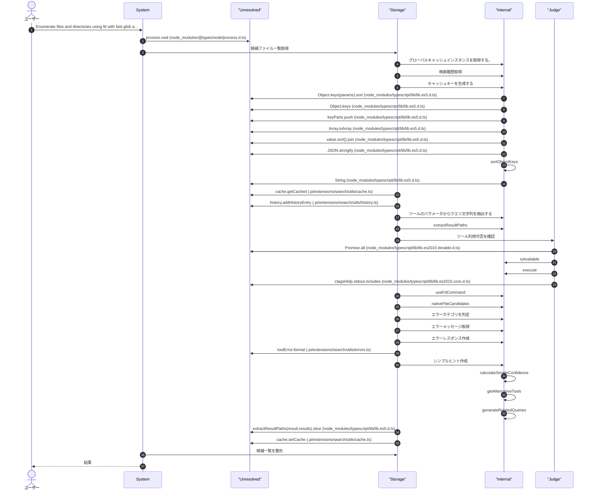
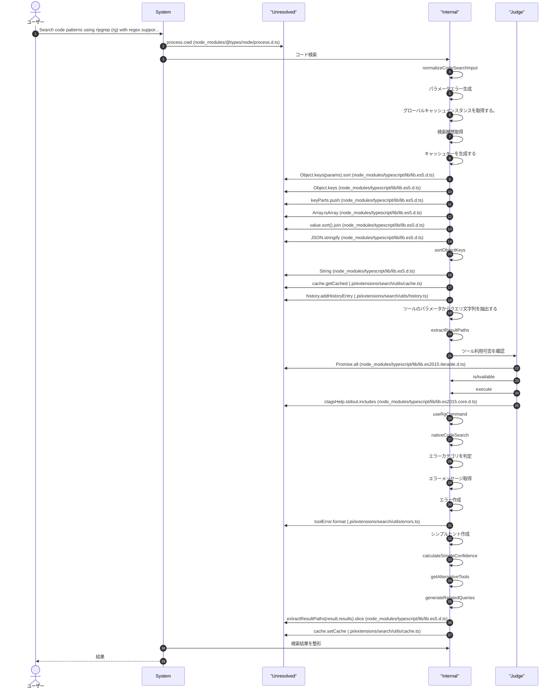
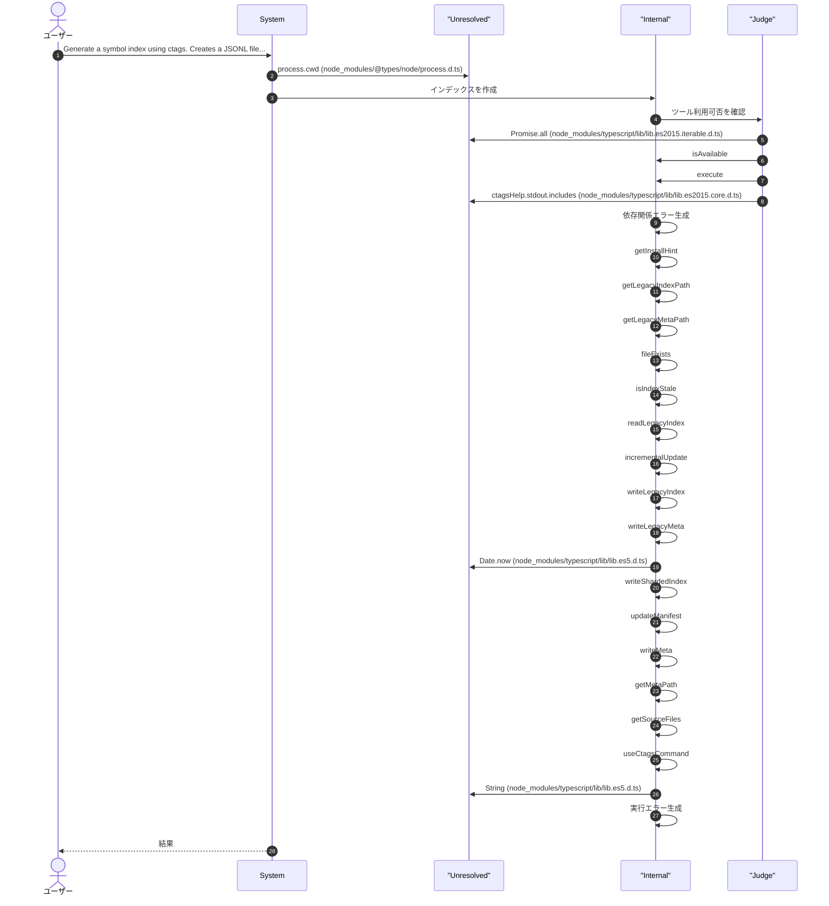
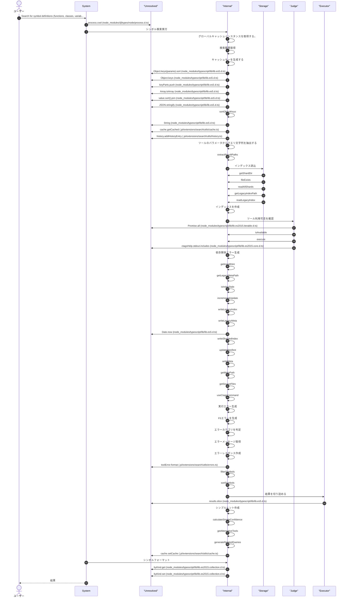
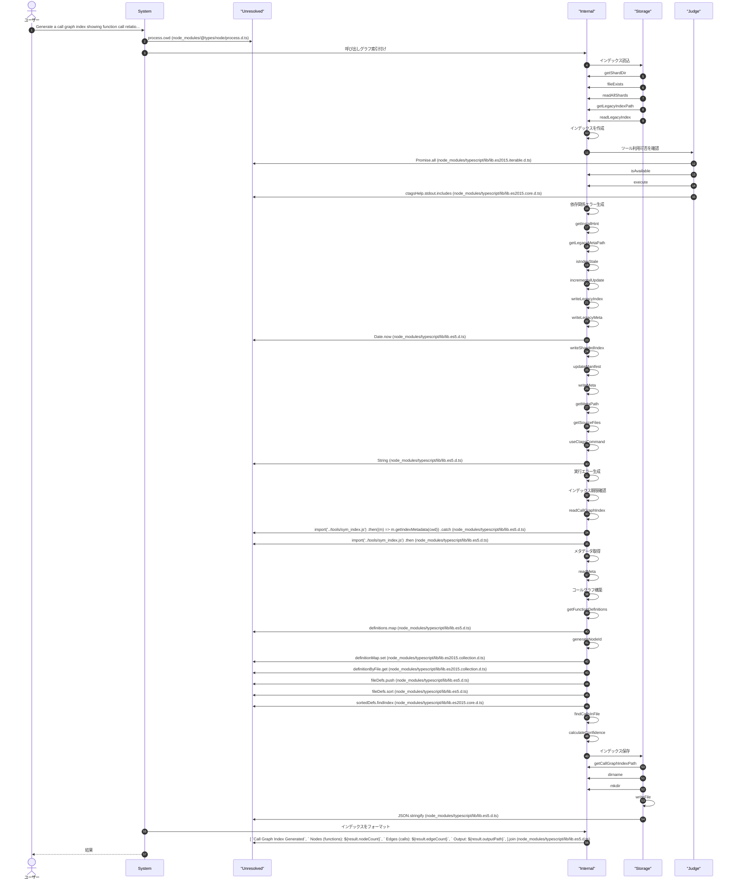
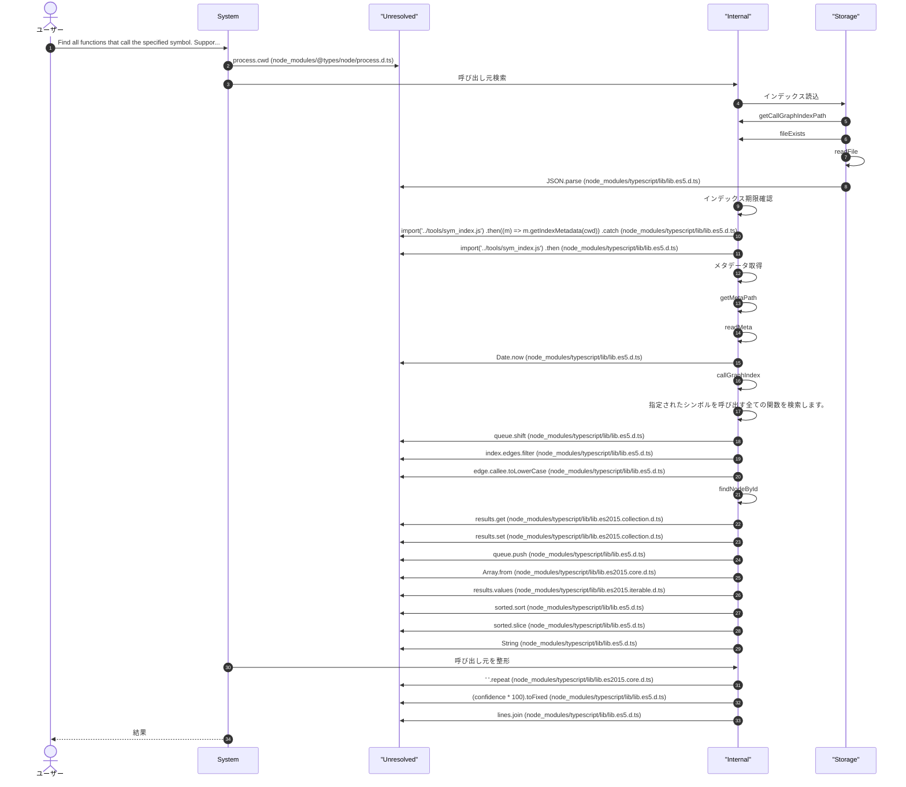
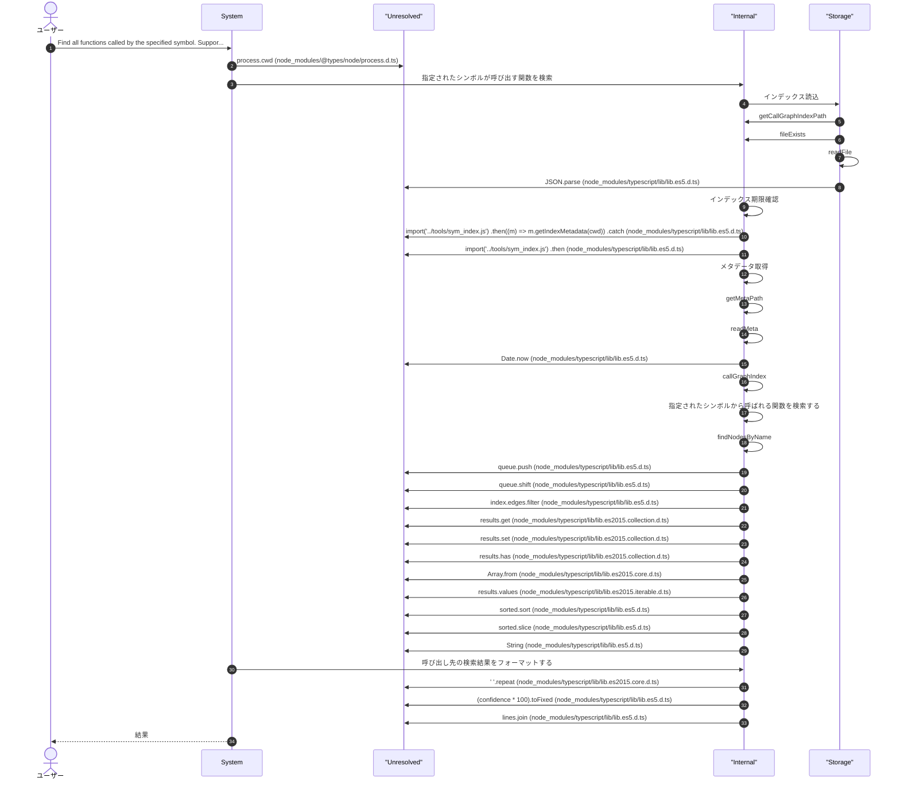
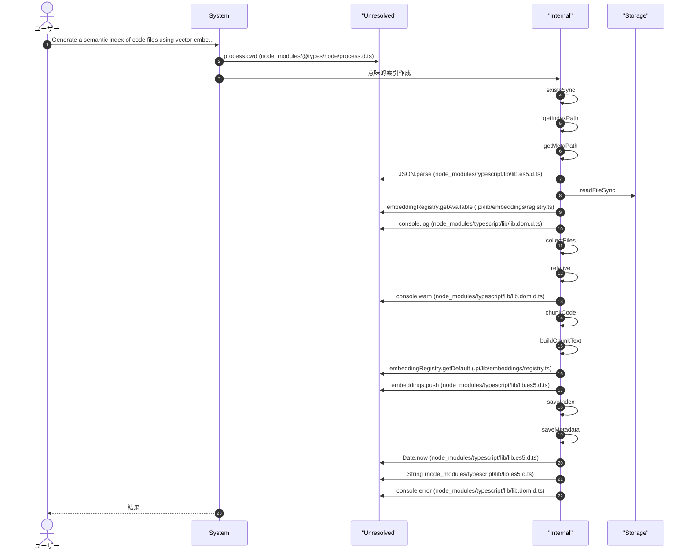
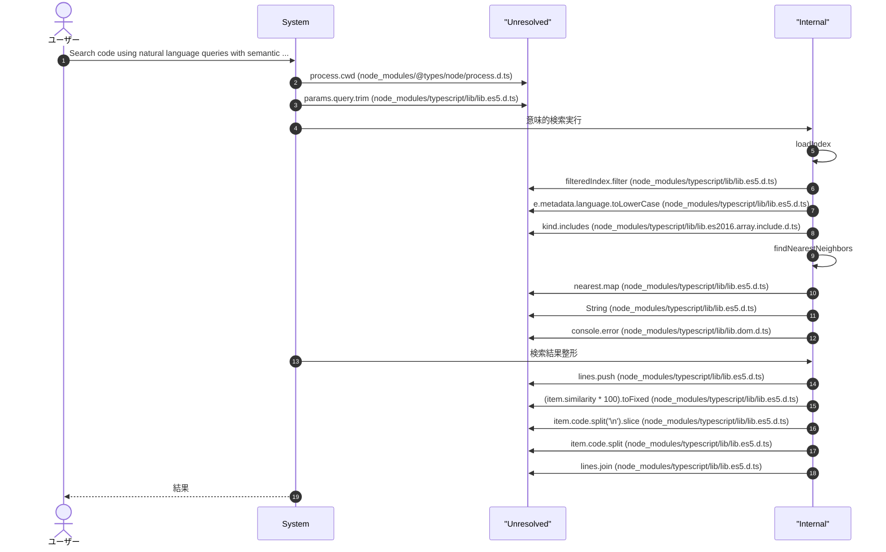
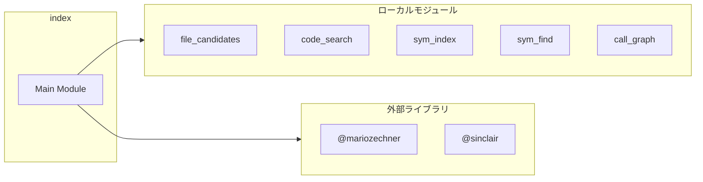

# index

## 概要

`index` モジュールのAPIリファレンス。

## インポート

```typescript
// from '@mariozechner/pi-coding-agent': ExtensionAPI
// from '@sinclair/typebox': Type
// from '@mariozechner/pi-ai': StringEnum
// from './tools/file_candidates.js': fileCandidates
// from './tools/code_search.js': codeSearch
// ... and 8 more imports
```

## エクスポート一覧

| 種別 | 名前 | 説明 |
|------|------|------|

## ユーザーフロー

このモジュールが提供するツールと、その実行フローを示します。

### file_candidates

Enumerate files and directories using fd with fast glob and extension filtering. Returns up to 100 results by default.



### code_search

Search code patterns using ripgrep (rg) with regex support. Returns matches with file, line, and context. Up to 50 results by default.



### sym_index

Generate a symbol index using ctags. Creates a JSONL file with function, class, and variable definitions.



### sym_find

Search for symbol definitions (functions, classes, variables) from the ctags index. Supports pattern matching on name and filtering by kind.



### call_graph_index

Generate a call graph index showing function call relationships. Uses ctags and ripgrep for analysis.



### find_callers

Find all functions that call the specified symbol. Supports depth-based traversal to find indirect callers.



### find_callees

Find all functions called by the specified symbol. Supports depth-based traversal to find indirect callees.



### semantic_index

Generate a semantic index of code files using vector embeddings. Enables semantic code search with natural language queries. Requires OpenAI API key.



### semantic_search

Search code using natural language queries with semantic understanding. Requires a pre-built semantic index (run semantic_index first). Returns code chunks ranked by similarity.



## 図解

### 依存関係図



---
*自動生成: 2026-02-23T06:29:42.127Z*
