# index

## 概要

`index` モジュールのAPIリファレンス。

## インポート

```typescript
// from '@mariozechner/pi-coding-agent': ExtensionAPI
// from '@sinclair/typebox': Type
// from '@mariozechner/pi-ai': StringEnum
// from './tools/file_candidates.js': fileCandidates
// from './tools/code_search.js': codeSearch
// ... and 16 more imports
```

## エクスポート一覧

| 種別 | 名前 | 説明 |
|------|------|------|

## ユーザーフロー

このモジュールが提供するツールと、その実行フローを示します。

### file_candidates

Enumerate files and directories using fd with fast glob and extension filtering. Returns up to 100 results by default.

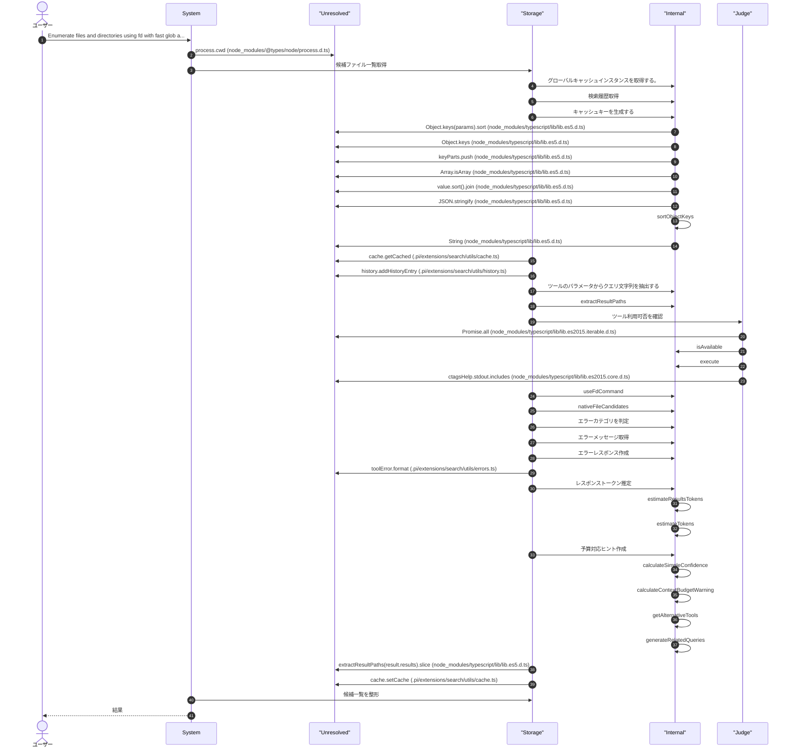
```mermaid
sequenceDiagram
  autonumber
  actor User as ユーザー
  participant System as System
  participant Unresolved as "Unresolved"
  participant Storage as "Storage"
  participant Internal as "Internal"
  participant Judge as "Judge"

  User->>System: Enumerate files and directories using fd with fast glob a...
  System->>Unresolved: process.cwd (node_modules/@types/node/process.d.ts)
  System->>Storage: 候補ファイル一覧取得
  Storage->>Internal: グローバルキャッシュインスタンスを取得する。
  Storage->>Internal: 検索履歴取得
  Storage->>Internal: キャッシュキーを生成する
  Internal->>Unresolved: Object.keys(params).sort (node_modules/typescript/lib/lib.es5.d.ts)
  Internal->>Unresolved: Object.keys (node_modules/typescript/lib/lib.es5.d.ts)
  Internal->>Unresolved: keyParts.push (node_modules/typescript/lib/lib.es5.d.ts)
  Internal->>Unresolved: Array.isArray (node_modules/typescript/lib/lib.es5.d.ts)
  Internal->>Unresolved: value.sort().join (node_modules/typescript/lib/lib.es5.d.ts)
  Internal->>Unresolved: JSON.stringify (node_modules/typescript/lib/lib.es5.d.ts)
  Internal->>Internal: sortObjectKeys
  Internal->>Unresolved: String (node_modules/typescript/lib/lib.es5.d.ts)
  Storage->>Unresolved: cache.getCached (.pi/extensions/search/utils/cache.ts)
  Storage->>Unresolved: history.addHistoryEntry (.pi/extensions/search/utils/history.ts)
  Storage->>Internal: ツールのパラメータからクエリ文字列を抽出する
  Storage->>Internal: extractResultPaths
  Storage->>Judge: ツール利用可否を確認
  Judge->>Unresolved: Promise.all (node_modules/typescript/lib/lib.es2015.iterable.d.ts)
  Judge->>Internal: isAvailable
  Judge->>Internal: execute
  Judge->>Unresolved: ctagsHelp.stdout.includes (node_modules/typescript/lib/lib.es2015.core.d.ts)
  Storage->>Internal: useFdCommand
  Storage->>Internal: nativeFileCandidates
  Storage->>Internal: エラーカテゴリを判定
  Storage->>Internal: エラーメッセージ取得
  Storage->>Internal: エラーレスポンス作成
  Storage->>Unresolved: toolError.format (.pi/extensions/search/utils/errors.ts)
  Storage->>Internal: レスポンストークン推定
  Internal->>Internal: estimateResultsTokens
  Internal->>Internal: estimateTokens
  Storage->>Internal: 予算対応ヒント作成
  Internal->>Internal: calculateSimpleConfidence
  Internal->>Internal: calculateContextBudgetWarning
  Internal->>Internal: getAlternativeTools
  Internal->>Internal: generateRelatedQueries
  Storage->>Unresolved: extractResultPaths(result.results).slice (node_modules/typescript/lib/lib.es5.d.ts)
  Storage->>Unresolved: cache.setCache (.pi/extensions/search/utils/cache.ts)
  System->>Storage: 候補一覧を整形
  System-->>User: 結果

```

### code_search

Search code patterns using ripgrep (rg) with regex support. Returns matches with file, line, and context. Up to 50 results by default.

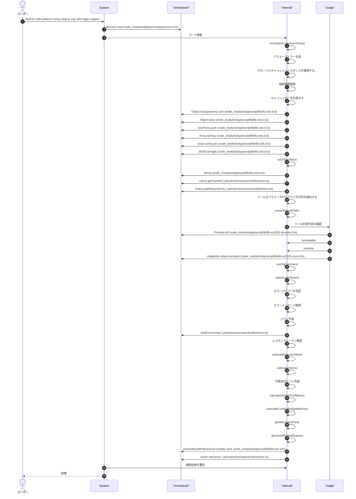
```mermaid
sequenceDiagram
  autonumber
  actor User as ユーザー
  participant System as System
  participant Unresolved as "Unresolved"
  participant Internal as "Internal"
  participant Judge as "Judge"

  User->>System: Search code patterns using ripgrep (rg) with regex suppor...
  System->>Unresolved: process.cwd (node_modules/@types/node/process.d.ts)
  System->>Internal: コード検索
  Internal->>Internal: normalizeCodeSearchInput
  Internal->>Internal: パラメータエラー生成
  Internal->>Internal: グローバルキャッシュインスタンスを取得する。
  Internal->>Internal: 検索履歴取得
  Internal->>Internal: キャッシュキーを生成する
  Internal->>Unresolved: Object.keys(params).sort (node_modules/typescript/lib/lib.es5.d.ts)
  Internal->>Unresolved: Object.keys (node_modules/typescript/lib/lib.es5.d.ts)
  Internal->>Unresolved: keyParts.push (node_modules/typescript/lib/lib.es5.d.ts)
  Internal->>Unresolved: Array.isArray (node_modules/typescript/lib/lib.es5.d.ts)
  Internal->>Unresolved: value.sort().join (node_modules/typescript/lib/lib.es5.d.ts)
  Internal->>Unresolved: JSON.stringify (node_modules/typescript/lib/lib.es5.d.ts)
  Internal->>Internal: sortObjectKeys
  Internal->>Unresolved: String (node_modules/typescript/lib/lib.es5.d.ts)
  Internal->>Unresolved: cache.getCached (.pi/extensions/search/utils/cache.ts)
  Internal->>Unresolved: history.addHistoryEntry (.pi/extensions/search/utils/history.ts)
  Internal->>Internal: ツールのパラメータからクエリ文字列を抽出する
  Internal->>Internal: extractResultPaths
  Internal->>Judge: ツール利用可否を確認
  Judge->>Unresolved: Promise.all (node_modules/typescript/lib/lib.es2015.iterable.d.ts)
  Judge->>Internal: isAvailable
  Judge->>Internal: execute
  Judge->>Unresolved: ctagsHelp.stdout.includes (node_modules/typescript/lib/lib.es2015.core.d.ts)
  Internal->>Internal: useRgCommand
  Internal->>Internal: nativeCodeSearch
  Internal->>Internal: エラーカテゴリを判定
  Internal->>Internal: エラーメッセージ取得
  Internal->>Internal: エラー作成
  Internal->>Unresolved: toolError.format (.pi/extensions/search/utils/errors.ts)
  Internal->>Internal: レスポンストークン推定
  Internal->>Internal: estimateResultsTokens
  Internal->>Internal: estimateTokens
  Internal->>Internal: 予算対応ヒント作成
  Internal->>Internal: calculateSimpleConfidence
  Internal->>Internal: calculateContextBudgetWarning
  Internal->>Internal: getAlternativeTools
  Internal->>Internal: generateRelatedQueries
  Internal->>Unresolved: extractResultPaths(result.results).slice (node_modules/typescript/lib/lib.es5.d.ts)
  Internal->>Unresolved: cache.setCache (.pi/extensions/search/utils/cache.ts)
  System->>Internal: 検索結果を整形
  System-->>User: 結果

```

### sym_index

Generate a symbol index using ctags. Creates a JSONL file with function, class, and variable definitions.

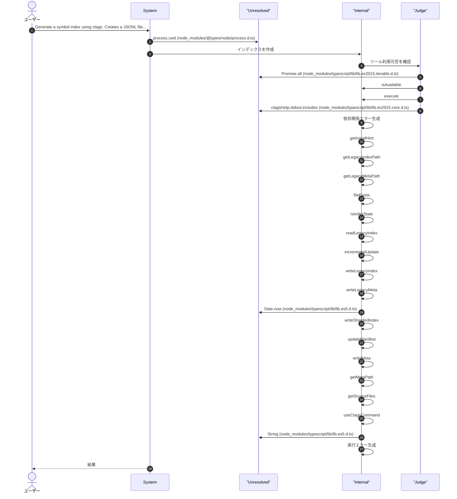
```mermaid
sequenceDiagram
  autonumber
  actor User as ユーザー
  participant System as System
  participant Unresolved as "Unresolved"
  participant Internal as "Internal"
  participant Judge as "Judge"

  User->>System: Generate a symbol index using ctags. Creates a JSONL file...
  System->>Unresolved: process.cwd (node_modules/@types/node/process.d.ts)
  System->>Internal: インデックスを作成
  Internal->>Judge: ツール利用可否を確認
  Judge->>Unresolved: Promise.all (node_modules/typescript/lib/lib.es2015.iterable.d.ts)
  Judge->>Internal: isAvailable
  Judge->>Internal: execute
  Judge->>Unresolved: ctagsHelp.stdout.includes (node_modules/typescript/lib/lib.es2015.core.d.ts)
  Internal->>Internal: 依存関係エラー生成
  Internal->>Internal: getInstallHint
  Internal->>Internal: getLegacyIndexPath
  Internal->>Internal: getLegacyMetaPath
  Internal->>Internal: fileExists
  Internal->>Internal: isIndexStale
  Internal->>Internal: readLegacyIndex
  Internal->>Internal: incrementalUpdate
  Internal->>Internal: writeLegacyIndex
  Internal->>Internal: writeLegacyMeta
  Internal->>Unresolved: Date.now (node_modules/typescript/lib/lib.es5.d.ts)
  Internal->>Internal: writeShardedIndex
  Internal->>Internal: updateManifest
  Internal->>Internal: writeMeta
  Internal->>Internal: getMetaPath
  Internal->>Internal: getSourceFiles
  Internal->>Internal: useCtagsCommand
  Internal->>Unresolved: String (node_modules/typescript/lib/lib.es5.d.ts)
  Internal->>Internal: 実行エラー生成
  System-->>User: 結果

```

### sym_find

Search for symbol definitions (functions, classes, variables) from the ctags index. Supports pattern matching on name and filtering by kind. Use detailLevel to control output verbosity.

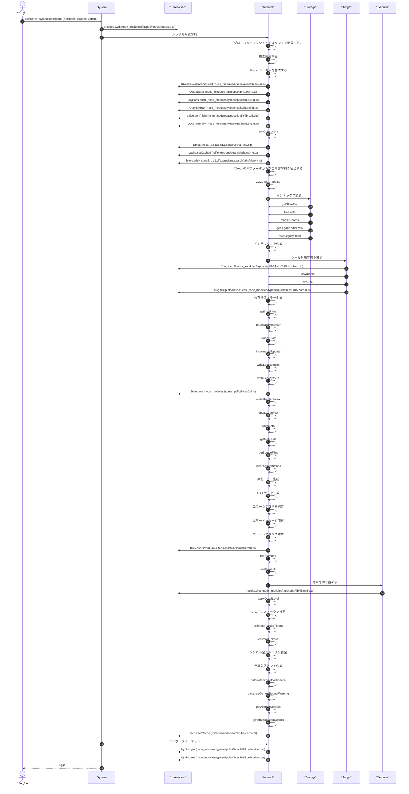
```mermaid
sequenceDiagram
  autonumber
  actor User as ユーザー
  participant System as System
  participant Unresolved as "Unresolved"
  participant Internal as "Internal"
  participant Storage as "Storage"
  participant Judge as "Judge"
  participant Executor as "Executor"

  User->>System: Search for symbol definitions (functions, classes, variab...
  System->>Unresolved: process.cwd (node_modules/@types/node/process.d.ts)
  System->>Internal: シンボル検索実行
  Internal->>Internal: グローバルキャッシュインスタンスを取得する。
  Internal->>Internal: 検索履歴取得
  Internal->>Internal: キャッシュキーを生成する
  Internal->>Unresolved: Object.keys(params).sort (node_modules/typescript/lib/lib.es5.d.ts)
  Internal->>Unresolved: Object.keys (node_modules/typescript/lib/lib.es5.d.ts)
  Internal->>Unresolved: keyParts.push (node_modules/typescript/lib/lib.es5.d.ts)
  Internal->>Unresolved: Array.isArray (node_modules/typescript/lib/lib.es5.d.ts)
  Internal->>Unresolved: value.sort().join (node_modules/typescript/lib/lib.es5.d.ts)
  Internal->>Unresolved: JSON.stringify (node_modules/typescript/lib/lib.es5.d.ts)
  Internal->>Internal: sortObjectKeys
  Internal->>Unresolved: String (node_modules/typescript/lib/lib.es5.d.ts)
  Internal->>Unresolved: cache.getCached (.pi/extensions/search/utils/cache.ts)
  Internal->>Unresolved: history.addHistoryEntry (.pi/extensions/search/utils/history.ts)
  Internal->>Internal: ツールのパラメータからクエリ文字列を抽出する
  Internal->>Internal: extractResultPaths
  Internal->>Storage: インデックス読込
  Storage->>Internal: getShardDir
  Storage->>Internal: fileExists
  Storage->>Internal: readAllShards
  Storage->>Internal: getLegacyIndexPath
  Storage->>Internal: readLegacyIndex
  Internal->>Internal: インデックスを作成
  Internal->>Judge: ツール利用可否を確認
  Judge->>Unresolved: Promise.all (node_modules/typescript/lib/lib.es2015.iterable.d.ts)
  Judge->>Internal: isAvailable
  Judge->>Internal: execute
  Judge->>Unresolved: ctagsHelp.stdout.includes (node_modules/typescript/lib/lib.es2015.core.d.ts)
  Internal->>Internal: 依存関係エラー生成
  Internal->>Internal: getInstallHint
  Internal->>Internal: getLegacyMetaPath
  Internal->>Internal: isIndexStale
  Internal->>Internal: incrementalUpdate
  Internal->>Internal: writeLegacyIndex
  Internal->>Internal: writeLegacyMeta
  Internal->>Unresolved: Date.now (node_modules/typescript/lib/lib.es5.d.ts)
  Internal->>Internal: writeShardedIndex
  Internal->>Internal: updateManifest
  Internal->>Internal: writeMeta
  Internal->>Internal: getMetaPath
  Internal->>Internal: getSourceFiles
  Internal->>Internal: useCtagsCommand
  Internal->>Internal: 実行エラー生成
  Internal->>Internal: FSエラーを生成
  Internal->>Internal: エラーカテゴリを判定
  Internal->>Internal: エラーメッセージ取得
  Internal->>Internal: エラーレスポンス作成
  Internal->>Unresolved: toolError.format (.pi/extensions/search/utils/errors.ts)
  Internal->>Internal: filterSymbols
  Internal->>Internal: sortSymbols
  Internal->>Executor: 結果を切り詰める
  Executor->>Unresolved: results.slice (node_modules/typescript/lib/lib.es5.d.ts)
  Internal->>Internal: applyDetailLevel
  Internal->>Internal: レスポンストークン推定
  Internal->>Internal: estimateResultsTokens
  Internal->>Internal: estimateTokens
  Internal->>Internal: シンボル定義トークン推定
  Internal->>Internal: 予算対応ヒント作成
  Internal->>Internal: calculateSimpleConfidence
  Internal->>Internal: calculateContextBudgetWarning
  Internal->>Internal: getAlternativeTools
  Internal->>Internal: generateRelatedQueries
  Internal->>Unresolved: cache.setCache (.pi/extensions/search/utils/cache.ts)
  System->>Internal: シンボルフォーマット
  Internal->>Unresolved: byKind.get (node_modules/typescript/lib/lib.es2015.collection.d.ts)
  Internal->>Unresolved: byKind.set (node_modules/typescript/lib/lib.es2015.collection.d.ts)
  System-->>User: 結果

```

### call_graph_index

Generate a call graph index showing function call relationships. Uses ctags and ripgrep for analysis.

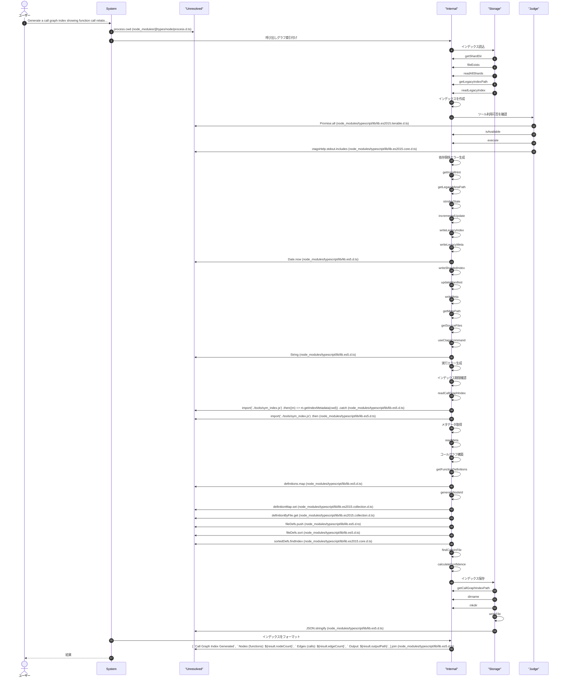
```mermaid
sequenceDiagram
  autonumber
  actor User as ユーザー
  participant System as System
  participant Unresolved as "Unresolved"
  participant Internal as "Internal"
  participant Storage as "Storage"
  participant Judge as "Judge"

  User->>System: Generate a call graph index showing function call relatio...
  System->>Unresolved: process.cwd (node_modules/@types/node/process.d.ts)
  System->>Internal: 呼び出しグラフ索引付け
  Internal->>Storage: インデックス読込
  Storage->>Internal: getShardDir
  Storage->>Internal: fileExists
  Storage->>Internal: readAllShards
  Storage->>Internal: getLegacyIndexPath
  Storage->>Internal: readLegacyIndex
  Internal->>Internal: インデックスを作成
  Internal->>Judge: ツール利用可否を確認
  Judge->>Unresolved: Promise.all (node_modules/typescript/lib/lib.es2015.iterable.d.ts)
  Judge->>Internal: isAvailable
  Judge->>Internal: execute
  Judge->>Unresolved: ctagsHelp.stdout.includes (node_modules/typescript/lib/lib.es2015.core.d.ts)
  Internal->>Internal: 依存関係エラー生成
  Internal->>Internal: getInstallHint
  Internal->>Internal: getLegacyMetaPath
  Internal->>Internal: isIndexStale
  Internal->>Internal: incrementalUpdate
  Internal->>Internal: writeLegacyIndex
  Internal->>Internal: writeLegacyMeta
  Internal->>Unresolved: Date.now (node_modules/typescript/lib/lib.es5.d.ts)
  Internal->>Internal: writeShardedIndex
  Internal->>Internal: updateManifest
  Internal->>Internal: writeMeta
  Internal->>Internal: getMetaPath
  Internal->>Internal: getSourceFiles
  Internal->>Internal: useCtagsCommand
  Internal->>Unresolved: String (node_modules/typescript/lib/lib.es5.d.ts)
  Internal->>Internal: 実行エラー生成
  Internal->>Internal: インデックス期限確認
  Internal->>Internal: readCallGraphIndex
  Internal->>Unresolved: import('../tools/sym_index.js') 		.then((m) => m.getIndexMetadata(cwd)) 		.catch (node_modules/typescript/lib/lib.es5.d.ts)
  Internal->>Unresolved: import('../tools/sym_index.js') 		.then (node_modules/typescript/lib/lib.es5.d.ts)
  Internal->>Internal: メタデータ取得
  Internal->>Internal: readMeta
  Internal->>Internal: コールグラフ構築
  Internal->>Internal: getFunctionDefinitions
  Internal->>Unresolved: definitions.map (node_modules/typescript/lib/lib.es5.d.ts)
  Internal->>Internal: generateNodeId
  Internal->>Unresolved: definitionMap.set (node_modules/typescript/lib/lib.es2015.collection.d.ts)
  Internal->>Unresolved: definitionByFile.get (node_modules/typescript/lib/lib.es2015.collection.d.ts)
  Internal->>Unresolved: fileDefs.push (node_modules/typescript/lib/lib.es5.d.ts)
  Internal->>Unresolved: fileDefs.sort (node_modules/typescript/lib/lib.es5.d.ts)
  Internal->>Unresolved: sortedDefs.findIndex (node_modules/typescript/lib/lib.es2015.core.d.ts)
  Internal->>Internal: findCallsInFile
  Internal->>Internal: calculateConfidence
  Internal->>Storage: インデックス保存
  Storage->>Internal: getCallGraphIndexPath
  Storage->>Internal: dirname
  Storage->>Internal: mkdir
  Storage->>Storage: writeFile
  Storage->>Unresolved: JSON.stringify (node_modules/typescript/lib/lib.es5.d.ts)
  System->>Internal: インデックスをフォーマット
  Internal->>Unresolved: [ 		`Call Graph Index Generated`, 		`  Nodes (functions): ${result.nodeCount}`, 		`  Edges (calls): ${result.edgeCount}`, 		`  Output: ${result.outputPath}`, 	].join (node_modules/typescript/lib/lib.es5.d.ts)
  System-->>User: 結果

```

### find_callers

Find all functions that call the specified symbol. Supports depth-based traversal to find indirect callers.

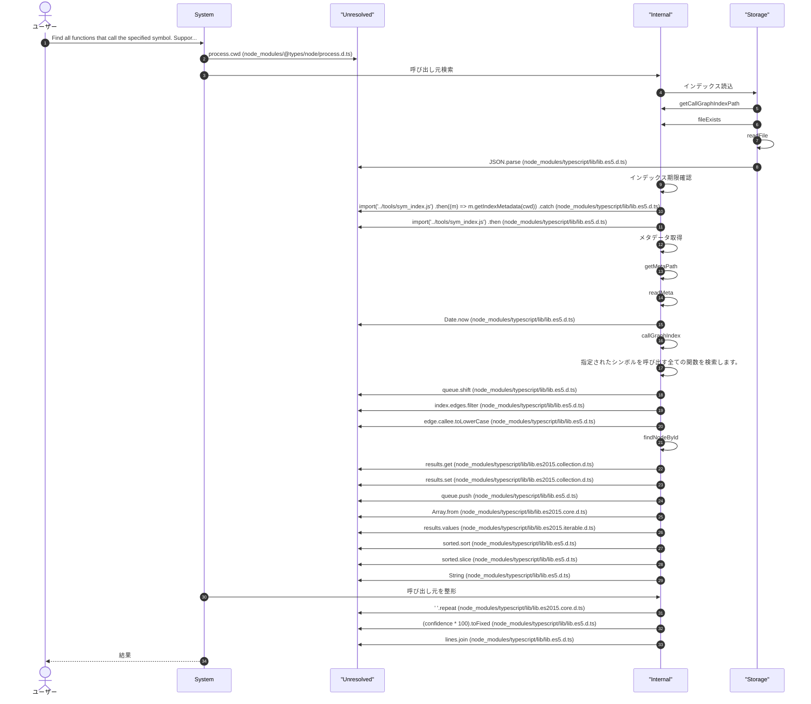
```mermaid
sequenceDiagram
  autonumber
  actor User as ユーザー
  participant System as System
  participant Unresolved as "Unresolved"
  participant Internal as "Internal"
  participant Storage as "Storage"

  User->>System: Find all functions that call the specified symbol. Suppor...
  System->>Unresolved: process.cwd (node_modules/@types/node/process.d.ts)
  System->>Internal: 呼び出し元検索
  Internal->>Storage: インデックス読込
  Storage->>Internal: getCallGraphIndexPath
  Storage->>Internal: fileExists
  Storage->>Storage: readFile
  Storage->>Unresolved: JSON.parse (node_modules/typescript/lib/lib.es5.d.ts)
  Internal->>Internal: インデックス期限確認
  Internal->>Unresolved: import('../tools/sym_index.js') 		.then((m) => m.getIndexMetadata(cwd)) 		.catch (node_modules/typescript/lib/lib.es5.d.ts)
  Internal->>Unresolved: import('../tools/sym_index.js') 		.then (node_modules/typescript/lib/lib.es5.d.ts)
  Internal->>Internal: メタデータ取得
  Internal->>Internal: getMetaPath
  Internal->>Internal: readMeta
  Internal->>Unresolved: Date.now (node_modules/typescript/lib/lib.es5.d.ts)
  Internal->>Internal: callGraphIndex
  Internal->>Internal: 指定されたシンボルを呼び出す全ての関数を検索します。
  Internal->>Unresolved: queue.shift (node_modules/typescript/lib/lib.es5.d.ts)
  Internal->>Unresolved: index.edges.filter (node_modules/typescript/lib/lib.es5.d.ts)
  Internal->>Unresolved: edge.callee.toLowerCase (node_modules/typescript/lib/lib.es5.d.ts)
  Internal->>Internal: findNodeById
  Internal->>Unresolved: results.get (node_modules/typescript/lib/lib.es2015.collection.d.ts)
  Internal->>Unresolved: results.set (node_modules/typescript/lib/lib.es2015.collection.d.ts)
  Internal->>Unresolved: queue.push (node_modules/typescript/lib/lib.es5.d.ts)
  Internal->>Unresolved: Array.from (node_modules/typescript/lib/lib.es2015.core.d.ts)
  Internal->>Unresolved: results.values (node_modules/typescript/lib/lib.es2015.iterable.d.ts)
  Internal->>Unresolved: sorted.sort (node_modules/typescript/lib/lib.es5.d.ts)
  Internal->>Unresolved: sorted.slice (node_modules/typescript/lib/lib.es5.d.ts)
  Internal->>Unresolved: String (node_modules/typescript/lib/lib.es5.d.ts)
  System->>Internal: 呼び出し元を整形
  Internal->>Unresolved: '  '.repeat (node_modules/typescript/lib/lib.es2015.core.d.ts)
  Internal->>Unresolved: (confidence * 100).toFixed (node_modules/typescript/lib/lib.es5.d.ts)
  Internal->>Unresolved: lines.join (node_modules/typescript/lib/lib.es5.d.ts)
  System-->>User: 結果

```

### find_callees

Find all functions called by the specified symbol. Supports depth-based traversal to find indirect callees.

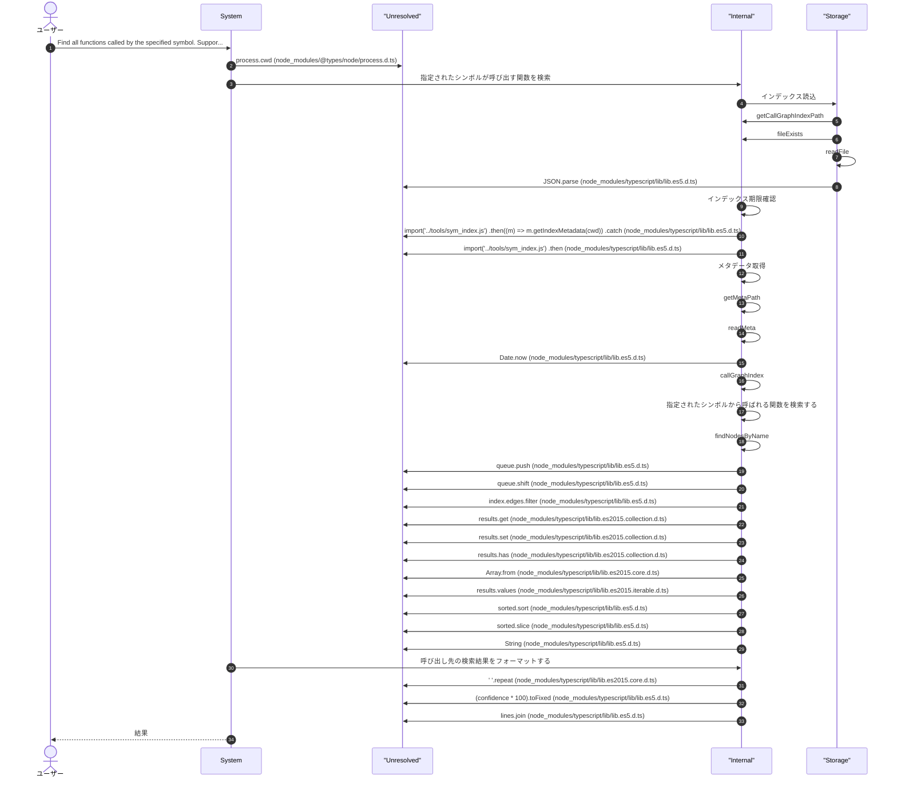
```mermaid
sequenceDiagram
  autonumber
  actor User as ユーザー
  participant System as System
  participant Unresolved as "Unresolved"
  participant Internal as "Internal"
  participant Storage as "Storage"

  User->>System: Find all functions called by the specified symbol. Suppor...
  System->>Unresolved: process.cwd (node_modules/@types/node/process.d.ts)
  System->>Internal: 指定されたシンボルが呼び出す関数を検索
  Internal->>Storage: インデックス読込
  Storage->>Internal: getCallGraphIndexPath
  Storage->>Internal: fileExists
  Storage->>Storage: readFile
  Storage->>Unresolved: JSON.parse (node_modules/typescript/lib/lib.es5.d.ts)
  Internal->>Internal: インデックス期限確認
  Internal->>Unresolved: import('../tools/sym_index.js') 		.then((m) => m.getIndexMetadata(cwd)) 		.catch (node_modules/typescript/lib/lib.es5.d.ts)
  Internal->>Unresolved: import('../tools/sym_index.js') 		.then (node_modules/typescript/lib/lib.es5.d.ts)
  Internal->>Internal: メタデータ取得
  Internal->>Internal: getMetaPath
  Internal->>Internal: readMeta
  Internal->>Unresolved: Date.now (node_modules/typescript/lib/lib.es5.d.ts)
  Internal->>Internal: callGraphIndex
  Internal->>Internal: 指定されたシンボルから呼ばれる関数を検索する
  Internal->>Internal: findNodesByName
  Internal->>Unresolved: queue.push (node_modules/typescript/lib/lib.es5.d.ts)
  Internal->>Unresolved: queue.shift (node_modules/typescript/lib/lib.es5.d.ts)
  Internal->>Unresolved: index.edges.filter (node_modules/typescript/lib/lib.es5.d.ts)
  Internal->>Unresolved: results.get (node_modules/typescript/lib/lib.es2015.collection.d.ts)
  Internal->>Unresolved: results.set (node_modules/typescript/lib/lib.es2015.collection.d.ts)
  Internal->>Unresolved: results.has (node_modules/typescript/lib/lib.es2015.collection.d.ts)
  Internal->>Unresolved: Array.from (node_modules/typescript/lib/lib.es2015.core.d.ts)
  Internal->>Unresolved: results.values (node_modules/typescript/lib/lib.es2015.iterable.d.ts)
  Internal->>Unresolved: sorted.sort (node_modules/typescript/lib/lib.es5.d.ts)
  Internal->>Unresolved: sorted.slice (node_modules/typescript/lib/lib.es5.d.ts)
  Internal->>Unresolved: String (node_modules/typescript/lib/lib.es5.d.ts)
  System->>Internal: 呼び出し先の検索結果をフォーマットする
  Internal->>Unresolved: '  '.repeat (node_modules/typescript/lib/lib.es2015.core.d.ts)
  Internal->>Unresolved: (confidence * 100).toFixed (node_modules/typescript/lib/lib.es5.d.ts)
  Internal->>Unresolved: lines.join (node_modules/typescript/lib/lib.es5.d.ts)
  System-->>User: 結果

```

### semantic_index

Generate a semantic index of code files using vector embeddings. Enables semantic code search with natural language queries. Requires OpenAI API key.

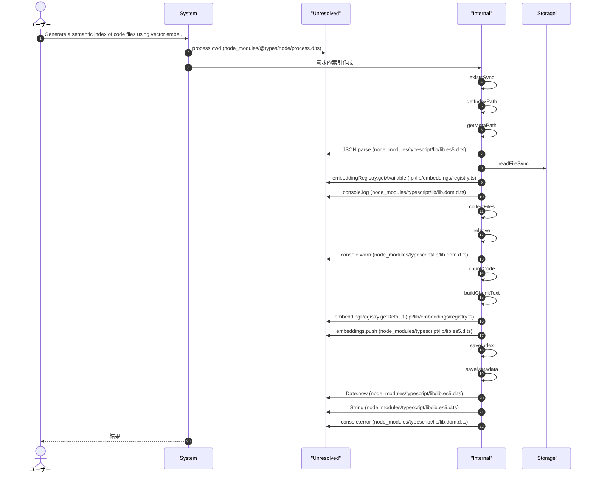
```mermaid
sequenceDiagram
  autonumber
  actor User as ユーザー
  participant System as System
  participant Unresolved as "Unresolved"
  participant Internal as "Internal"
  participant Storage as "Storage"

  User->>System: Generate a semantic index of code files using vector embe...
  System->>Unresolved: process.cwd (node_modules/@types/node/process.d.ts)
  System->>Internal: 意味的索引作成
  Internal->>Internal: existsSync
  Internal->>Internal: getIndexPath
  Internal->>Internal: getMetaPath
  Internal->>Unresolved: JSON.parse (node_modules/typescript/lib/lib.es5.d.ts)
  Internal->>Storage: readFileSync
  Internal->>Unresolved: embeddingRegistry.getAvailable (.pi/lib/embeddings/registry.ts)
  Internal->>Unresolved: console.log (node_modules/typescript/lib/lib.dom.d.ts)
  Internal->>Internal: collectFiles
  Internal->>Internal: relative
  Internal->>Unresolved: console.warn (node_modules/typescript/lib/lib.dom.d.ts)
  Internal->>Internal: chunkCode
  Internal->>Internal: buildChunkText
  Internal->>Unresolved: embeddingRegistry.getDefault (.pi/lib/embeddings/registry.ts)
  Internal->>Unresolved: embeddings.push (node_modules/typescript/lib/lib.es5.d.ts)
  Internal->>Internal: saveIndex
  Internal->>Internal: saveMetadata
  Internal->>Unresolved: Date.now (node_modules/typescript/lib/lib.es5.d.ts)
  Internal->>Unresolved: String (node_modules/typescript/lib/lib.es5.d.ts)
  Internal->>Unresolved: console.error (node_modules/typescript/lib/lib.dom.d.ts)
  System-->>User: 結果

```

### semantic_search

Search code using natural language queries with semantic understanding. Requires a pre-built semantic index (run semantic_index first). Returns code chunks ranked by similarity.

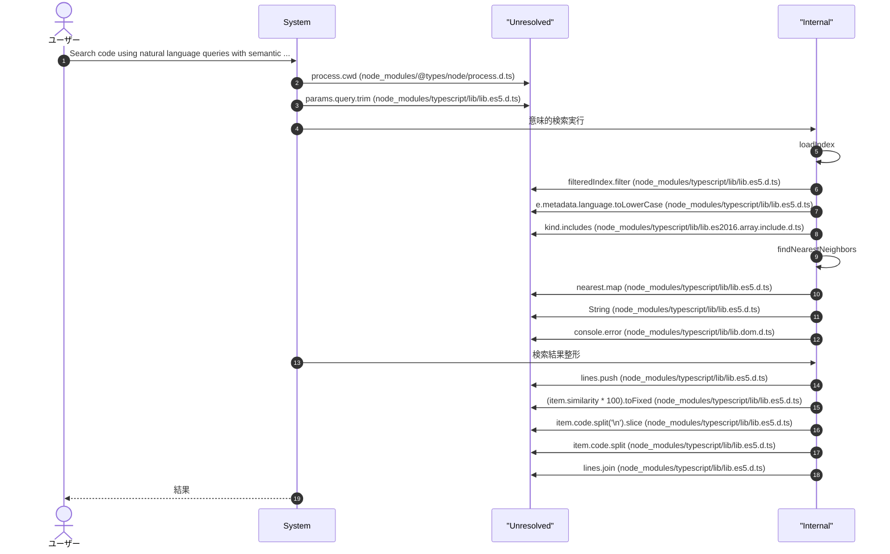
```mermaid
sequenceDiagram
  autonumber
  actor User as ユーザー
  participant System as System
  participant Unresolved as "Unresolved"
  participant Internal as "Internal"

  User->>System: Search code using natural language queries with semantic ...
  System->>Unresolved: process.cwd (node_modules/@types/node/process.d.ts)
  System->>Unresolved: params.query.trim (node_modules/typescript/lib/lib.es5.d.ts)
  System->>Internal: 意味的検索実行
  Internal->>Internal: loadIndex
  Internal->>Unresolved: filteredIndex.filter (node_modules/typescript/lib/lib.es5.d.ts)
  Internal->>Unresolved: e.metadata.language.toLowerCase (node_modules/typescript/lib/lib.es5.d.ts)
  Internal->>Unresolved: kind.includes (node_modules/typescript/lib/lib.es2016.array.include.d.ts)
  Internal->>Internal: findNearestNeighbors
  Internal->>Unresolved: nearest.map (node_modules/typescript/lib/lib.es5.d.ts)
  Internal->>Unresolved: String (node_modules/typescript/lib/lib.es5.d.ts)
  Internal->>Unresolved: console.error (node_modules/typescript/lib/lib.dom.d.ts)
  System->>Internal: 検索結果整形
  Internal->>Unresolved: lines.push (node_modules/typescript/lib/lib.es5.d.ts)
  Internal->>Unresolved: (item.similarity * 100).toFixed (node_modules/typescript/lib/lib.es5.d.ts)
  Internal->>Unresolved: item.code.split('\n').slice (node_modules/typescript/lib/lib.es5.d.ts)
  Internal->>Unresolved: item.code.split (node_modules/typescript/lib/lib.es5.d.ts)
  Internal->>Unresolved: lines.join (node_modules/typescript/lib/lib.es5.d.ts)
  System-->>User: 結果

```

### context_explore

Execute a chain of search queries in sequence. Supports find_class, find_methods, search_code, and get_callers steps. Results from previous steps can be referenced using $0, $1, etc. Automatically compresses results based on token budget.

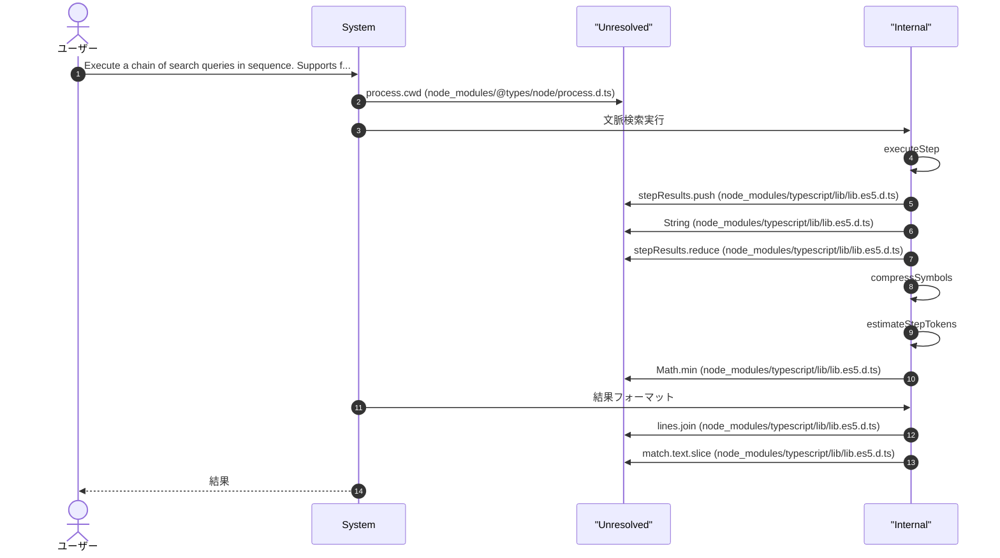
```mermaid
sequenceDiagram
  autonumber
  actor User as ユーザー
  participant System as System
  participant Unresolved as "Unresolved"
  participant Internal as "Internal"

  User->>System: Execute a chain of search queries in sequence. Supports f...
  System->>Unresolved: process.cwd (node_modules/@types/node/process.d.ts)
  System->>Internal: 文脈検索実行
  Internal->>Internal: executeStep
  Internal->>Unresolved: stepResults.push (node_modules/typescript/lib/lib.es5.d.ts)
  Internal->>Unresolved: String (node_modules/typescript/lib/lib.es5.d.ts)
  Internal->>Unresolved: stepResults.reduce (node_modules/typescript/lib/lib.es5.d.ts)
  Internal->>Internal: compressSymbols
  Internal->>Internal: estimateStepTokens
  Internal->>Unresolved: Math.min (node_modules/typescript/lib/lib.es5.d.ts)
  System->>Internal: 結果フォーマット
  Internal->>Unresolved: lines.join (node_modules/typescript/lib/lib.es5.d.ts)
  Internal->>Unresolved: match.text.slice (node_modules/typescript/lib/lib.es5.d.ts)
  System-->>User: 結果

```

### search_class

Search for class definitions with optional method listing. Supports wildcards in class name. Use includeMethods to get class structure overview.

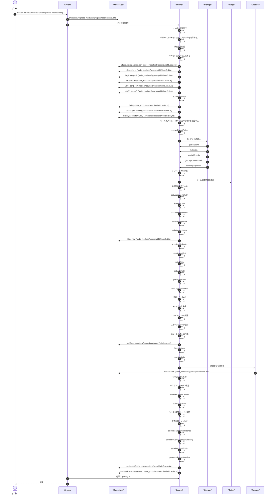
```mermaid
sequenceDiagram
  autonumber
  actor User as ユーザー
  participant System as System
  participant Unresolved as "Unresolved"
  participant Internal as "Internal"
  participant Storage as "Storage"
  participant Judge as "Judge"
  participant Executor as "Executor"

  User->>System: Search for class definitions with optional method listing...
  System->>Unresolved: process.cwd (node_modules/@types/node/process.d.ts)
  System->>Internal: クラス検索実行
  Internal->>Internal: シンボル検索実行
  Internal->>Internal: グローバルキャッシュインスタンスを取得する。
  Internal->>Internal: 検索履歴取得
  Internal->>Internal: キャッシュキーを生成する
  Internal->>Unresolved: Object.keys(params).sort (node_modules/typescript/lib/lib.es5.d.ts)
  Internal->>Unresolved: Object.keys (node_modules/typescript/lib/lib.es5.d.ts)
  Internal->>Unresolved: keyParts.push (node_modules/typescript/lib/lib.es5.d.ts)
  Internal->>Unresolved: Array.isArray (node_modules/typescript/lib/lib.es5.d.ts)
  Internal->>Unresolved: value.sort().join (node_modules/typescript/lib/lib.es5.d.ts)
  Internal->>Unresolved: JSON.stringify (node_modules/typescript/lib/lib.es5.d.ts)
  Internal->>Internal: sortObjectKeys
  Internal->>Unresolved: String (node_modules/typescript/lib/lib.es5.d.ts)
  Internal->>Unresolved: cache.getCached (.pi/extensions/search/utils/cache.ts)
  Internal->>Unresolved: history.addHistoryEntry (.pi/extensions/search/utils/history.ts)
  Internal->>Internal: ツールのパラメータからクエリ文字列を抽出する
  Internal->>Internal: extractResultPaths
  Internal->>Storage: インデックス読込
  Storage->>Internal: getShardDir
  Storage->>Internal: fileExists
  Storage->>Internal: readAllShards
  Storage->>Internal: getLegacyIndexPath
  Storage->>Internal: readLegacyIndex
  Internal->>Internal: インデックスを作成
  Internal->>Judge: ツール利用可否を確認
  Internal->>Internal: 依存関係エラー生成
  Internal->>Internal: getLegacyMetaPath
  Internal->>Internal: isIndexStale
  Internal->>Internal: incrementalUpdate
  Internal->>Internal: writeLegacyIndex
  Internal->>Internal: writeLegacyMeta
  Internal->>Unresolved: Date.now (node_modules/typescript/lib/lib.es5.d.ts)
  Internal->>Internal: writeShardedIndex
  Internal->>Internal: updateManifest
  Internal->>Internal: writeMeta
  Internal->>Internal: getMetaPath
  Internal->>Internal: getSourceFiles
  Internal->>Internal: useCtagsCommand
  Internal->>Internal: 実行エラー生成
  Internal->>Internal: FSエラーを生成
  Internal->>Internal: エラーカテゴリを判定
  Internal->>Internal: エラーメッセージ取得
  Internal->>Internal: エラーレスポンス作成
  Internal->>Unresolved: toolError.format (.pi/extensions/search/utils/errors.ts)
  Internal->>Internal: filterSymbols
  Internal->>Internal: sortSymbols
  Internal->>Executor: 結果を切り詰める
  Executor->>Unresolved: results.slice (node_modules/typescript/lib/lib.es5.d.ts)
  Internal->>Internal: applyDetailLevel
  Internal->>Internal: レスポンストークン推定
  Internal->>Internal: estimateResultsTokens
  Internal->>Internal: estimateTokens
  Internal->>Internal: シンボル定義トークン推定
  Internal->>Internal: 予算対応ヒント作成
  Internal->>Internal: calculateSimpleConfidence
  Internal->>Internal: calculateContextBudgetWarning
  Internal->>Internal: getAlternativeTools
  Internal->>Internal: generateRelatedQueries
  Internal->>Unresolved: cache.setCache (.pi/extensions/search/utils/cache.ts)
  Internal->>Unresolved: methodsResult.results.map (node_modules/typescript/lib/lib.es5.d.ts)
  System->>Internal: 結果フォーマット
  System-->>User: 結果

```

### search_method

Search for method definitions with optional implementation code. Supports wildcards in method name. Use className to filter by containing class.

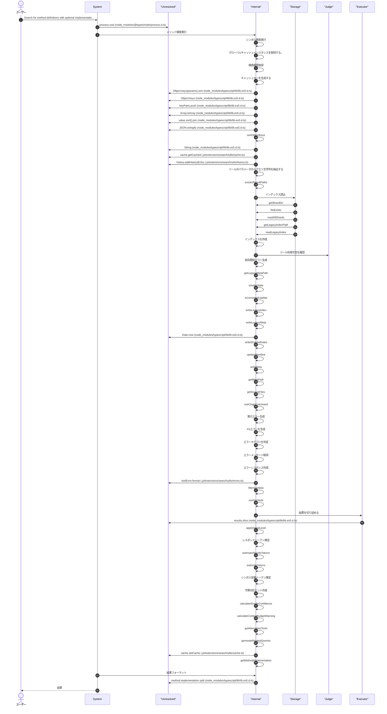
```mermaid
sequenceDiagram
  autonumber
  actor User as ユーザー
  participant System as System
  participant Unresolved as "Unresolved"
  participant Internal as "Internal"
  participant Storage as "Storage"
  participant Judge as "Judge"
  participant Executor as "Executor"

  User->>System: Search for method definitions with optional implementatio...
  System->>Unresolved: process.cwd (node_modules/@types/node/process.d.ts)
  System->>Internal: メソッド検索実行
  Internal->>Internal: シンボル検索実行
  Internal->>Internal: グローバルキャッシュインスタンスを取得する。
  Internal->>Internal: 検索履歴取得
  Internal->>Internal: キャッシュキーを生成する
  Internal->>Unresolved: Object.keys(params).sort (node_modules/typescript/lib/lib.es5.d.ts)
  Internal->>Unresolved: Object.keys (node_modules/typescript/lib/lib.es5.d.ts)
  Internal->>Unresolved: keyParts.push (node_modules/typescript/lib/lib.es5.d.ts)
  Internal->>Unresolved: Array.isArray (node_modules/typescript/lib/lib.es5.d.ts)
  Internal->>Unresolved: value.sort().join (node_modules/typescript/lib/lib.es5.d.ts)
  Internal->>Unresolved: JSON.stringify (node_modules/typescript/lib/lib.es5.d.ts)
  Internal->>Internal: sortObjectKeys
  Internal->>Unresolved: String (node_modules/typescript/lib/lib.es5.d.ts)
  Internal->>Unresolved: cache.getCached (.pi/extensions/search/utils/cache.ts)
  Internal->>Unresolved: history.addHistoryEntry (.pi/extensions/search/utils/history.ts)
  Internal->>Internal: ツールのパラメータからクエリ文字列を抽出する
  Internal->>Internal: extractResultPaths
  Internal->>Storage: インデックス読込
  Storage->>Internal: getShardDir
  Storage->>Internal: fileExists
  Storage->>Internal: readAllShards
  Storage->>Internal: getLegacyIndexPath
  Storage->>Internal: readLegacyIndex
  Internal->>Internal: インデックスを作成
  Internal->>Judge: ツール利用可否を確認
  Internal->>Internal: 依存関係エラー生成
  Internal->>Internal: getLegacyMetaPath
  Internal->>Internal: isIndexStale
  Internal->>Internal: incrementalUpdate
  Internal->>Internal: writeLegacyIndex
  Internal->>Internal: writeLegacyMeta
  Internal->>Unresolved: Date.now (node_modules/typescript/lib/lib.es5.d.ts)
  Internal->>Internal: writeShardedIndex
  Internal->>Internal: updateManifest
  Internal->>Internal: writeMeta
  Internal->>Internal: getMetaPath
  Internal->>Internal: getSourceFiles
  Internal->>Internal: useCtagsCommand
  Internal->>Internal: 実行エラー生成
  Internal->>Internal: FSエラーを生成
  Internal->>Internal: エラーカテゴリを判定
  Internal->>Internal: エラーメッセージ取得
  Internal->>Internal: エラーレスポンス作成
  Internal->>Unresolved: toolError.format (.pi/extensions/search/utils/errors.ts)
  Internal->>Internal: filterSymbols
  Internal->>Internal: sortSymbols
  Internal->>Executor: 結果を切り詰める
  Executor->>Unresolved: results.slice (node_modules/typescript/lib/lib.es5.d.ts)
  Internal->>Internal: applyDetailLevel
  Internal->>Internal: レスポンストークン推定
  Internal->>Internal: estimateResultsTokens
  Internal->>Internal: estimateTokens
  Internal->>Internal: シンボル定義トークン推定
  Internal->>Internal: 予算対応ヒント作成
  Internal->>Internal: calculateSimpleConfidence
  Internal->>Internal: calculateContextBudgetWarning
  Internal->>Internal: getAlternativeTools
  Internal->>Internal: generateRelatedQueries
  Internal->>Unresolved: cache.setCache (.pi/extensions/search/utils/cache.ts)
  Internal->>Internal: getMethodImplementation
  System->>Internal: 結果フォーマット
  Internal->>Unresolved: method.implementation.split (node_modules/typescript/lib/lib.es5.d.ts)
  System-->>User: 結果

```

### fault_localize

Identify potential bug locations using Spectrum-Based Fault Localization (SBFL). Analyzes test coverage data to find code that is frequently covered by failing tests. Supports Ochiai, Tarantula, and OP2 algorithms.

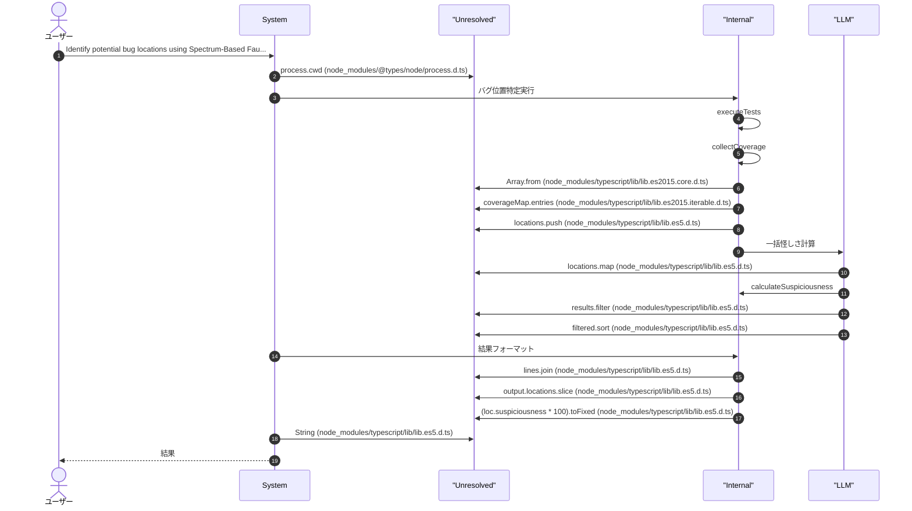
```mermaid
sequenceDiagram
  autonumber
  actor User as ユーザー
  participant System as System
  participant Unresolved as "Unresolved"
  participant Internal as "Internal"
  participant LLM as "LLM"

  User->>System: Identify potential bug locations using Spectrum-Based Fau...
  System->>Unresolved: process.cwd (node_modules/@types/node/process.d.ts)
  System->>Internal: バグ位置特定実行
  Internal->>Internal: executeTests
  Internal->>Internal: collectCoverage
  Internal->>Unresolved: Array.from (node_modules/typescript/lib/lib.es2015.core.d.ts)
  Internal->>Unresolved: coverageMap.entries (node_modules/typescript/lib/lib.es2015.iterable.d.ts)
  Internal->>Unresolved: locations.push (node_modules/typescript/lib/lib.es5.d.ts)
  Internal->>LLM: 一括怪しさ計算
  LLM->>Unresolved: locations.map (node_modules/typescript/lib/lib.es5.d.ts)
  LLM->>Internal: calculateSuspiciousness
  LLM->>Unresolved: results.filter (node_modules/typescript/lib/lib.es5.d.ts)
  LLM->>Unresolved: filtered.sort (node_modules/typescript/lib/lib.es5.d.ts)
  System->>Internal: 結果フォーマット
  Internal->>Unresolved: lines.join (node_modules/typescript/lib/lib.es5.d.ts)
  Internal->>Unresolved: output.locations.slice (node_modules/typescript/lib/lib.es5.d.ts)
  Internal->>Unresolved: (loc.suspiciousness * 100).toFixed (node_modules/typescript/lib/lib.es5.d.ts)
  System->>Unresolved: String (node_modules/typescript/lib/lib.es5.d.ts)
  System-->>User: 結果

```

### search_history

Manage search history across sessions. Use 'get' to retrieve history, 'clear' to delete history, 'save_query' to manually save a query. Supports filtering by session (current/previous/all).

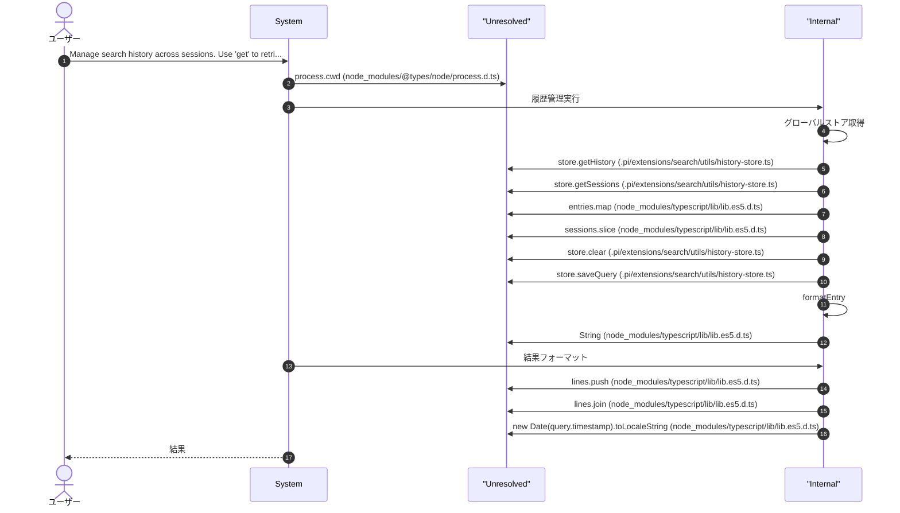
```mermaid
sequenceDiagram
  autonumber
  actor User as ユーザー
  participant System as System
  participant Unresolved as "Unresolved"
  participant Internal as "Internal"

  User->>System: Manage search history across sessions. Use 'get' to retri...
  System->>Unresolved: process.cwd (node_modules/@types/node/process.d.ts)
  System->>Internal: 履歴管理実行
  Internal->>Internal: グローバルストア取得
  Internal->>Unresolved: store.getHistory (.pi/extensions/search/utils/history-store.ts)
  Internal->>Unresolved: store.getSessions (.pi/extensions/search/utils/history-store.ts)
  Internal->>Unresolved: entries.map (node_modules/typescript/lib/lib.es5.d.ts)
  Internal->>Unresolved: sessions.slice (node_modules/typescript/lib/lib.es5.d.ts)
  Internal->>Unresolved: store.clear (.pi/extensions/search/utils/history-store.ts)
  Internal->>Unresolved: store.saveQuery (.pi/extensions/search/utils/history-store.ts)
  Internal->>Internal: formatEntry
  Internal->>Unresolved: String (node_modules/typescript/lib/lib.es5.d.ts)
  System->>Internal: 結果フォーマット
  Internal->>Unresolved: lines.push (node_modules/typescript/lib/lib.es5.d.ts)
  Internal->>Unresolved: lines.join (node_modules/typescript/lib/lib.es5.d.ts)
  Internal->>Unresolved: new Date(query.timestamp).toLocaleString (node_modules/typescript/lib/lib.es5.d.ts)
  System-->>User: 結果

```

### ast_summary

Display AST structure of a file in tree, flat, or JSON format. Supports depth control and type information. Useful for understanding file structure quickly.

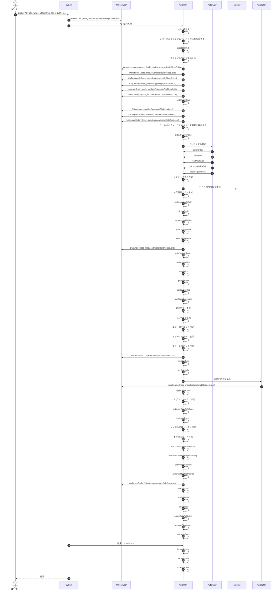
```mermaid
sequenceDiagram
  autonumber
  actor User as ユーザー
  participant System as System
  participant Unresolved as "Unresolved"
  participant Internal as "Internal"
  participant Storage as "Storage"
  participant Judge as "Judge"
  participant Executor as "Executor"

  User->>System: Display AST structure of a file in tree, flat, or JSON fo...
  System->>Unresolved: process.cwd (node_modules/@types/node/process.d.ts)
  System->>Internal: AST要約実行
  Internal->>Internal: シンボル検索実行
  Internal->>Internal: グローバルキャッシュインスタンスを取得する。
  Internal->>Internal: 検索履歴取得
  Internal->>Internal: キャッシュキーを生成する
  Internal->>Unresolved: Object.keys(params).sort (node_modules/typescript/lib/lib.es5.d.ts)
  Internal->>Unresolved: Object.keys (node_modules/typescript/lib/lib.es5.d.ts)
  Internal->>Unresolved: keyParts.push (node_modules/typescript/lib/lib.es5.d.ts)
  Internal->>Unresolved: Array.isArray (node_modules/typescript/lib/lib.es5.d.ts)
  Internal->>Unresolved: value.sort().join (node_modules/typescript/lib/lib.es5.d.ts)
  Internal->>Unresolved: JSON.stringify (node_modules/typescript/lib/lib.es5.d.ts)
  Internal->>Internal: sortObjectKeys
  Internal->>Unresolved: String (node_modules/typescript/lib/lib.es5.d.ts)
  Internal->>Unresolved: cache.getCached (.pi/extensions/search/utils/cache.ts)
  Internal->>Unresolved: history.addHistoryEntry (.pi/extensions/search/utils/history.ts)
  Internal->>Internal: ツールのパラメータからクエリ文字列を抽出する
  Internal->>Internal: extractResultPaths
  Internal->>Storage: インデックス読込
  Storage->>Internal: getShardDir
  Storage->>Internal: fileExists
  Storage->>Internal: readAllShards
  Storage->>Internal: getLegacyIndexPath
  Storage->>Internal: readLegacyIndex
  Internal->>Internal: インデックスを作成
  Internal->>Judge: ツール利用可否を確認
  Internal->>Internal: 依存関係エラー生成
  Internal->>Internal: getLegacyMetaPath
  Internal->>Internal: isIndexStale
  Internal->>Internal: incrementalUpdate
  Internal->>Internal: writeLegacyIndex
  Internal->>Internal: writeLegacyMeta
  Internal->>Unresolved: Date.now (node_modules/typescript/lib/lib.es5.d.ts)
  Internal->>Internal: writeShardedIndex
  Internal->>Internal: updateManifest
  Internal->>Internal: writeMeta
  Internal->>Internal: getMetaPath
  Internal->>Internal: getSourceFiles
  Internal->>Internal: useCtagsCommand
  Internal->>Internal: 実行エラー生成
  Internal->>Internal: FSエラーを生成
  Internal->>Internal: エラーカテゴリを判定
  Internal->>Internal: エラーメッセージ取得
  Internal->>Internal: エラーレスポンス作成
  Internal->>Unresolved: toolError.format (.pi/extensions/search/utils/errors.ts)
  Internal->>Internal: filterSymbols
  Internal->>Internal: sortSymbols
  Internal->>Executor: 結果を切り詰める
  Executor->>Unresolved: results.slice (node_modules/typescript/lib/lib.es5.d.ts)
  Internal->>Internal: applyDetailLevel
  Internal->>Internal: レスポンストークン推定
  Internal->>Internal: estimateResultsTokens
  Internal->>Internal: estimateTokens
  Internal->>Internal: シンボル定義トークン推定
  Internal->>Internal: 予算対応ヒント作成
  Internal->>Internal: calculateSimpleConfidence
  Internal->>Internal: calculateContextBudgetWarning
  Internal->>Internal: getAlternativeTools
  Internal->>Internal: generateRelatedQueries
  Internal->>Unresolved: cache.setCache (.pi/extensions/search/utils/cache.ts)
  Internal->>Internal: extractCalls
  Internal->>Internal: buildAstTree
  Internal->>Internal: limitDepth
  Internal->>Internal: attachCallsToNodes
  Internal->>Internal: removeSignatures
  Internal->>Internal: calculateStats
  System->>Internal: 結果フォーマット
  Internal->>Internal: formatAsJson
  Internal->>Internal: formatAsFlat
  Internal->>Internal: formatAsTree
  System-->>User: 結果

```

### merge_results

Merge results from multiple search methods (semantic, symbol, code) with ranking improvements. Supports weighted, rank_fusion, and interleave strategies.

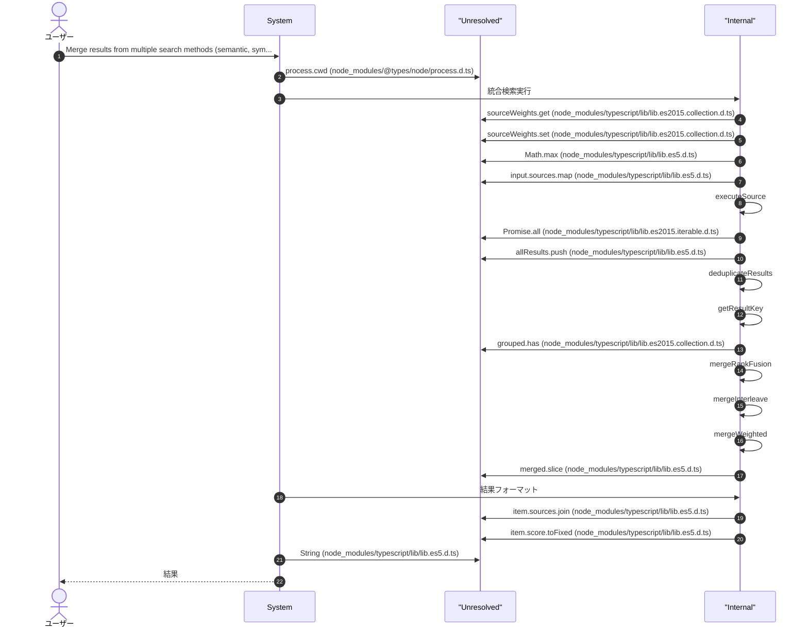
```mermaid
sequenceDiagram
  autonumber
  actor User as ユーザー
  participant System as System
  participant Unresolved as "Unresolved"
  participant Internal as "Internal"

  User->>System: Merge results from multiple search methods (semantic, sym...
  System->>Unresolved: process.cwd (node_modules/@types/node/process.d.ts)
  System->>Internal: 統合検索実行
  Internal->>Unresolved: sourceWeights.get (node_modules/typescript/lib/lib.es2015.collection.d.ts)
  Internal->>Unresolved: sourceWeights.set (node_modules/typescript/lib/lib.es2015.collection.d.ts)
  Internal->>Unresolved: Math.max (node_modules/typescript/lib/lib.es5.d.ts)
  Internal->>Unresolved: input.sources.map (node_modules/typescript/lib/lib.es5.d.ts)
  Internal->>Internal: executeSource
  Internal->>Unresolved: Promise.all (node_modules/typescript/lib/lib.es2015.iterable.d.ts)
  Internal->>Unresolved: allResults.push (node_modules/typescript/lib/lib.es5.d.ts)
  Internal->>Internal: deduplicateResults
  Internal->>Internal: getResultKey
  Internal->>Unresolved: grouped.has (node_modules/typescript/lib/lib.es2015.collection.d.ts)
  Internal->>Internal: mergeRankFusion
  Internal->>Internal: mergeInterleave
  Internal->>Internal: mergeWeighted
  Internal->>Unresolved: merged.slice (node_modules/typescript/lib/lib.es5.d.ts)
  System->>Internal: 結果フォーマット
  Internal->>Unresolved: item.sources.join (node_modules/typescript/lib/lib.es5.d.ts)
  Internal->>Unresolved: item.score.toFixed (node_modules/typescript/lib/lib.es5.d.ts)
  System->>Unresolved: String (node_modules/typescript/lib/lib.es5.d.ts)
  System-->>User: 結果

```

### repograph_index

Build a RepoGraph index showing line-level code dependencies. Uses tree-sitter for AST-based analysis. More accurate than regex-based call graph for definition/reference extraction.

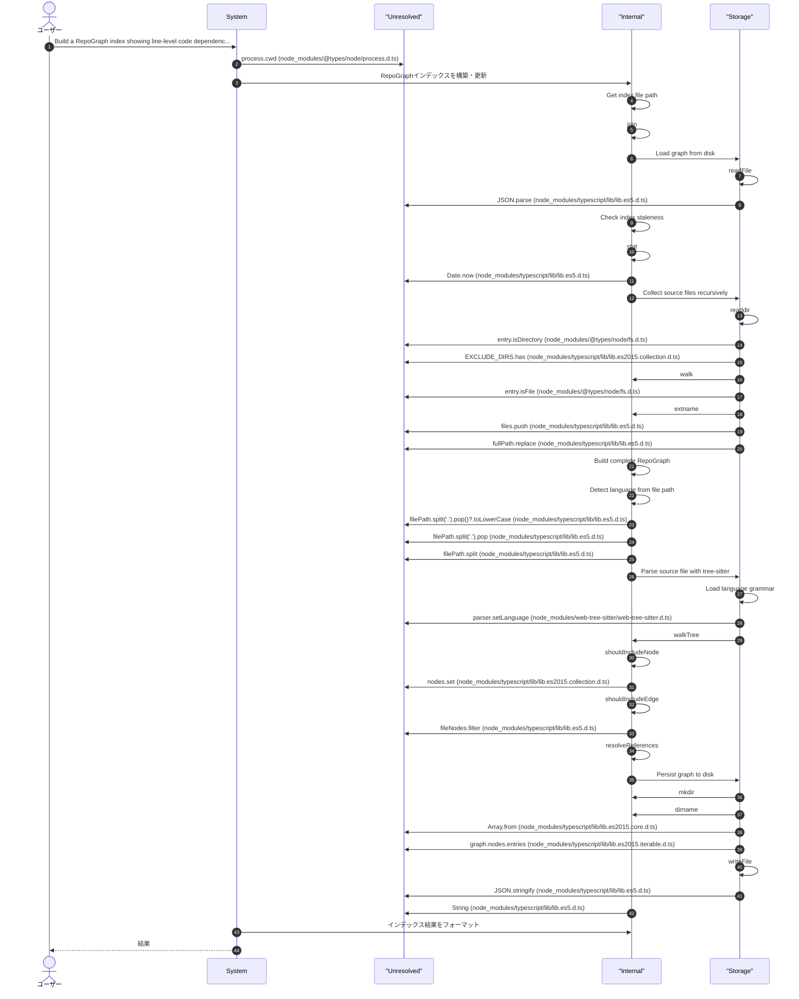
```mermaid
sequenceDiagram
  autonumber
  actor User as ユーザー
  participant System as System
  participant Unresolved as "Unresolved"
  participant Internal as "Internal"
  participant Storage as "Storage"

  User->>System: Build a RepoGraph index showing line-level code dependenc...
  System->>Unresolved: process.cwd (node_modules/@types/node/process.d.ts)
  System->>Internal: RepoGraphインデックスを構築・更新
  Internal->>Internal: Get index file path
  Internal->>Internal: join
  Internal->>Storage: Load graph from disk
  Storage->>Storage: readFile
  Storage->>Unresolved: JSON.parse (node_modules/typescript/lib/lib.es5.d.ts)
  Internal->>Internal: Check index staleness
  Internal->>Internal: stat
  Internal->>Unresolved: Date.now (node_modules/typescript/lib/lib.es5.d.ts)
  Internal->>Storage: Collect source files recursively
  Storage->>Storage: readdir
  Storage->>Unresolved: entry.isDirectory (node_modules/@types/node/fs.d.ts)
  Storage->>Unresolved: EXCLUDE_DIRS.has (node_modules/typescript/lib/lib.es2015.collection.d.ts)
  Storage->>Internal: walk
  Storage->>Unresolved: entry.isFile (node_modules/@types/node/fs.d.ts)
  Storage->>Internal: extname
  Storage->>Unresolved: files.push (node_modules/typescript/lib/lib.es5.d.ts)
  Storage->>Unresolved: fullPath.replace (node_modules/typescript/lib/lib.es5.d.ts)
  Internal->>Internal: Build complete RepoGraph
  Internal->>Internal: Detect language from file path
  Internal->>Unresolved: filePath.split('.').pop()?.toLowerCase (node_modules/typescript/lib/lib.es5.d.ts)
  Internal->>Unresolved: filePath.split('.').pop (node_modules/typescript/lib/lib.es5.d.ts)
  Internal->>Unresolved: filePath.split (node_modules/typescript/lib/lib.es5.d.ts)
  Internal->>Storage: Parse source file with tree-sitter
  Storage->>Storage: Load language grammar
  Storage->>Unresolved: parser.setLanguage (node_modules/web-tree-sitter/web-tree-sitter.d.ts)
  Storage->>Internal: walkTree
  Internal->>Internal: shouldIncludeNode
  Internal->>Unresolved: nodes.set (node_modules/typescript/lib/lib.es2015.collection.d.ts)
  Internal->>Internal: shouldIncludeEdge
  Internal->>Unresolved: fileNodes.filter (node_modules/typescript/lib/lib.es5.d.ts)
  Internal->>Internal: resolveReferences
  Internal->>Storage: Persist graph to disk
  Storage->>Internal: mkdir
  Storage->>Internal: dirname
  Storage->>Unresolved: Array.from (node_modules/typescript/lib/lib.es2015.core.d.ts)
  Storage->>Unresolved: graph.nodes.entries (node_modules/typescript/lib/lib.es2015.iterable.d.ts)
  Storage->>Storage: writeFile
  Storage->>Unresolved: JSON.stringify (node_modules/typescript/lib/lib.es5.d.ts)
  Internal->>Unresolved: String (node_modules/typescript/lib/lib.es5.d.ts)
  System->>Internal: インデックス結果をフォーマット
  System-->>User: 結果

```

### repograph_query

Query the RepoGraph index for symbols, definitions, references, and related nodes. Supports k-hop traversal for context extraction. Requires repograph_index to be built first.

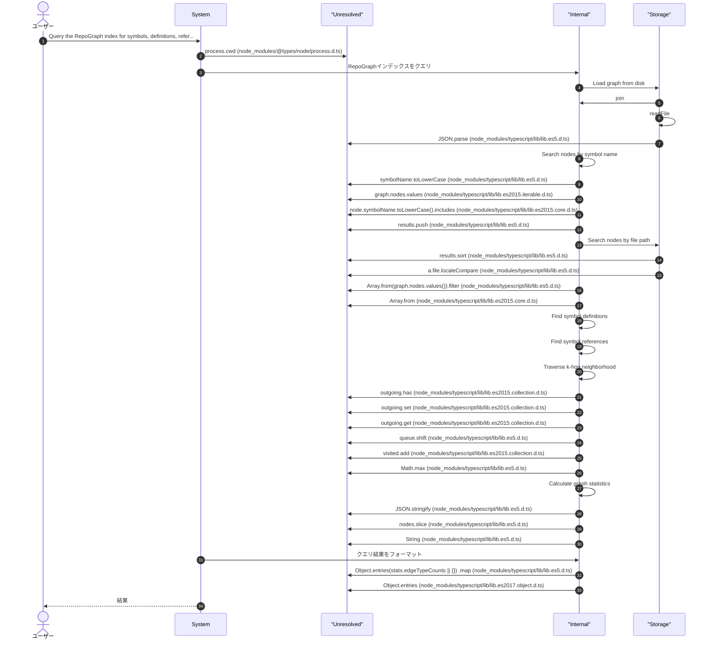
```mermaid
sequenceDiagram
  autonumber
  actor User as ユーザー
  participant System as System
  participant Unresolved as "Unresolved"
  participant Internal as "Internal"
  participant Storage as "Storage"

  User->>System: Query the RepoGraph index for symbols, definitions, refer...
  System->>Unresolved: process.cwd (node_modules/@types/node/process.d.ts)
  System->>Internal: RepoGraphインデックスをクエリ
  Internal->>Storage: Load graph from disk
  Storage->>Internal: join
  Storage->>Storage: readFile
  Storage->>Unresolved: JSON.parse (node_modules/typescript/lib/lib.es5.d.ts)
  Internal->>Internal: Search nodes by symbol name
  Internal->>Unresolved: symbolName.toLowerCase (node_modules/typescript/lib/lib.es5.d.ts)
  Internal->>Unresolved: graph.nodes.values (node_modules/typescript/lib/lib.es2015.iterable.d.ts)
  Internal->>Unresolved: node.symbolName.toLowerCase().includes (node_modules/typescript/lib/lib.es2015.core.d.ts)
  Internal->>Unresolved: results.push (node_modules/typescript/lib/lib.es5.d.ts)
  Internal->>Storage: Search nodes by file path
  Storage->>Unresolved: results.sort (node_modules/typescript/lib/lib.es5.d.ts)
  Storage->>Unresolved: a.file.localeCompare (node_modules/typescript/lib/lib.es5.d.ts)
  Internal->>Unresolved: Array.from(graph.nodes.values()).filter (node_modules/typescript/lib/lib.es5.d.ts)
  Internal->>Unresolved: Array.from (node_modules/typescript/lib/lib.es2015.core.d.ts)
  Internal->>Internal: Find symbol definitions
  Internal->>Internal: Find symbol references
  Internal->>Internal: Traverse k-hop neighborhood
  Internal->>Unresolved: outgoing.has (node_modules/typescript/lib/lib.es2015.collection.d.ts)
  Internal->>Unresolved: outgoing.set (node_modules/typescript/lib/lib.es2015.collection.d.ts)
  Internal->>Unresolved: outgoing.get (node_modules/typescript/lib/lib.es2015.collection.d.ts)
  Internal->>Unresolved: queue.shift (node_modules/typescript/lib/lib.es5.d.ts)
  Internal->>Unresolved: visited.add (node_modules/typescript/lib/lib.es2015.collection.d.ts)
  Internal->>Unresolved: Math.max (node_modules/typescript/lib/lib.es5.d.ts)
  Internal->>Internal: Calculate graph statistics
  Internal->>Unresolved: JSON.stringify (node_modules/typescript/lib/lib.es5.d.ts)
  Internal->>Unresolved: nodes.slice (node_modules/typescript/lib/lib.es5.d.ts)
  Internal->>Unresolved: String (node_modules/typescript/lib/lib.es5.d.ts)
  System->>Internal: クエリ結果をフォーマット
  Internal->>Unresolved: Object.entries(stats.edgeTypeCounts || {}) 				.map (node_modules/typescript/lib/lib.es5.d.ts)
  Internal->>Unresolved: Object.entries (node_modules/typescript/lib/lib.es2017.object.d.ts)
  System-->>User: 結果

```

## 図解

### 依存関係図

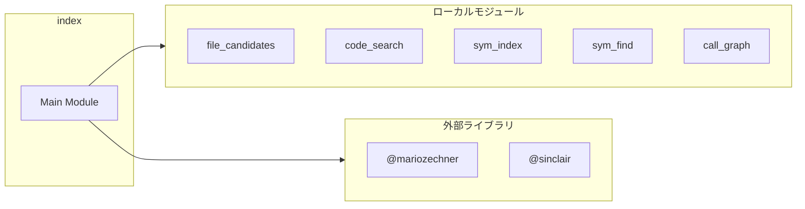
```mermaid
flowchart LR
  subgraph this[index]
    main[Main Module]
  end
  subgraph local[ローカルモジュール]
    file_candidates["file_candidates"]
    code_search["code_search"]
    sym_index["sym_index"]
    sym_find["sym_find"]
    call_graph["call_graph"]
  end
  main --> local
  subgraph external[外部ライブラリ]
    _mariozechner["@mariozechner"]
    _sinclair["@sinclair"]
    _mariozechner["@mariozechner"]
  end
  main --> external
```

---
*自動生成: 2026-02-24T17:08:02.406Z*
