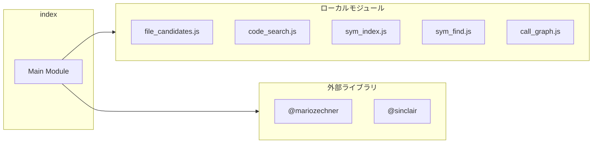

# index

## 概要

`index` モジュールのAPIリファレンス。

## インポート

```typescript
import { ExtensionAPI } from '@mariozechner/pi-coding-agent';
import { Type } from '@sinclair/typebox';
import { StringEnum } from '@mariozechner/pi-ai';
import { fileCandidates } from './tools/file_candidates.js';
import { codeSearch } from './tools/code_search.js';
// ... and 7 more imports
```

## エクスポート一覧

| 種別 | 名前 | 説明 |
|------|------|------|

## 図解

### 依存関係図



---
*自動生成: 2026-02-17T22:24:18.827Z*
