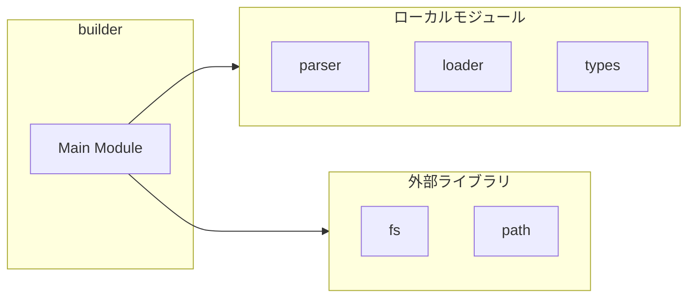
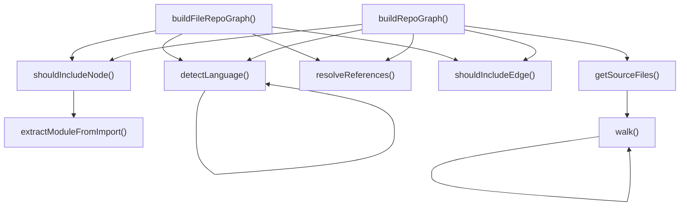
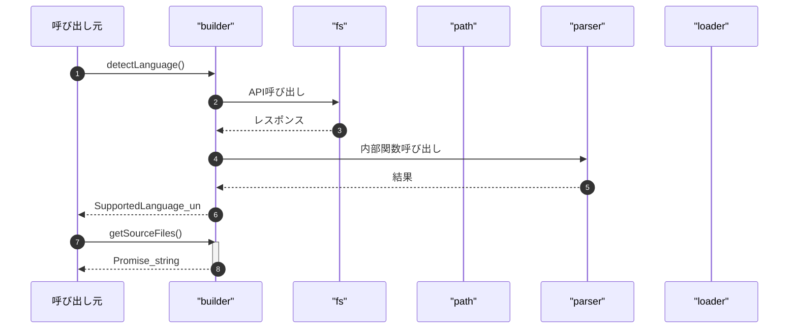

# builder

## 概要

`builder` モジュールのAPIリファレンス。

## インポート

```typescript
// from 'fs/promises': readFile, readdir, stat
// from 'path': join, extname
// from './parser.js': parseFile
// from '../tree-sitter/loader.js': detectLang
// from './types.js': RepoGraphIndex, RepoGraphNode, RepoGraphEdge, ...
// ... and 1 more imports
```

## エクスポート一覧

| 種別 | 名前 | 説明 |
|------|------|------|
| 関数 | `detectLanguage` | Detect language from file extension |
| 関数 | `getSourceFiles` | Get all source files in a directory recursively |
| 関数 | `shouldIncludeNode` | Check if a node should be included in the graph |
| 関数 | `resolveReferences` | Resolve references to their definitions |
| 関数 | `buildRepoGraph` | Build RepoGraph index from project files |
| 関数 | `buildFileRepoGraph` | Build RepoGraph for a single file |

## 図解

### 依存関係図



### 関数フロー



### シーケンス図



## 関数

### detectLanguage

```typescript
detectLanguage(filePath: string): SupportedLanguage | undefined
```

Detect language from file extension

**パラメータ**

| 名前 | 型 | 必須 |
|------|-----|------|
| filePath | `string` | はい |

**戻り値**: `SupportedLanguage | undefined`

### getSourceFiles

```typescript
async getSourceFiles(path: string, cwd: string): Promise<string[]>
```

Get all source files in a directory recursively

**パラメータ**

| 名前 | 型 | 必須 |
|------|-----|------|
| path | `string` | はい |
| cwd | `string` | はい |

**戻り値**: `Promise<string[]>`

### walk

```typescript
async walk(dir: string): Promise<void>
```

**パラメータ**

| 名前 | 型 | 必須 |
|------|-----|------|
| dir | `string` | はい |

**戻り値**: `Promise<void>`

### shouldIncludeNode

```typescript
shouldIncludeNode(node: RepoGraphNode): boolean
```

Check if a node should be included in the graph

**パラメータ**

| 名前 | 型 | 必須 |
|------|-----|------|
| node | `RepoGraphNode` | はい |

**戻り値**: `boolean`

### shouldIncludeEdge

```typescript
shouldIncludeEdge(edge: RepoGraphEdge): boolean
```

Check if an edge should be included in the graph

**パラメータ**

| 名前 | 型 | 必須 |
|------|-----|------|
| edge | `RepoGraphEdge` | はい |

**戻り値**: `boolean`

### extractModuleFromImport

```typescript
extractModuleFromImport(lineText: string): string | undefined
```

Extract module name from import statement text

**パラメータ**

| 名前 | 型 | 必須 |
|------|-----|------|
| lineText | `string` | はい |

**戻り値**: `string | undefined`

### resolveReferences

```typescript
resolveReferences(nodes: Map<string, RepoGraphNode>, edges: RepoGraphEdge[]): void
```

Resolve references to their definitions

**パラメータ**

| 名前 | 型 | 必須 |
|------|-----|------|
| nodes | `Map<string, RepoGraphNode>` | はい |
| edges | `RepoGraphEdge[]` | はい |

**戻り値**: `void`

### buildRepoGraph

```typescript
async buildRepoGraph(path: string, cwd: string): Promise<RepoGraphIndex>
```

Build RepoGraph index from project files

**パラメータ**

| 名前 | 型 | 必須 |
|------|-----|------|
| path | `string` | はい |
| cwd | `string` | はい |

**戻り値**: `Promise<RepoGraphIndex>`

### buildFileRepoGraph

```typescript
async buildFileRepoGraph(filePath: string, cwd: string): Promise<RepoGraphIndex | null>
```

Build RepoGraph for a single file

**パラメータ**

| 名前 | 型 | 必須 |
|------|-----|------|
| filePath | `string` | はい |
| cwd | `string` | はい |

**戻り値**: `Promise<RepoGraphIndex | null>`

---
*自動生成: 2026-02-28T13:55:19.988Z*
