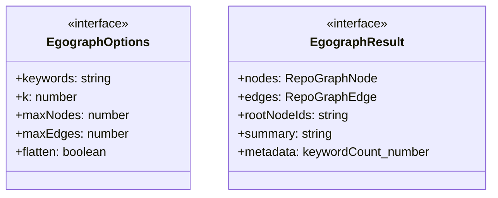
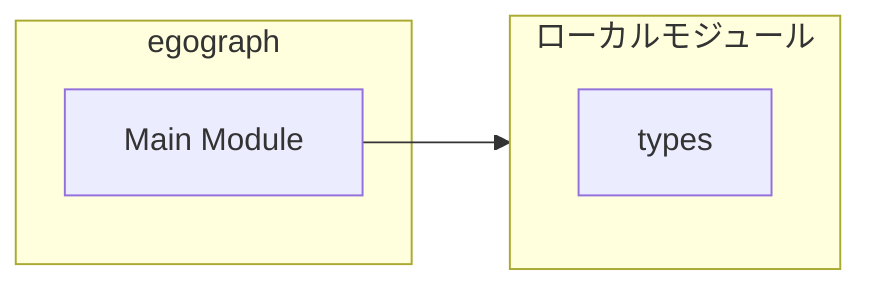
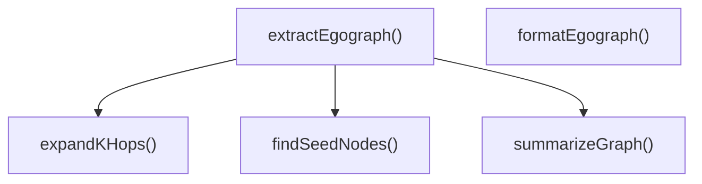
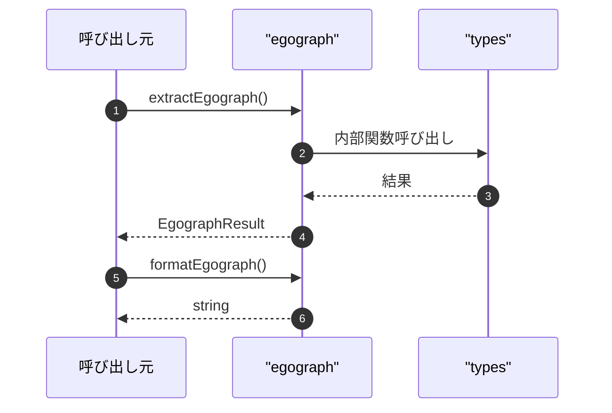

# egograph

## 概要

`egograph` モジュールのAPIリファレンス。

## インポート

```typescript
// from './types.js': RepoGraphIndex, RepoGraphNode, RepoGraphEdge
```

## エクスポート一覧

| 種別 | 名前 | 説明 |
|------|------|------|
| 関数 | `extractEgograph` | Extract k-hop egograph around keywords |
| 関数 | `formatEgograph` | Format egograph result as human-readable text |
| インターフェース | `EgographOptions` | Options for egograph extraction |
| インターフェース | `EgographResult` | Result of egograph extraction |

## 図解

### クラス図



### 依存関係図



### 関数フロー



### シーケンス図



## 関数

### extractEgograph

```typescript
extractEgograph(graph: RepoGraphIndex, options: EgographOptions): EgographResult
```

Extract k-hop egograph around keywords

**パラメータ**

| 名前 | 型 | 必須 |
|------|-----|------|
| graph | `RepoGraphIndex` | はい |
| options | `EgographOptions` | はい |

**戻り値**: `EgographResult`

### formatEgograph

```typescript
formatEgograph(result: EgographResult): string
```

Format egograph result as human-readable text

**パラメータ**

| 名前 | 型 | 必須 |
|------|-----|------|
| result | `EgographResult` | はい |

**戻り値**: `string`

### findSeedNodes

```typescript
findSeedNodes(graph: RepoGraphIndex, keywords: string[]): string[]
```

Find seed nodes matching keywords

**パラメータ**

| 名前 | 型 | 必須 |
|------|-----|------|
| graph | `RepoGraphIndex` | はい |
| keywords | `string[]` | はい |

**戻り値**: `string[]`

### expandKHops

```typescript
expandKHops(graph: RepoGraphIndex, seedNodeIds: string[], options: {
		k: number;
		maxNodes: number;
		maxEdges: number;
		edgeTypes?: string[];
	}): {
	nodes: RepoGraphNode[];
	edges: RepoGraphEdge[];
	visitedNodes: Set<string>;
}
```

Expand k hops from seed nodes using BFS

**パラメータ**

| 名前 | 型 | 必須 |
|------|-----|------|
| graph | `RepoGraphIndex` | はい |
| seedNodeIds | `string[]` | はい |
| options | `object` | はい |
| &nbsp;&nbsp;↳ k | `number` | はい |
| &nbsp;&nbsp;↳ maxNodes | `number` | はい |
| &nbsp;&nbsp;↳ maxEdges | `number` | はい |
| &nbsp;&nbsp;↳ edgeTypes | `string[]` | いいえ |

**戻り値**: `{
	nodes: RepoGraphNode[];
	edges: RepoGraphEdge[];
	visitedNodes: Set<string>;
}`

### summarizeGraph

```typescript
summarizeGraph(nodes: RepoGraphNode[], edges: RepoGraphEdge[], rootNodeIds: string[]): string
```

Generate summary for LLM context

**パラメータ**

| 名前 | 型 | 必須 |
|------|-----|------|
| nodes | `RepoGraphNode[]` | はい |
| edges | `RepoGraphEdge[]` | はい |
| rootNodeIds | `string[]` | はい |

**戻り値**: `string`

## インターフェース

### EgographOptions

```typescript
interface EgographOptions {
  keywords: string[];
  k?: number;
  maxNodes?: number;
  maxEdges?: number;
  flatten?: boolean;
  summarize?: boolean;
  edgeTypes?: string[];
}
```

Options for egograph extraction

### EgographResult

```typescript
interface EgographResult {
  nodes: RepoGraphNode[];
  edges: RepoGraphEdge[];
  rootNodeIds: string[];
  summary?: string;
  metadata: {
		keywordCount: number;
		hops: number;
		totalNodesInGraph: number;
		totalEdgesInGraph: number;
		extractedAt: number;
	};
}
```

Result of egograph extraction

---
*自動生成: 2026-02-28T13:55:19.990Z*
