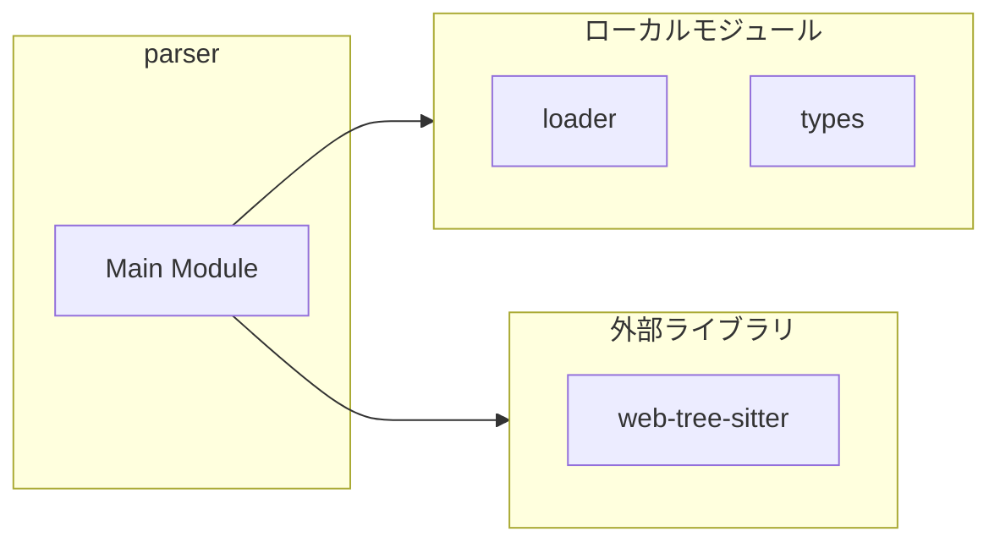
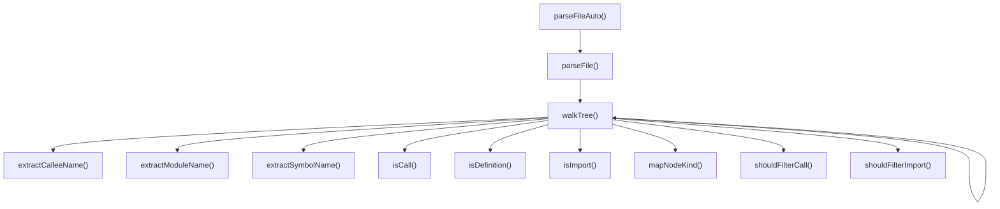
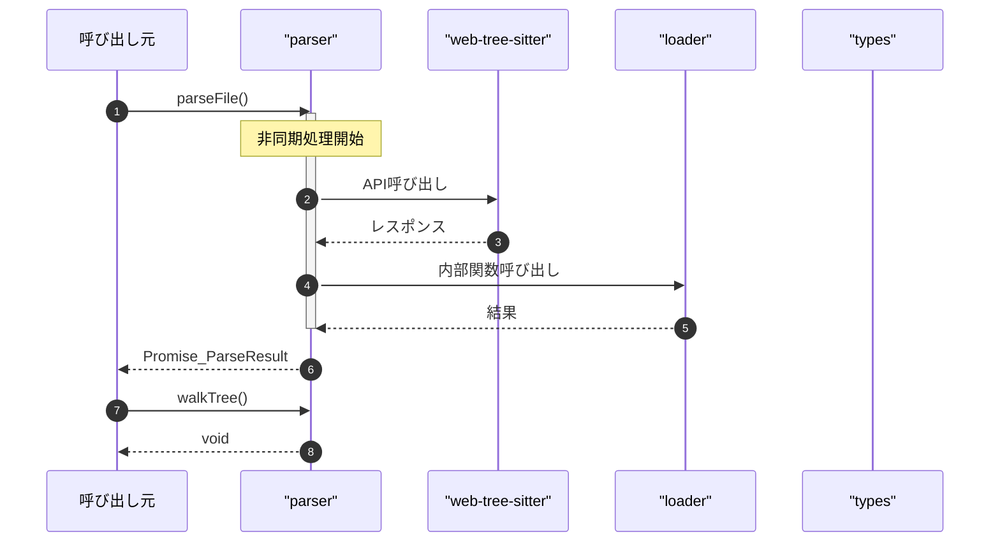

# parser

## 概要

`parser` モジュールのAPIリファレンス。

## インポート

```typescript
// from 'web-tree-sitter': Parser, Node
// from '../tree-sitter/loader.js': loadLanguage, detectLanguage
// from './types.js': RepoGraphNode, RepoGraphEdge, ParseResult, ...
```

## エクスポート一覧

| 種別 | 名前 | 説明 |
|------|------|------|
| 関数 | `parseFile` | Parse a file and extract RepoGraph nodes and edges |
| 関数 | `walkTree` | Walk the AST tree and extract nodes |
| 関数 | `isDefinition` | Check if a node is a definition |
| 関数 | `isImport` | Check if a node is an import statement |
| 関数 | `isCall` | Check if a node is a function call |
| 関数 | `extractSymbolName` | Extract symbol name from a definition node |
| 関数 | `extractCalleeName` | Extract callee name from a call expression |
| 関数 | `extractModuleName` | Extract module name from import statement |
| 関数 | `shouldFilterImport` | Check if import should be filtered out |
| 関数 | `shouldFilterCall` | Check if call should be filtered out |
| 関数 | `parseFileAuto` | Parse file with automatic language detection |

## 図解

### 依存関係図



### 関数フロー



### シーケンス図



## 関数

### mapNodeKind

```typescript
mapNodeKind(nodeType: string): RepoGraphSymbolKind
```

Map tree-sitter node types to RepoGraph symbol kinds

**パラメータ**

| 名前 | 型 | 必須 |
|------|-----|------|
| nodeType | `string` | はい |

**戻り値**: `RepoGraphSymbolKind`

### parseFile

```typescript
async parseFile(content: string, filePath: string, language: SupportedLanguage): Promise<ParseResult>
```

Parse a file and extract RepoGraph nodes and edges

**パラメータ**

| 名前 | 型 | 必須 |
|------|-----|------|
| content | `string` | はい |
| filePath | `string` | はい |
| language | `SupportedLanguage` | はい |

**戻り値**: `Promise<ParseResult>`

### walkTree

```typescript
walkTree(node: Node, lines: string[], filePath: string, nodes: RepoGraphNode[], edges: RepoGraphEdge[], language: SupportedLanguage): void
```

Walk the AST tree and extract nodes

**パラメータ**

| 名前 | 型 | 必須 |
|------|-----|------|
| node | `Node` | はい |
| lines | `string[]` | はい |
| filePath | `string` | はい |
| nodes | `RepoGraphNode[]` | はい |
| edges | `RepoGraphEdge[]` | はい |
| language | `SupportedLanguage` | はい |

**戻り値**: `void`

### isDefinition

```typescript
isDefinition(node: Node, language: SupportedLanguage): boolean
```

Check if a node is a definition

**パラメータ**

| 名前 | 型 | 必須 |
|------|-----|------|
| node | `Node` | はい |
| language | `SupportedLanguage` | はい |

**戻り値**: `boolean`

### isImport

```typescript
isImport(node: Node, language: SupportedLanguage): boolean
```

Check if a node is an import statement

**パラメータ**

| 名前 | 型 | 必須 |
|------|-----|------|
| node | `Node` | はい |
| language | `SupportedLanguage` | はい |

**戻り値**: `boolean`

### isCall

```typescript
isCall(node: Node, language: SupportedLanguage): boolean
```

Check if a node is a function call

**パラメータ**

| 名前 | 型 | 必須 |
|------|-----|------|
| node | `Node` | はい |
| language | `SupportedLanguage` | はい |

**戻り値**: `boolean`

### extractSymbolName

```typescript
extractSymbolName(node: Node): string | undefined
```

Extract symbol name from a definition node

**パラメータ**

| 名前 | 型 | 必須 |
|------|-----|------|
| node | `Node` | はい |

**戻り値**: `string | undefined`

### extractCalleeName

```typescript
extractCalleeName(node: Node): string | undefined
```

Extract callee name from a call expression

**パラメータ**

| 名前 | 型 | 必須 |
|------|-----|------|
| node | `Node` | はい |

**戻り値**: `string | undefined`

### extractModuleName

```typescript
extractModuleName(node: Node, lineText: string): string | undefined
```

Extract module name from import statement

**パラメータ**

| 名前 | 型 | 必須 |
|------|-----|------|
| node | `Node` | はい |
| lineText | `string` | はい |

**戻り値**: `string | undefined`

### shouldFilterImport

```typescript
shouldFilterImport(moduleName: string): boolean
```

Check if import should be filtered out

**パラメータ**

| 名前 | 型 | 必須 |
|------|-----|------|
| moduleName | `string` | はい |

**戻り値**: `boolean`

### shouldFilterCall

```typescript
shouldFilterCall(calleeName: string): boolean
```

Check if call should be filtered out

**パラメータ**

| 名前 | 型 | 必須 |
|------|-----|------|
| calleeName | `string` | はい |

**戻り値**: `boolean`

### parseFileAuto

```typescript
async parseFileAuto(content: string, filePath: string): Promise<ParseResult | null>
```

Parse file with automatic language detection

**パラメータ**

| 名前 | 型 | 必須 |
|------|-----|------|
| content | `string` | はい |
| filePath | `string` | はい |

**戻り値**: `Promise<ParseResult | null>`

---
*自動生成: 2026-02-28T13:55:19.991Z*
