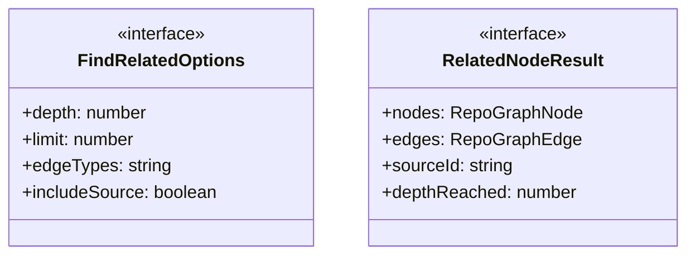
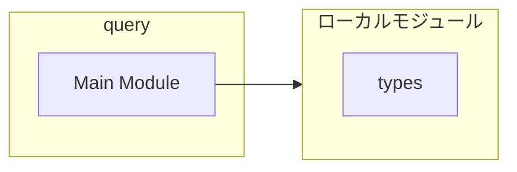
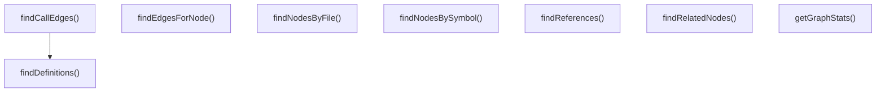
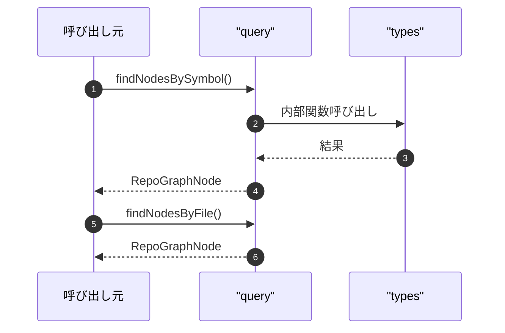

# query

## 概要

`query` モジュールのAPIリファレンス。

## インポート

```typescript
// from './types.js': RepoGraphIndex, RepoGraphNode, RepoGraphEdge
```

## エクスポート一覧

| 種別 | 名前 | 説明 |
|------|------|------|
| 関数 | `findNodesBySymbol` | Find nodes by symbol name (case-insensitive partia |
| 関数 | `findNodesByFile` | Find nodes by file path (exact or partial match) |
| 関数 | `findDefinitions` | Find all definition nodes for a symbol |
| 関数 | `findReferences` | Find all reference nodes for a symbol |
| 関数 | `findRelatedNodes` | Find nodes related to a source node via graph edge |
| 関数 | `findEdgesForNode` | Find all edges connected to a node |
| 関数 | `findCallEdges` | Find call edges (invoke type) for a symbol |
| 関数 | `getGraphStats` | Get statistics about the graph |
| インターフェース | `FindRelatedOptions` | Options for related node search |
| インターフェース | `RelatedNodeResult` | Result of related node search |

## 図解

### クラス図



### 依存関係図



### 関数フロー



### シーケンス図



## 関数

### findNodesBySymbol

```typescript
findNodesBySymbol(graph: RepoGraphIndex, symbolName: string): RepoGraphNode[]
```

Find nodes by symbol name (case-insensitive partial match)

**パラメータ**

| 名前 | 型 | 必須 |
|------|-----|------|
| graph | `RepoGraphIndex` | はい |
| symbolName | `string` | はい |

**戻り値**: `RepoGraphNode[]`

### findNodesByFile

```typescript
findNodesByFile(graph: RepoGraphIndex, filePath: string): RepoGraphNode[]
```

Find nodes by file path (exact or partial match)

**パラメータ**

| 名前 | 型 | 必須 |
|------|-----|------|
| graph | `RepoGraphIndex` | はい |
| filePath | `string` | はい |

**戻り値**: `RepoGraphNode[]`

### findDefinitions

```typescript
findDefinitions(graph: RepoGraphIndex, symbolName: string, exact: boolean): RepoGraphNode[]
```

Find all definition nodes for a symbol

**パラメータ**

| 名前 | 型 | 必須 |
|------|-----|------|
| graph | `RepoGraphIndex` | はい |
| symbolName | `string` | はい |
| exact | `boolean` | はい |

**戻り値**: `RepoGraphNode[]`

### findReferences

```typescript
findReferences(graph: RepoGraphIndex, symbolName: string, exact: boolean): RepoGraphNode[]
```

Find all reference nodes for a symbol

**パラメータ**

| 名前 | 型 | 必須 |
|------|-----|------|
| graph | `RepoGraphIndex` | はい |
| symbolName | `string` | はい |
| exact | `boolean` | はい |

**戻り値**: `RepoGraphNode[]`

### findRelatedNodes

```typescript
findRelatedNodes(graph: RepoGraphIndex, nodeId: string, options: FindRelatedOptions): RelatedNodeResult
```

Find nodes related to a source node via graph edges

**パラメータ**

| 名前 | 型 | 必須 |
|------|-----|------|
| graph | `RepoGraphIndex` | はい |
| nodeId | `string` | はい |
| options | `FindRelatedOptions` | はい |

**戻り値**: `RelatedNodeResult`

### findEdgesForNode

```typescript
findEdgesForNode(graph: RepoGraphIndex, nodeId: string): RepoGraphEdge[]
```

Find all edges connected to a node

**パラメータ**

| 名前 | 型 | 必須 |
|------|-----|------|
| graph | `RepoGraphIndex` | はい |
| nodeId | `string` | はい |

**戻り値**: `RepoGraphEdge[]`

### findCallEdges

```typescript
findCallEdges(graph: RepoGraphIndex, symbolName: string): RepoGraphEdge[]
```

Find call edges (invoke type) for a symbol

**パラメータ**

| 名前 | 型 | 必須 |
|------|-----|------|
| graph | `RepoGraphIndex` | はい |
| symbolName | `string` | はい |

**戻り値**: `RepoGraphEdge[]`

### getGraphStats

```typescript
getGraphStats(graph: RepoGraphIndex): {
	totalNodes: number;
	totalEdges: number;
	nodesByType: Record<string, number>;
	edgesByType: Record<string, number>;
	uniqueFiles: number;
	uniqueSymbols: number;
}
```

Get statistics about the graph

**パラメータ**

| 名前 | 型 | 必須 |
|------|-----|------|
| graph | `RepoGraphIndex` | はい |

**戻り値**: `{
	totalNodes: number;
	totalEdges: number;
	nodesByType: Record<string, number>;
	edgesByType: Record<string, number>;
	uniqueFiles: number;
	uniqueSymbols: number;
}`

## インターフェース

### FindRelatedOptions

```typescript
interface FindRelatedOptions {
  depth?: number;
  limit?: number;
  edgeTypes?: string[];
  includeSource?: boolean;
}
```

Options for related node search

### RelatedNodeResult

```typescript
interface RelatedNodeResult {
  nodes: RepoGraphNode[];
  edges: RepoGraphEdge[];
  sourceId: string;
  depthReached: number;
}
```

Result of related node search

---
*自動生成: 2026-02-28T13:55:19.992Z*
