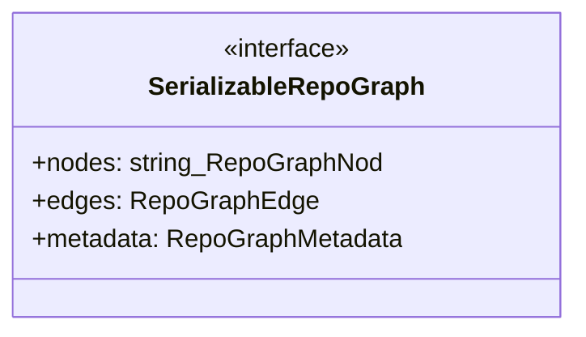
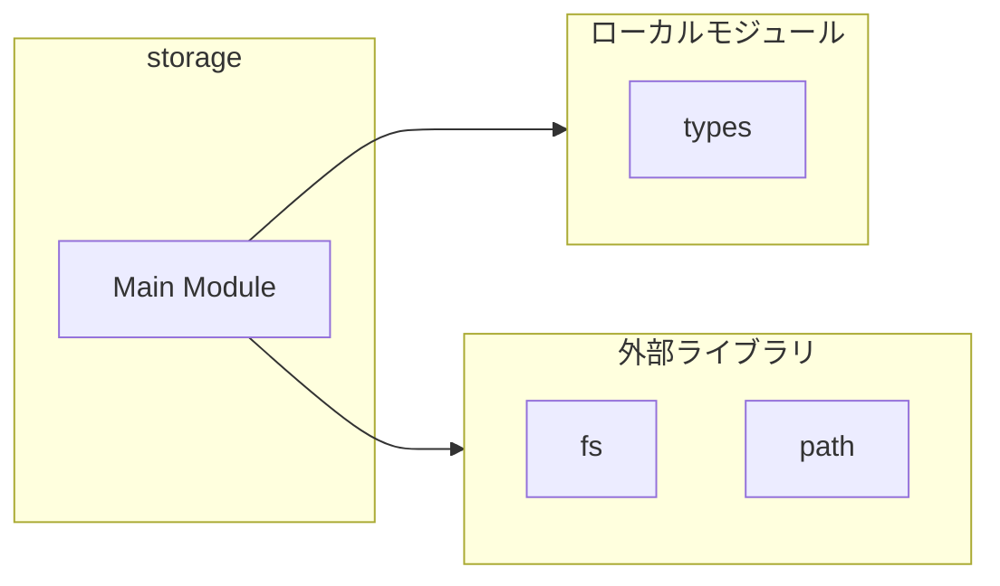
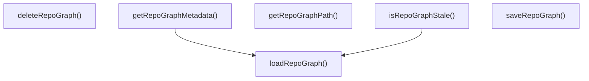
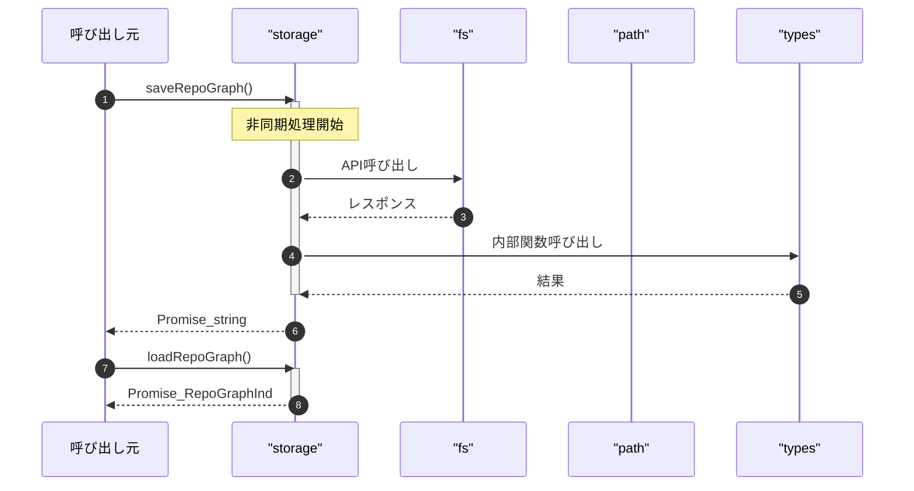

# storage

## 概要

`storage` モジュールのAPIリファレンス。

## インポート

```typescript
// from 'fs/promises': readFile, writeFile, mkdir, ...
// from 'path': join, dirname
// from './types.js': RepoGraphIndex, RepoGraphNode, RepoGraphEdge, ...
```

## エクスポート一覧

| 種別 | 名前 | 説明 |
|------|------|------|
| 関数 | `saveRepoGraph` | Save RepoGraph index to disk |
| 関数 | `loadRepoGraph` | Load RepoGraph index from disk |
| 関数 | `deleteRepoGraph` | Delete RepoGraph index from disk |
| 関数 | `isRepoGraphStale` | Check if RepoGraph index is stale compared to sour |
| 関数 | `getRepoGraphPath` | Get path to RepoGraph index file |
| 関数 | `getRepoGraphMetadata` | Get RepoGraph index metadata without loading full  |

## 図解

### クラス図



### 依存関係図



### 関数フロー



### シーケンス図



## 関数

### saveRepoGraph

```typescript
async saveRepoGraph(graph: RepoGraphIndex, cwd: string): Promise<string>
```

Save RepoGraph index to disk

**パラメータ**

| 名前 | 型 | 必須 |
|------|-----|------|
| graph | `RepoGraphIndex` | はい |
| cwd | `string` | はい |

**戻り値**: `Promise<string>`

### loadRepoGraph

```typescript
async loadRepoGraph(cwd: string): Promise<RepoGraphIndex | null>
```

Load RepoGraph index from disk

**パラメータ**

| 名前 | 型 | 必須 |
|------|-----|------|
| cwd | `string` | はい |

**戻り値**: `Promise<RepoGraphIndex | null>`

### deleteRepoGraph

```typescript
async deleteRepoGraph(cwd: string): Promise<void>
```

Delete RepoGraph index from disk

**パラメータ**

| 名前 | 型 | 必須 |
|------|-----|------|
| cwd | `string` | はい |

**戻り値**: `Promise<void>`

### isRepoGraphStale

```typescript
async isRepoGraphStale(cwd: string, sourcePath?: string): Promise<boolean>
```

Check if RepoGraph index is stale compared to source files

**パラメータ**

| 名前 | 型 | 必須 |
|------|-----|------|
| cwd | `string` | はい |
| sourcePath | `string` | いいえ |

**戻り値**: `Promise<boolean>`

### getRepoGraphPath

```typescript
getRepoGraphPath(cwd: string): string
```

Get path to RepoGraph index file

**パラメータ**

| 名前 | 型 | 必須 |
|------|-----|------|
| cwd | `string` | はい |

**戻り値**: `string`

### getRepoGraphMetadata

```typescript
async getRepoGraphMetadata(cwd: string): Promise<RepoGraphMetadata | null>
```

Get RepoGraph index metadata without loading full graph

**パラメータ**

| 名前 | 型 | 必須 |
|------|-----|------|
| cwd | `string` | はい |

**戻り値**: `Promise<RepoGraphMetadata | null>`

## インターフェース

### SerializableRepoGraph

```typescript
interface SerializableRepoGraph {
  nodes: [string, RepoGraphNode][];
  edges: RepoGraphEdge[];
  metadata: RepoGraphMetadata;
}
```

Serializable format for JSON storage

---
*自動生成: 2026-02-28T13:55:19.993Z*
