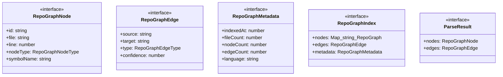

# types

## 概要

`types` モジュールのAPIリファレンス。

## エクスポート一覧

| 種別 | 名前 | 説明 |
|------|------|------|
| インターフェース | `RepoGraphNode` | Line-level node in RepoGraph |
| インターフェース | `RepoGraphEdge` | Edge connecting two nodes in RepoGraph |
| インターフェース | `RepoGraphMetadata` | Metadata for RepoGraph index |
| インターフェース | `RepoGraphIndex` | Complete RepoGraph index structure |
| インターフェース | `ParseResult` | Result of parsing a single file |
| 型 | `RepoGraphNodeType` | Node type in RepoGraph |
| 型 | `RepoGraphSymbolKind` | Symbol kind classification |
| 型 | `RepoGraphEdgeType` | Edge types in RepoGraph |
| 型 | `SupportedLanguage` | Supported languages for parsing |

## 図解

### クラス図



## インターフェース

### RepoGraphNode

```typescript
interface RepoGraphNode {
  id: string;
  file: string;
  line: number;
  nodeType: RepoGraphNodeType;
  symbolName: string;
  symbolKind: RepoGraphSymbolKind;
  scope?: string;
  text: string;
}
```

Line-level node in RepoGraph

### RepoGraphEdge

```typescript
interface RepoGraphEdge {
  source: string;
  target: string;
  type: RepoGraphEdgeType;
  confidence: number;
}
```

Edge connecting two nodes in RepoGraph

### RepoGraphMetadata

```typescript
interface RepoGraphMetadata {
  indexedAt: number;
  fileCount: number;
  nodeCount: number;
  edgeCount: number;
  language: string;
  version: number;
}
```

Metadata for RepoGraph index

### RepoGraphIndex

```typescript
interface RepoGraphIndex {
  nodes: Map<string, RepoGraphNode>;
  edges: RepoGraphEdge[];
  metadata: RepoGraphMetadata;
}
```

Complete RepoGraph index structure

### ParseResult

```typescript
interface ParseResult {
  nodes: RepoGraphNode[];
  edges: RepoGraphEdge[];
}
```

Result of parsing a single file

## 型定義

### RepoGraphNodeType

```typescript
type RepoGraphNodeType = "def" | "ref" | "import" | "export"
```

Node type in RepoGraph

### RepoGraphSymbolKind

```typescript
type RepoGraphSymbolKind = | "function"
  | "method"
  | "class"
  | "variable"
  | "import"
  | "constant"
  | "interface"
  | "type"
  | "property"
```

Symbol kind classification

### RepoGraphEdgeType

```typescript
type RepoGraphEdgeType = | "invoke" // A calls B
  | "contain" // A contains B (file contains function)
  | "define" // A defines B (import defines symbol)
  | "reference" // A references B
  | "next"
```

Edge types in RepoGraph

### SupportedLanguage

```typescript
type SupportedLanguage = "typescript" | "javascript" | "python"
```

Supported languages for parsing

---
*自動生成: 2026-02-24T17:08:02.411Z*
