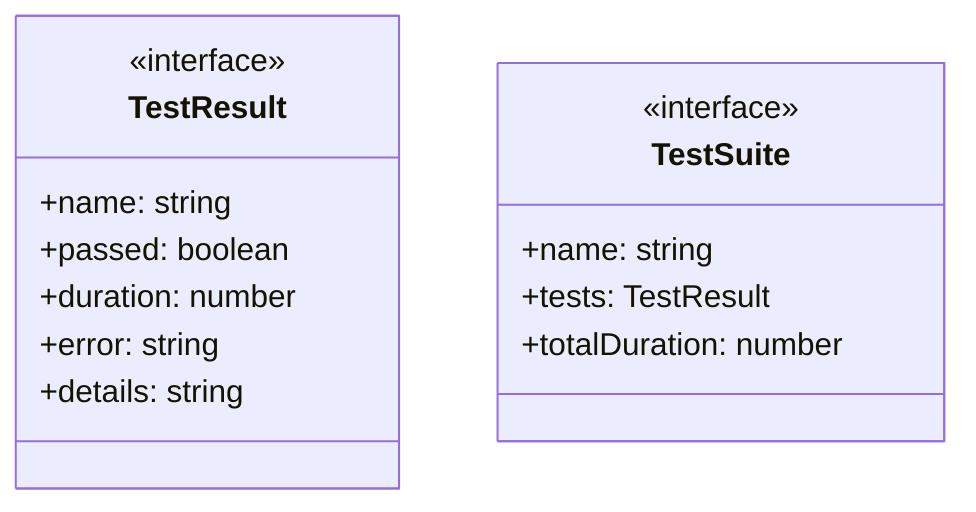
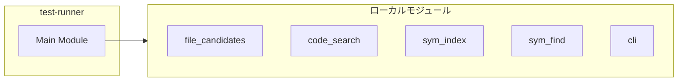
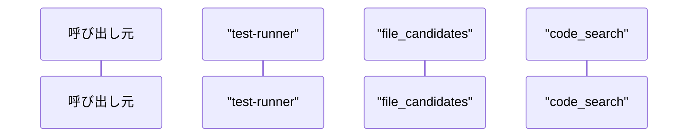

# test-runner

## 概要

`test-runner` モジュールのAPIリファレンス。

## インポート

```typescript
import { fileCandidates } from './tools/file_candidates.js';
import { codeSearch } from './tools/code_search.js';
import { symIndex } from './tools/sym_index.js';
import { symFind } from './tools/sym_find.js';
import { checkToolAvailability } from './utils/cli.js';
```

## エクスポート一覧

| 種別 | 名前 | 説明 |
|------|------|------|

## 図解

### クラス図



### 依存関係図



### シーケンス図



## 関数

### formatDuration

```typescript
formatDuration(ms: number): string
```

**パラメータ**

| 名前 | 型 | 必須 |
|------|-----|------|
| ms | `number` | はい |

**戻り値**: `string`

### runTest

```typescript
async runTest(suite: string, name: string, fn: () => Promise<void> | void): Promise<TestResult>
```

**パラメータ**

| 名前 | 型 | 必須 |
|------|-----|------|
| suite | `string` | はい |
| name | `string` | はい |
| fn | `() => Promise<void> | void` | はい |

**戻り値**: `Promise<TestResult>`

### assert

```typescript
assert(condition: boolean, message: string): void
```

**パラメータ**

| 名前 | 型 | 必須 |
|------|-----|------|
| condition | `boolean` | はい |
| message | `string` | はい |

**戻り値**: `void`

### log

```typescript
log(msg: string): void
```

**パラメータ**

| 名前 | 型 | 必須 |
|------|-----|------|
| msg | `string` | はい |

**戻り値**: `void`

### testToolAvailability

```typescript
async testToolAvailability(): Promise<TestSuite>
```

**戻り値**: `Promise<TestSuite>`

### testFileCandidates

```typescript
async testFileCandidates(): Promise<TestSuite>
```

**戻り値**: `Promise<TestSuite>`

### testCodeSearch

```typescript
async testCodeSearch(): Promise<TestSuite>
```

**戻り値**: `Promise<TestSuite>`

### testSymIndex

```typescript
async testSymIndex(): Promise<TestSuite>
```

**戻り値**: `Promise<TestSuite>`

### testSymFind

```typescript
async testSymFind(): Promise<TestSuite>
```

**戻り値**: `Promise<TestSuite>`

### testIncrementalIndex

```typescript
async testIncrementalIndex(): Promise<TestSuite>
```

**戻り値**: `Promise<TestSuite>`

### main

```typescript
async main(): Promise<void>
```

**戻り値**: `Promise<void>`

## インターフェース

### TestResult

```typescript
interface TestResult {
  name: string;
  passed: boolean;
  duration: number;
  error?: string;
  details?: string;
}
```

### TestSuite

```typescript
interface TestSuite {
  name: string;
  tests: TestResult[];
  totalDuration: number;
}
```

---
*自動生成: 2026-02-18T07:48:44.594Z*
